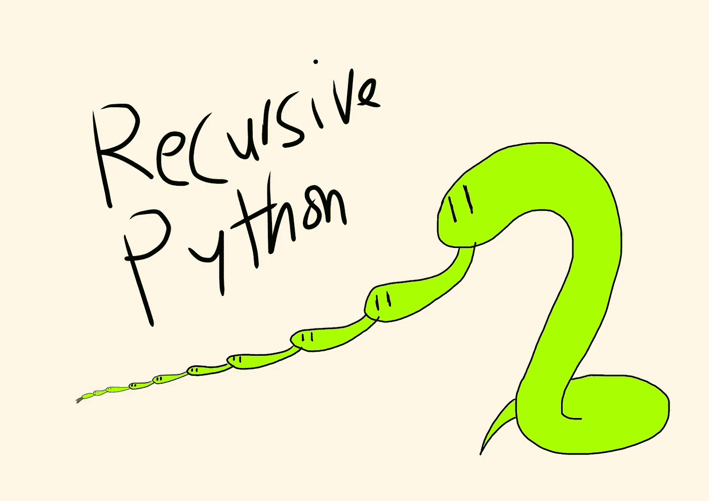

# 7 个针对初学者的入门级递归练习题

> 原文：<https://medium.com/codex/7-actual-entry-level-recursion-practice-questions-for-beginners-f5f66ac733de?source=collection_archive---------8----------------------->

最近，一个学生要求我在我给他的练习的基础上再做一些递归的练习。我在谷歌上快速搜索了一下，发现很多入门级的递归练习题并不是很入门。如果作为一个递归初学者，我被要求做许多这样的问题，我会非常害怕！