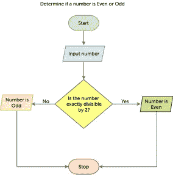
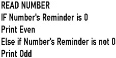

# 每个编程新手都应该知道的 7 个基本算法:第 1 部分

> 原文：<https://medium.com/codex/7-basic-algorithms-every-newbie-coder-should-know-part-1-6119ca14e6df?source=collection_archive---------11----------------------->

欢迎大家，来到这个每个新手程序员都应该知道的 7 个算法的小编。这个系列将由三篇文章组成，以使这些算法易于理解，并确保我的新手编码爱好者(我自己就是一个)不会被所有的数据处理所窒息。

我们都知道变化是持续的，这种说法对于编程领域也是成立的&随着时间的推移，我们都看到了针对各种用例的各种新算法的巨大浪潮，但并不是所有的东西都发生了变化，一些算法在这种变化中幸存了下来，这些就是我们将在本系列中讨论的算法。

这是本系列的一组文章:

*   [算法介绍:第一部分](/@manvendraaaa/7-basic-algorithms-every-newbie-coder-should-know-part-1-6119ca14e6df)
*   [搜索&排序算法:第二部分](/@manvendraaaa/7-basic-algorithms-every-newbie-coder-should-know-part-2-425985e0ae69)
*   [双指针&滑动窗口:第三部分](/@manvendraaaa/7-basic-algorithms-every-newbie-coder-should-know-part-3-dc25feb68f66)

本指南旨在为初学者提供快速而简明的参考，涵盖了最基本但广泛使用的算法。

因此，这是本系列文章的第一部分*算法介绍*，我们将回顾各种术语的定义，如算法、流程图和伪代码等，以及它们的重要性和其他几个小事实，它们将帮助您进行编码探索，并以更好的方式理解本系列文章。

## **算法**

虽然我们都听说过“算法”这个术语，但我们中的许多人从未读过它的正式解释，用外行人的话来说，我们只知道它是一个过程。那么，我们来看看算法这个术语的含义，看能不能对它有更好的理解。

> *定义*算法总是明确的，并被用作执行计算、数据处理、自动推理和其他任务的规范。

因此，让我们将前面的描述与现实生活中的情况进行比较。假设我们想泡茶，我们将使用一个包括几个步骤的配方，这些步骤必须按照特定的顺序完成，才能制作出奶油味浓郁的茶。让我们把这个应用到编程中，假设泡茶的*是*问题陈述*，*配方*是*过程*，而*配料*是*输入*，而最终产品*茶*是*输出*。
因此，算法只是一个简单的过程，用于解决特定问题或执行一些计算或各种其他用例，例如用于从线性数据预测真实数值的线性回归算法。*

请记住，算法不一定要用代码编写；它可能以简单的英语开始，然后被转换成流程图，然后被转换成伪代码，或者我们可以直接用任何编程语言对它进行编码，因为这没有严格的规则。接下来，我们将讨论*流程图* & *伪代码。*

## **流程图**

不管是什么情况，我们都在生活中的某个时刻见过流程图，它们真的很有价值，我们将在本文后面讨论。让我们来看一下流程图的正式定义，然后像我们对算法的定义一样将其分解。

> 定义:流程图是一种表示工作流程或过程的图表。流程图也可以定义为算法的图形表示，即解决任务的逐步方法。

流程图:数字是偶数还是奇数

在左侧，您可以看到一个简单的流程图示例，它概述了一个用于确定一个数字是偶数还是奇数的算法。看一看图表，试着理解它；你会注意到理解算法使用的阶段是多么简单。流程图有几种不同类型的方框，每种都有自己的含义。在这篇文章中，我们将看看最基本的:

*   椭圆形或丸形—代表起点或终点
*   矩形形状—代表一个流程
*   菱形——代表决策/条件
*   平行四边形—表示输入/输出

所以这个流程图用一个简洁的图形简化了这个技术，它清楚地表明，如果一个数能被 2 整除，它就是偶数，如果不能，它就是奇数。因此，很明显，流程图通过使算法的各个阶段更加简单明了，有助于我们更长久地记住信息。稍后会有一篇关于流程图的文章，敬请关注。

## 伪代码

伪代码将是我们在本文中讨论的最后一个话题。我希望在阅读 GFG 和 W3Schools 等网站上的文章时，每个人都能在实际代码之前看到用简单英语写的东西。这就是所谓的伪代码。

> 定义:在计算机科学中，伪代码是算法或另一个系统中的步骤的简单语言描述。伪代码通常使用普通编程语言的结构约定，但是是为人类阅读而不是机器阅读而设计的。它通常省略了对机器理解算法至关重要的细节，例如变量声明和特定语言代码。

左边的图表提供了所使用的相同流程图的伪代码示例，正如您所看到的，我们只是将流程图转换为简单的英语。与流程图相比，伪代码的主要好处是更简洁，更容易理解。

## 结论

设计/实现算法的理想管道是首先考虑将要采用的步骤，然后将该概念转换成流程图，最后在实际执行/实现算法之前将流程图转换成伪代码。虽然这样做是一个好的做法，但没有必要对所有算法都遵循这个管道，因为这个过程需要时间，所以当我们是编程新手或算法特别难以开发/实现时，我们可以使用它。

这个系列的第 2 部分和第 3 部分将很快出版，在其中我们将讨论每个新手程序员应该知道的 7 个基本算法。

> 编者按:这是我的第一篇文章，所以把我当成一个新手，请在评论中给出你的反馈。