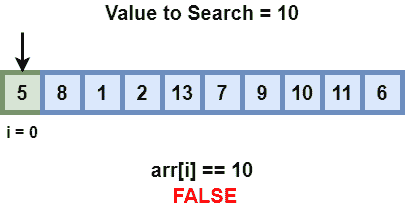
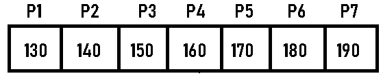
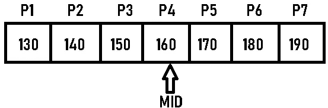
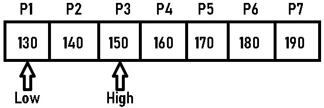
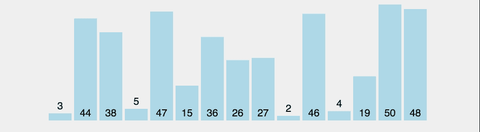
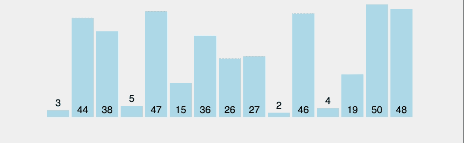
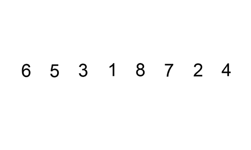

# 每个编程新手都应该知道的 7 个基本算法:第 2 部分

> 原文：<https://medium.com/codex/7-basic-algorithms-every-newbie-coder-should-know-part-2-425985e0ae69?source=collection_archive---------6----------------------->


本文是一个系列的第 2 部分，涵盖了每个编程新手都应该知道的 7 个基本算法。以下是该系列的计划:

*   [算法介绍:第一部分](/@manvendraaaa/7-basic-algorithms-every-newbie-coder-should-know-part-1-6119ca14e6df)
*   [搜索&排序算法:第二部分](/@manvendraaaa/7-basic-algorithms-every-newbie-coder-should-know-part-2-425985e0ae69)
*   [两个指针&滑动窗口:第三部分](/@manvendraaaa/7-basic-algorithms-every-newbie-coder-should-know-part-3-dc25feb68f66)

在本文中，我们将介绍最基本的搜索和排序算法。所以在整篇文章中，我将使用一个例子，7 个不同身高的人站成一条直线来解释算法。

## 线性搜索

这是最基本的搜索算法之一，最坏情况的时间复杂度为 O(n ),最好情况的时间复杂度为 O(1)。

> 定义:在计算机科学中，线性搜索或顺序搜索是一种在列表中查找元素的方法。它按顺序检查列表中的每个元素，直到找到匹配项或搜索完整个列表。



图片提供:[教程点](https://www.tutorialspoint.com/)

那么让我们用一个真实的例子来理解这个算法。正如我们所知，我们有 7 个不同身高的人随机站成一排&假设这些人的身高是 180、140、170、160、190、130、150 厘米&假设这些人的名字是 P1、P2……..P7。如果我们想找到一个身高 160 厘米的人，我们可以在这里使用线性搜索。我们开始传递一行人，并询问每个人的身高，如果身高等于 160 厘米，我们可以返回此人的位置或姓名，如果没有人，我们可以返回零值。在这个场景中，我们将询问每个人的身高，当我们到达 P4 时，我们将知道这个人的身高是 160 厘米。下面是线性搜索的伪代码，我希望你能尝试用你喜欢的编程语言来实现它。

```
**Step 1.** Take Input of the array and x.**Step 2\.** Start from the leftmost element of list/array and one by one compare x with each element of array/list.**Step 3.** If x matches with an element, return the index.**Step 4.** If x doesn’t match with any of elements, return -1.
```

## 二进位检索

二分搜索法是一种搜索算法，用于查找排序数组中元素的位置。简而言之，这种搜索算法通过在一次比较后忽略一半的元素来利用已经排序的元素集合。

> 定义:在计算机科学中，二分搜索法，也称为半区间搜索、对数搜索或二进制斩波，是一种在排序数组中查找目标值位置的搜索算法。二分搜索法将目标值与数组的中间元素进行比较。如果它们不相等，则消除目标不能位于其中的一半，并且在剩余的一半上继续搜索，再次取中间的元素来与目标值进行比较，并且重复这一过程，直到找到目标值。如果搜索结束时剩下的一半为空，则目标不在数组中。

视频提供: [Gyfcat](https://gfycat.com/)

现在让我们用理解线性搜索的同一个例子来理解二分搜索法，但在此之前，让我们看看二分搜索法的先决条件；与元素可以是任意顺序的线性搜索不同，二分搜索法中的数组必须排序。这是二分搜索法的唯一先决条件。

1.让我们考虑人们以这种方式站成一排。



按照升序排列的人。

2.设 x = 4 (P4)是被搜索的人。

3.在第一个和最后一个元素分别设置两个低和高指针。

4.找到数组中间的元素。arr[(低+高)/2] = 160。



(0+6)/2 = 3 == P4 == 160

5.如果 x == mid，则返回 mid。否则，将待搜索的元素与 m 进行比较。

6.如果 x > mid，则将 x 与 mid 右侧元素中的中间元素进行比较。这可以通过将 low 设置为 low = mid + 1 来实现。

7.否则，将 x 与 mid 左侧元素中的中间元素进行比较。这是通过将 high 设为 high = mid-1 来实现的。



新低和新高

8.重复这些步骤，直到低遇到高。我们找到了 P4。

这种搜索技术更快，更容易实现，不需要额外的空间&在很大程度上降低了程序的时间复杂度。最坏情况下的时间复杂度为 O(nlogn)。下面给出了这个算法的伪代码，我希望你能用你喜欢的语言实现这个算法。

```
**Step 1**. Let the element we are searching for, in the given array/list is X.**Step 2**. Compare X with the middle element in the array.**Step 3**. If X matches with the middle element, we return the middle index.**Step 4**. If X is greater than the middle element, then X can only lie in the right (greater)half subarray after the middle element, then we apply the algorithm again for the right half.**Step 5**. If X is smaller than the middle element, then X must lie in the left (lower) half , this is because the array is sorted. So we apply the algorithm for the left half.
```

## 整理

排序是对元素列表的排列，使得元素按升序或降序排列。有许多不同的排序技术。主要区别在于它们在程序中执行时所消耗的空间和时间。现在，我们将讨论以下排序技术:

*   选择排序
*   冒泡排序
*   插入排序

现在让我们详细讨论一下这些排序技术。

## 选择排序法

> 定义:选择排序是一种算法，它在每次迭代中从未排序列表中选择最小的元素，并将该元素放在未排序列表的开头。详细算法如下。



图片提供: [Gyfcat](https://gfycat.com/)

在你掌握了上面的图形之后，我将描述*选择排序*算法是如何工作的。我希望你从图像中得到一些东西；现在我将把它分解给你，让它变得非常简单易懂。我们首先假设图中的第一个条形(3)具有最小的高度，然后遍历数组，将其与每个条形进行比较，如果条形的高度更小，我们将它作为新的最小值，在图的末尾，我们将具有最小高度的条形(2)，我们将与第一个条形交换，从而在图中的第一个位置产生最小的条形。

我们将从第二个条(44)开始，作为下一次迭代的最小值，因为第一个条已经排序并位于正确的位置，我们将重复这个过程。我们需要进行 n-1 次迭代来对图进行完全排序，其中 n 是元素/条的数量。下面提供了相同的伪代码，我希望你能尝试用你喜欢的编程语言实现相同的功能。

```
**Step 1** − Set MIN to location 0**Step 2** − Search the minimum element in the list**Step 3** − Swap with value at location MIN**Step 4** − Increment MIN to point to next element**Step 5** − Repeat until list is sorted.
```

## 冒泡排序

> 定义:冒泡排序(Bubble sort)，也称为下沉排序(sinking sort)，是一种基本的排序算法，它遍历一个列表，比较相邻的元素，如果它们无序，就交换它们。列表被一次又一次地发送，直到它被排序。比较排序法是根据较小或较大的组件“冒泡”到列表顶部的方式命名的。这种简单的方法在现实世界中表现不佳，主要用作教学辅助。



图片提供: [Gyfcat](https://gfycat.com/)

在你掌握了上面的图形之后，我将描述一下*冒泡排序*算法是如何工作的。我希望你从图像中得到一些东西；现在我将把它分解给你，让它变得非常简单易懂。我们首先遍历图/列表，比较每一个相邻的成员，如果它们是无序的，就交换它们，到第一次迭代结束时，我们将在最后得到最大的元素。

在接下来的迭代中，我们将从第一个元素开始，重复比较和交换过程，但是这次我们将只进行倒数第二个元素，因为最后一个元素已经被排序并位于正确的位置。要对列表进行排序，我们必须执行 n-1 次，类似于选择排序，其中 n 代表列表中元素的数量。下面你可以找到同样的伪代码，我希望你能用你喜欢的编程语言实现它。

```
**Step 1.** In first cycle, Start by comparing 1st and 2nd element and swap if 1st element is greater. After that do the same for 2nd and 3rd element. At the end of cycle you will get max element at the end of list.**Step 2.** Now do the same in all subsequent cycles.**Step 3.** Perform this for (number of elements – 1) times.**Step 4.** You will get sorted list.
```

## 插入分类

> 定义:插入排序是一种简单的排序算法，它一次构建一个最终排序的数组(或列表)。在大型列表上，它的效率比快速排序、堆排序或合并排序等更高级的算法要低得多。但是，插入排序有几个优点。插入排序是一种排序算法，它一次一个元素地构建最终排序的数组(有时称为列表)。插入排序的平均和最坏情况运行时间为 O(n)，O(n)，因此在大多数情况下，更快的算法是更可取的。



图片提供: [Zybernetics](http://www.xybernetics.com/)

在您掌握了上面的图形之后，我将描述一下*插入排序*算法是如何工作的。我希望你从图像中得到一些东西；现在我将把它分解给你，让它变得非常简单易懂。

*插入排序*的工作方式类似于我们在纸牌游戏中排序手中的牌。假设上图中的数字在你的右手边，你想对它们进行排序；所以你从右边选择最左边的卡片，放在你的左手。我们可以说左手边的列表已经排序，因为只有一张卡片存在&现在我们将再次从右手中挑选最左边的卡片，并将其与左手中唯一的卡片进行比较，比较后，我们将按顺序排列。然后，我们将从右手中取出最左边的卡片，将其与左手中的所有其他卡片进行比较，并相应地放置，直到我们的左手中有三张排序的卡片，我们将重复这些过程，直到我们的右手中没有任何卡片。下面你会发现*插入排序* &的伪代码，我希望你会用你喜欢的编程语言实现它。

```
**Step 1:** Iterate through the array from arr[1] to arr[n].**Step 2:** Compare the current element (key) to the one that came before it.**Step 3:** Compare the essential element to the elements that came before it if it is smaller , To make room for the switched element, move the larger elements up one position.
```

在“每个新手程序员都应该知道的 7 个基本算法”系列的这一部分中，我们学习了两个基本的搜索算法和三个非常有用的排序算法，这将帮助你解决主题数组/列表、链表、字符串等问题。在本系列的下一节也是最后一节，我们将学习两个真正有趣的算法，叫做滑动窗口和双指针。我希望你们都和我一样兴奋。

> 编者按:首先感谢你一直阅读这篇文章，我希望你们都学到了新的东西。