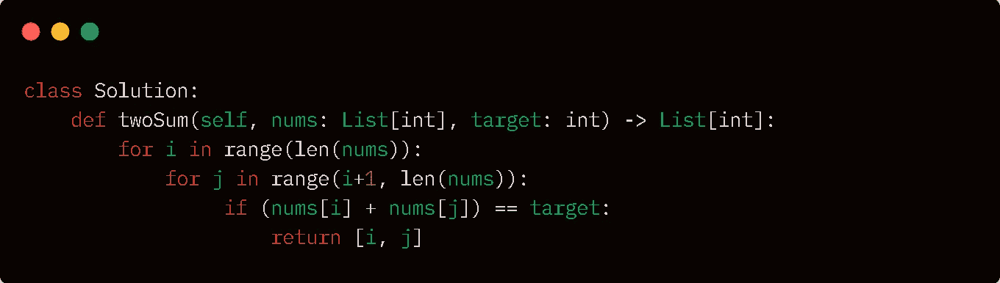
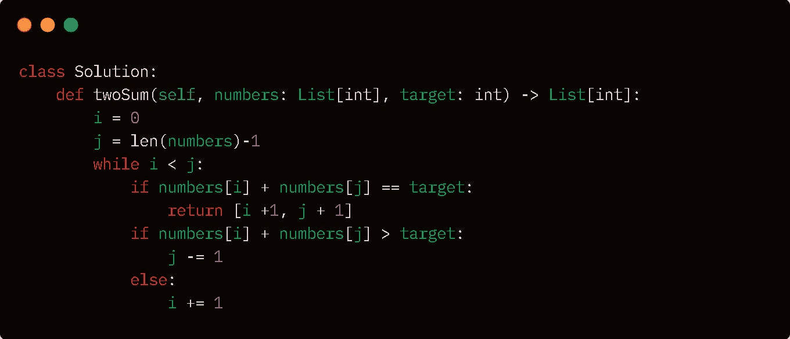
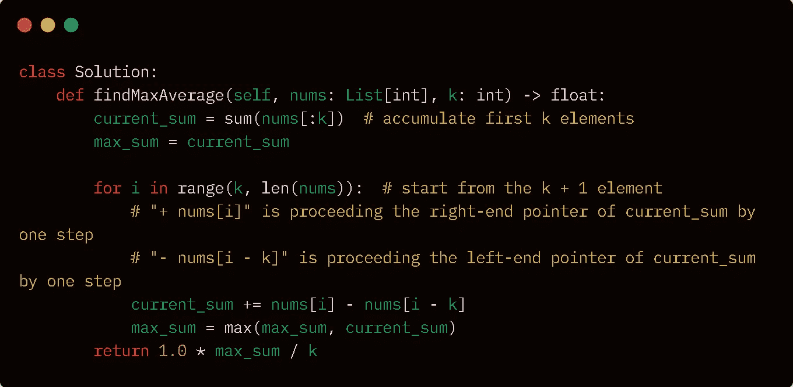

# 每个编程新手都应该知道的 7 个基本算法:第 3 部分

> 原文：<https://medium.com/codex/7-basic-algorithms-every-newbie-coder-should-know-part-3-dc25feb68f66?source=collection_archive---------5----------------------->


图片提供: [Unsplash](http://www.unsplash.com)

问候学习者！所以这篇文章将是我的小编《每个新手程序员都应该知道的 7 个基本算法》的结论。今天我们将讨论两个非常有趣并且在解决问题中广泛使用的算法，但是在此之前，我希望你们都去检查一下本系列的前两部分，如果你们还没有检查过的话。以下是该系列的计划:

*   [算法介绍:第一部分](/@manvendraaaa/7-basic-algorithms-every-newbie-coder-should-know-part-1-6119ca14e6df)
*   [搜索&排序算法:第二部分](/@manvendraaaa/7-basic-algorithms-every-newbie-coder-should-know-part-2-425985e0ae69)
*   [双指针&滑动窗口:第三部分](/@manvendraaaa/7-basic-algorithms-every-newbie-coder-should-know-part-3-dc25feb68f66)

开门见山今天我们将学习两种最广泛使用的算法/技术:*双指针&滑动窗口，*所以让我们以一种简单而有趣的方式来学习它们。

## 双指针算法

可以毫不夸张地说，两点技术是任何软件开发人员工具包中最重要的工具之一，甚至对于初学者来说，它也是一项必须学习的技术，因为它将在任何人的整个旅程中为他们提供帮助，甚至在他们的技术面试中。我们将通过问自己三个问题来理解这个技巧，这三个问题是:什么，为什么，如何？。

***什么是*** 双指针技术？
名字(*两个指针*)表明我们在这种技术中使用两个指针或标记来遍历类似列表/数组的可迭代对象，以在数据结构(例如列表/数组、字符串、链表)的单个循环中使用两个指针/标记来执行搜索操作。现在让我们来谈谈双指针技术的*变体*:

*   *反方向*:在这种情况下，每个指针/标记被放置在数组的相对两端，它们在遍历时彼此相向移动，直到它们相遇或满足其他条件。基于此变体的问题*两个指针*:

[](https://leetcode.com/problems/two-sum-ii-input-array-is-sorted/) [## 两个和 II -输入数组排序- LeetCode

### 给定一个已经按非降序排序的整数数组，找出两个数字，使它们相加…

leetcode.co](https://leetcode.com/problems/two-sum-ii-input-array-is-sorted/) 

*   *同向*:在这种情况下，每个指针/标记从头开始，一个慢速移动，另一个快速移动，直到满足某个条件。基于*两个指针*的变体的问题:

[](https://leetcode.com/problems/remove-duplicates-from-sorted-array/) [## 从排序的数组中删除重复项- LeetCode

### 给定一个按非降序排序的整数数组 num，就地删除重复项，使每个唯一的…

leetcode.com](https://leetcode.com/problems/remove-duplicates-from-sorted-array/) 

***为什么*** 要用两个指针的手法？
使用这种技术背后最突出的原因是根据数组是否排序，将问题的时间复杂度从 O(n3)或 O(n2)降低到 O(n)或 O(nlogn)。

***如何使用*** 两种指针技术？
我们通过上面提到的同一个问题来理解这一点，*两个 Sum(排序数组)*。所以问题如下:

```
Given an array of integers numbers that is already ***sorted in non-decreasing order***, find two numbers such that they add up to a specific target number.Return *the indices of the two numbers (****1-indexed****) as an integer array* answer *of size* 2*, where* 1 <= answer[0] < answer[1] <= numbers.length.**Example:
Input:** numbers = [2,7,11,15], target = 9
**Output:** [1,2]
**Explanation:** The sum of 2 and 7 is 9\. Therefore index1 = 1,index2 = 2.
```

我们可以从前面的问题中推断出，我们已经得到了一个排序数组和一个数字；我们必须遍历数组，找到两个这样的数字，它们加起来就是提供的数字，然后返回这些数字的索引。现在让我们来谈谈可以用来解决这个问题的方法:

1.蛮力|时间复杂度:O(n2)
2。双指针技术|时间复杂度:O(n)

第一种方法本质上非常简单，但仍然需要很多时间，我将解释这两种方法，只是为了指出明显的问题(时间复杂性)。

*暴力破解方法*:在暴力破解中，我们使用两个循环，外层循环一个接一个地迭代每个元素&内层循环做同样的事情，但是对于外层循环元素的每一次跳转，内层循环完成数组的整个迭代。在这种方法中，我们检查数组中每个元素与其他元素的总和，然后将其与给定的总和进行比较，检查是否相等。下面提供了相同的代码。



解决方案代码:暴力方法

*双指针技术:*在这个方法中，我们使用了两个指针/标记来发现排序后的数组中的元素，这些元素加起来就是想要的值。我们首先初始化两个指针，一个指向最左边的索引:start = 0，另一个指向数组的末尾:end = length(array)-1。现在，我们将遍历数组，直到开始小于结束，然后添加指针引用的元素，以查看它们是否匹配所需的数字。如果总和等于数字，我们可以返回开始和结束变量；如果总和大于所需的数字，我们将 end 变量减 1；否则，我们将 start 递增 1。因为数组是排序的，我们可以利用这样一个事实，如果我们减少变量 end，它所指向的数字将小于它之前的数字，降低总和&开始增加也是一样，它将增加总和。相同的代码已附在下面。



解决方案代码:双指针方法

## 滑动窗口算法

因此，在*双指针*算法之后，我们将讨论*滑动窗口*算法，因为在双指针技术之后，它也是任何软件开发人员工具包中最重要的工具之一，甚至对于初学者来说，它也是一项必须学习的技术，因为它将在任何人的整个旅程中&帮助每个人&，甚至在他们的技术面试中。我们将通过问自己三个问题来理解这个技巧，这三个问题是:什么，为什么，如何？。

***什么*** 是滑动窗口算法？
涉及线性序列的问题，如数组，可以使用滑动窗口方法解决。作为数组一部分的连续序列称为窗口。顾名思义，窗口在阵列上滑动。当对窗口中的元素执行某些操作时，窗口会进一步滑动。这种算法有各种各样的变体，但我们不会在本文中涵盖所有的变体，因为本文中我们将讨论最通用的一种。下面是一个可以使用这个算法的问题。

[](https://leetcode.com/problems/maximum-average-subarray-i/) [## 最大平均子阵列 I - LeetCode

### 给你一个由 n 个元素组成的整数数组 nums 和一个整数 k。求一个连续的子数组，它的长度…

leetcode.com](https://leetcode.com/problems/maximum-average-subarray-i/) 

***为什么*** 使用滑动窗口算法？
该算法通过降低时间复杂度来帮助我们，就像双指针算法一样&该算法的各种各样的问题和变体被开发人员社区的很大一部分使用。

***如何使用*** 滑动窗口算法？
让我们通过上面提到的同一个问题来理解这一点，*具有不同字符的大小为三的子串*。所以问题如下:

```
You are given an integer array nums consisting of n elements, and an integer k.Find a contiguous subarray whose **length is equal to** k that has the maximum average value and return *this value*. Any answer with a calculation error less than 10-5 will be accepted.**Example:
Input:** nums = [1,12,-5,-6,50,3], k = 4
**Output:** 12.75000
**Explanation:** Maximum average is (12 - 5 - 6 + 50) / 4 = 51 / 4 = 12.75
```

我们可以从上面的挑战中得出，给我们一个数字数组和一个数(k)，我们必须找到一个长度为(k)的连续子数组，它具有最大的平均值并返回最大的平均值。现在让我们来谈谈可以用来解决这个问题的方法:

1.蛮力|时间复杂度:O(n2)
2。滑动窗口技术|时间复杂度:O(n)

第一种方法本质上非常简单，但需要很多时间&对于这个问题，我希望你们都自己尝试一下，因为它非常简单。我们将讨论这个问题的*滑动窗口*方法。

*滑动窗口方法*:主要思想是建立一个大小为 k 的窗口，然后遍历该窗口穿过阵列，添加后面的元素并丢弃前面的元素，然后除以 k，找到并比较平均值，以获得最大的平均子阵列。所以我们创建两个变量:current sum 和 Max Sum，在将 Max Sum 设置为等于 Current Sum 之前，我们将前 k 个元素的和存储在 Current Sum 中。现在，我们开始遍历数组，从索引 k 开始，一直到最后，通过添加后面的元素并删除前面的元素来更新当前的总和，直到我们达到与窗口大小 k 相对应的最大总和，我们只需将它除以 k 即可获得平均值。这方面的代码可以在下面找到。



解决方案代码:滑动窗口方法

O verview:我们学习了两个非常有用的算法，在“每个新手程序员都应该知道的 7 个基本算法”系列的这一部分中，这两个基本但非常有用的算法将帮助你在技术面试中解决主题数组/列表、链表、字符串&中的问题。还有，这标志着这个系列的结束。

> 编者按:首先，感谢你坚持写完这篇文章；如果你学到了新的东西，请鼓掌并跟随。