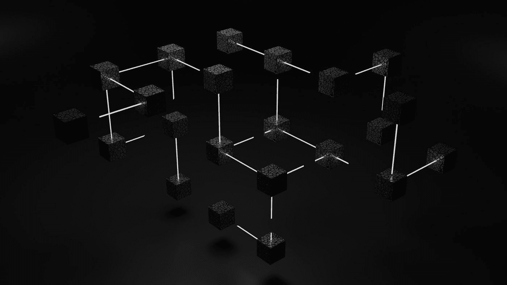

# 学习 Web 的 7 个最佳开源资源 3

> 原文：<https://medium.com/codex/7-best-open-source-resources-to-learn-web3-666fe7f54021?source=collection_archive---------2----------------------->

## 创造下一个大事件

由 [Unsplash](https://unsplash.com?utm_source=medium&utm_medium=referral) 上的 [Shubham Dhage](https://unsplash.com/@theshubhamdhage?utm_source=medium&utm_medium=referral) 拍摄的照片

Web3 是下一件大事。它仍然是新的和不断变化的。它提供了开发分散应用程序和使用基于区块链的技术所必需的工具。此外，它将使用人工智能和机器学习来开发更神奇的应用程序。我整理了一份 7 个 Web3 资源和开源项目的列表，它们会有所帮助…