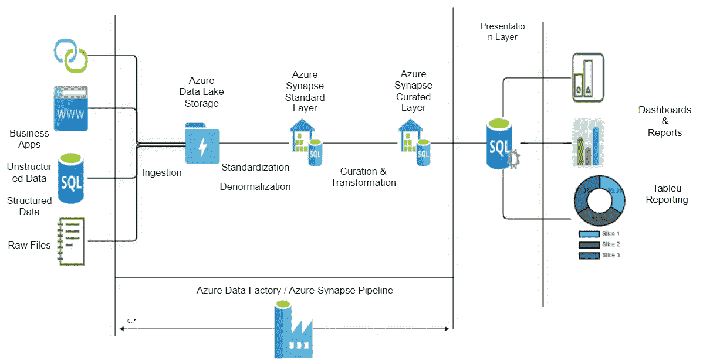
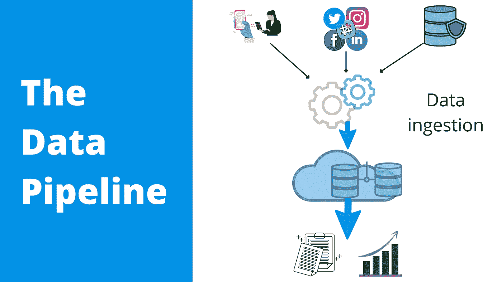
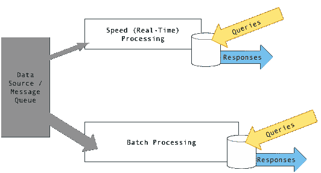

# 数据摄取的 7 个最佳实践

> 原文：<https://medium.com/codex/7-best-practices-for-data-ingestion-f336c6b5128c?source=collection_archive---------0----------------------->

## 数据工程 101

## 数据工程:超越宣传#1

**“数据工程是 2022 年最性感的新工作”**在需求和职业机会上已经超过数据科学。

如果你还没有看到对数据工程需求的天文数字般的增长，那么在过去的 2 年里，你很可能生活在一个山洞里。

炒作到底是为了什么？

为了回答这个问题，我们必须首先探索，

# 什么是数据工程？

Coursera 定义，

> *数据工程是为* ***采集*******存储*******分析*** ***规模的**数据而设计和构建系统的实践。*****

**嗯，有意思，但实际上是什么呢？让我们试着深入探讨上面强调的每一点。**

****从不同来源收集数据:****

**数据现在可以在各种结构化和非结构化数据集中获得。**

**它存在于文本、图像、视频、社交媒体平台、物联网(IoT)设备、流式传输数据的实时事件、传统数据库以及来自数据提供商和机构的数据中。**

**来源从未如此多样和动态。**

**连接不同类型的源、读取不同格式的数据并收集所有数据并不容易。**

****在标准存储库中存储数据:****

**一旦建立连接，将原始数据存储在一个公共位置是非常重要的。**

**在分析和理解数据之前，需要对数据进行清理。**

**数据还需要符合法规和标准。**

****最终利益相关者/数据消费者:****

**我们的业务利益相关者、应用程序、程序员、分析师和数据科学用例都从企业数据存储库中提取这些数据。**

**所有这些消费者都将试图分析和理解这些数据，以便了解业务并做出一些关键决策。**

****缩放基础结构:****

**最后，扩展是数据工程师最重要的任务之一。数据将呈指数级增长。加载、存储和分析数据的基础架构需要能够随着数据的增长而增长。**

**因此，我们已经了解了数据工程中涉及的基本工作和挑战。让我们试着更深入地研究前两个任务，收集和存储数据。**

# **数据摄取:**

**数据接收被定义为从大量来源吸收数据，然后将其传输到目标站点进行分析和存储的过程。**

****

**一个数据工程师花费超过 50%的时间编写不同的管道，将数据从一个地方移动到另一个地方。有两个基本框架可以实现这一点:**

1.  ****ETL:提取—转换—加载****
2.  ****ELT:提取—加载—转换****

**直观地理解，基本的区别在于应用转换时，在加载数据之前还是之后。**

**然而，在这两个框架中，共同的元素是能够提取数据并将其加载到另一个目的地。这是**数据摄取。****

**现在，根据广泛的分类，主要有 3 种类型的数据接收:**

1.  ****基于批处理的数据摄取:****

**基于批处理的摄取在定期安排的时间发生。数据是成批接收的。当企业需要监控每日报告时，这是很重要的，例如:不同商店的销售报告。这是最常用的数据接收用例。**

****2。实时/流数据摄取:****

**在诸如**变更数据捕获(CDC)** 等实时解决方案中，从源系统收集和传输数据的过程称为实时数据摄取。**

**CDC 或流数据实时捕获任何更改、新事务或回滚，并将更改的数据移动到目标，而不会影响数据库工作负载。**

**实时接收在电网监控、运营分析、股票市场分析、航空公司动态定价和推荐引擎等领域至关重要。**

****3。基于 Lambda 的数据摄取架构:****

**数据接收中的 Lambda 架构尝试使用批处理和实时接收的最佳实践。**

1.  ****批处理层:**根据整张图片计算数据。这更准确，但是计算速度较慢。**
2.  ****速度层:**用于实时摄取，计算出的数据可能不完全准确，但给出了数据的实时图像。**
3.  ****服务层:**来自批处理层的批处理视图形式的输出和来自速度层的近实时视图形式的输出被转发给服务。这一层对批处理视图进行索引，以便它们可以在特定的基础上以低延迟被查询。**

****

**图片来源:[维基百科](https://en.wikipedia.org/wiki/Lambda_architecture#/media/File:Diagram_of_Lambda_Architecture_(generic).png)**

**既然我们已经了解了什么是数据摄取，那么它看起来就相当简单了，只需从源复制数据并粘贴到目的地，对吗？**

**没有。**

**什么为什么？**

****数据接收面临哪些挑战？****

1.  **各种数据源需要定制的协议来连接**
2.  **源中数据的不同格式和标准**
3.  **读取和存储时数据的完整性**
4.  **数据质量和复制**

**这些只是其中的几个例子。**

**那么，我们如何确保摄取正确的数据呢？**

**我们可以通过遵循一些简单的多年来遵循的最佳实践。**

# **数据接收最佳实践:**

1.  ****在数据问题的源头添加警报****

**在源数据中添加警报将节省大量调试下游问题的时间。**

**在将数据丢失到存储库之前，可以进行基本的数据质量检查，如空列、重复记录和无效数据。**

**如果检查失败，必须触发警报，以便源团队进行修复。错误的记录可以被丢弃和记录。**

****2。在应用转换之前保留所有原始数据的副本****

**原始数据层必须是只读的，任何人都不应拥有更新权限。**

**在尝试清理或添加转换时，如果后续层出现故障，这将作为备份。**

****3。尽早设定期望和时间表，数据摄取并不容易****

**业务领导和项目经理经常高估或低估数据摄取所需的时间。**

**数据接收通常非常复杂，接收管道需要进行适当的测试。**

**因此，在构建管道所涉及的时间表和加载数据所花费的时间上设定利益相关者的期望总是好的。**

****4。自动化管道、使用流程编排、设置 SLA****

**数据接收管道应该是自动化的，以及所有需要的依赖性。**

**编排工具可用于同步不同的管道。**

**必须为每个管道设置 SLA，这将允许监控团队在任何管道运行更长时间的情况下进行标记。**

****5。数据摄取管道必须是等幂的****

**幂等性是数据接收管道的一个关键特征。**

****幂等性**是指如果多次执行一个操作，在初次执行后结果不会改变。**

**数学上 f(f(x)) = f(x)是一个幂等函数。**

**在数据集成的上下文中，幂等性使得数据摄取管道能够自我纠正。**

**最重要的是，它防止加载重复的记录。**

**实现相同目的的一些策略可以是:删除插入、向上插入、合并操作和查找任务。**

****6。模板化、重用开发框架****

**许多数据接收管道是重复的，因此为管道开发创建模板很重要。**

**如果您在您的管道中创建一个可重用的框架，交付工作将会大大减少。**

**企业总是会对吸收新数据的速度加快表示赞赏。**

****7。记录您的管道****

**这是最后一个也是最重要的一个需要反复灌输的习惯。**

**记录管道内部的输入、输出和逻辑极其重要。**

**该文档有助于节省调试、解释业务逻辑或创建业务的源到目的地映射的时间。**

**下周再见。**

****只要你准备好了，我有 3 种方式可以帮助你的职业发展:****

1.  **在这里 让我来帮你辅导你的职业之旅 [**。**](https://topmate.io/saikatdutta/8008)**
2.  **发展你的 LinkedIn 品牌，在这里获得多样化的****。******
3.  ****在这里掌控你的职业成长 [**。**](https://topmate.io/saikatdutta/8007)****

****和我预约时间:[https://topmate.io/saikatdutta](https://topmate.io/saikatdutta)****

****来源:****

1.  ****[Airbyte 博客](https://airbyte.com/blog/best-practices-data-ingestion-pipeline)****
2.  ****[数据摄取最佳实践](https://www.cmswire.com/information-management/data-ingestion-best-practices/)作者 [Moshe Kranc](https://www.cmswire.com/author/moshe-kranc/)****
3.  ****维基百科上的 [Lambda 架构。](https://en.wikipedia.org/wiki/Lambda_architecture)****
4.  ****[数据接收类型、最佳实践、框架&由 Hevodata 进一步简化 101](https://hevodata.com/learn/data-ingestion-types/#real-time) 。****
5.  ****[什么是数据工程师？由 Coursera](https://www.coursera.org/articles/what-does-a-data-engineer-do-and-how-do-i-become-one)****
6.  ****[数据工程中的幂等性](https://www.fivetran.com/blog/what-is-idempotence)****