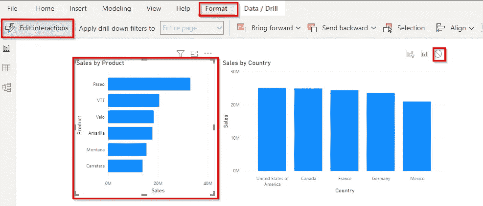
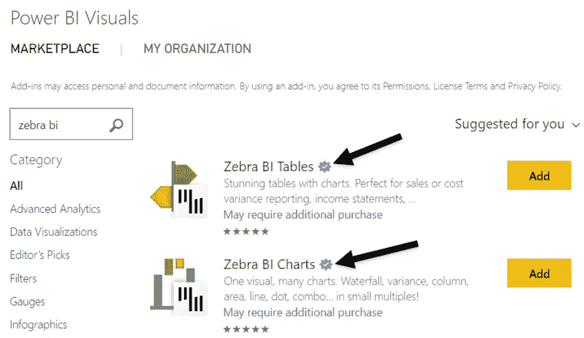

# 优化功率 BI 模型的 7 个最佳实践

> 原文：<https://medium.com/codex/7-best-practices-to-optimize-power-bi-model-4fd7a4e73147?source=collection_archive---------5----------------------->

在 Power BI dashboards 的开发过程中，我们通常倾向于创建报告并以良好的准确性将输出交付给客户，但有些仓促。在这个过程中，我们经常忽略优化性能和整体用户体验。虽然在最初的开发阶段，这可能不会出现，但随着用户需求和模型复杂性的增长:模型优化变得至关重要。

这里有一些帮助解决问题的提示

## 1.不要使用太多视觉效果:

仪表板的目的是用最少的视觉效果来表现复杂的情况。太多的视觉效果让用户难以理解，也影响了报告的表现。

> 根据“Power BI 优化指南”,报告每页不应超过 8 个视觉效果和一个表格。

## 2.消除视觉效果之间不必要的交互:

这一点通常被我们很多人忽略了。默认情况下，Power BI 支持页面上视觉效果之间的交互。有必要禁用不必要的交互。

要禁用交互:
选择视觉>格式>编辑交互>选择其他视觉以禁用过滤

## 3.检查自定义视觉效果的性能:

自定义可视化可能会满足您的客户端需求，但是使用性能分析器检查它们的性能是一个很好的实践。

> 视图>性能分析器

这里要注意的另一点是，只使用微软认证的视觉效果，因为它们通过了质量测试和公司的代码要求。

微软认证视觉示例

## 4.不要导入完整的数据集:

加载完整的数据集会使数据模型膨胀。为了流畅的用户体验，最好加载有限的行和列。

## 5.不要使用太多切片机:

切片器便于用户挖掘细节，但是每个切片器需要两次查询，这会降低报告的性能和容量。
查看和减少切片器:通过过滤器面板，您可以评估切片器并删除那些不常用的。

## 6.限制数据模型中的复杂聚合:

Power BI 作为一种工具，在可视化方面比在数据建模方面支持得更好，因此最好同样使用它，而不要在其中进行复杂的聚合和转换。
阅读我下面的博客，它推荐了实现你所有转变的最佳地点。

> [**Power BI 桌面中 4 种数据转换方式**](/@paraspatil12/data-transformation-methods-in-power-bi-desktop-2fec8ab400db)

## 7.将报表和数据源存储在同一位置:

最好将 Power BI desktop 文件驻留在数据源所在的同一报表服务器位置。

*如果您的数据源服务器位于您公司的伦敦办公室，建议您将 Power BI 桌面文件托管在同一位置。*

> 结论:有必要从仪表板开发的一开始就优化 Power BI 报告，并且还应该在仪表板开发的整个生命周期中定期进行监控。

让我知道，如果你知道任何其他优化技术。

干杯！