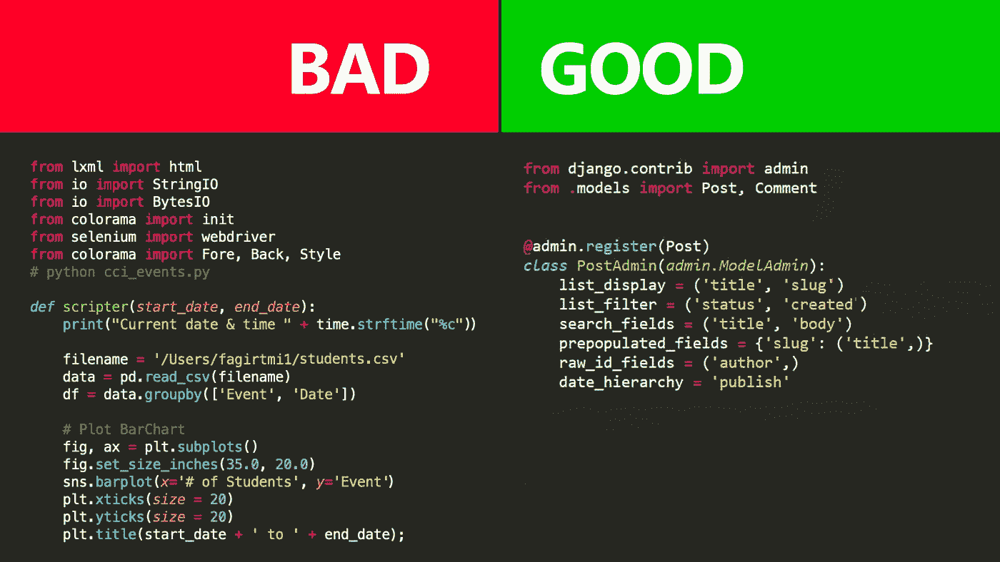

# Python 编程语言的 7 个最佳安全实践

> 原文：<https://medium.com/codex/7-best-security-practices-in-python-programming-language-5e0d6b46aa65?source=collection_archive---------5----------------------->

## 确保你在开发中有几层保护

Python 已经迅速成为当今最流行的编程语言之一，这意味着越来越多的程序员需要 Python 开发的安全最佳实践。本文旨在为**提供 7 种最佳安全性** …