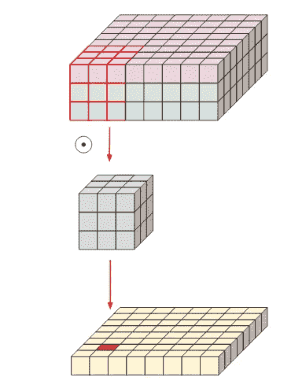
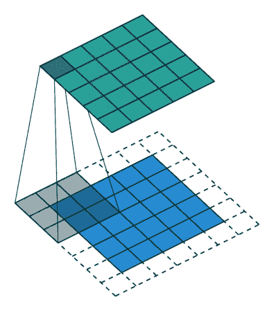
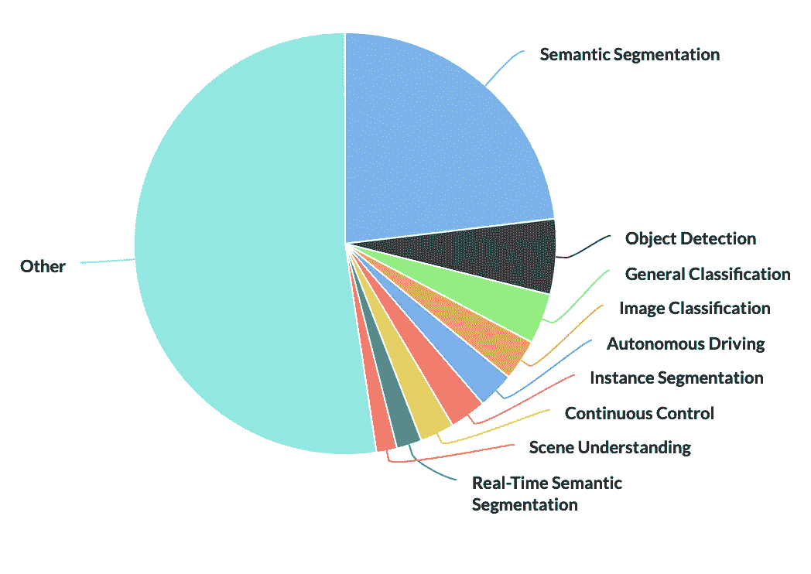
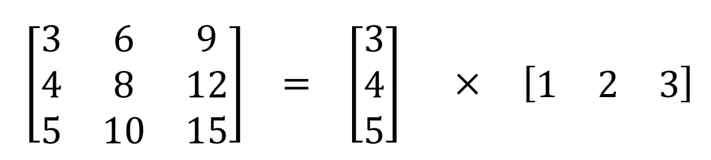
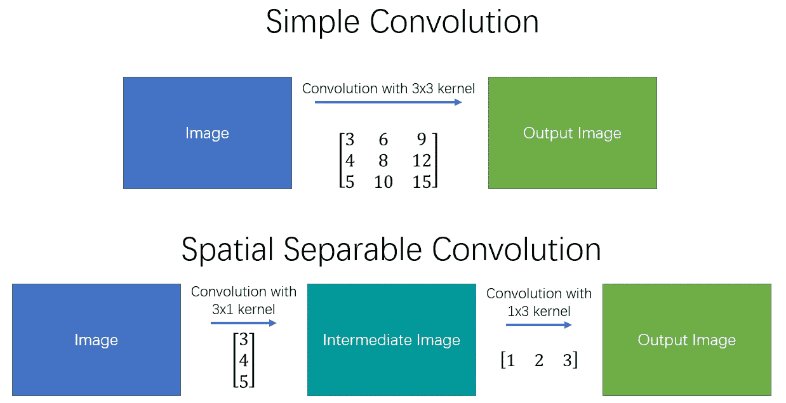
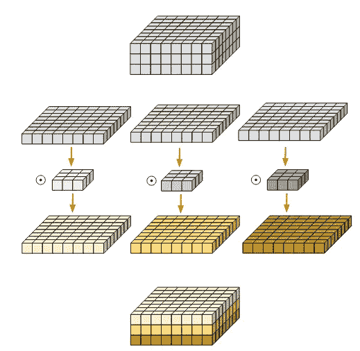
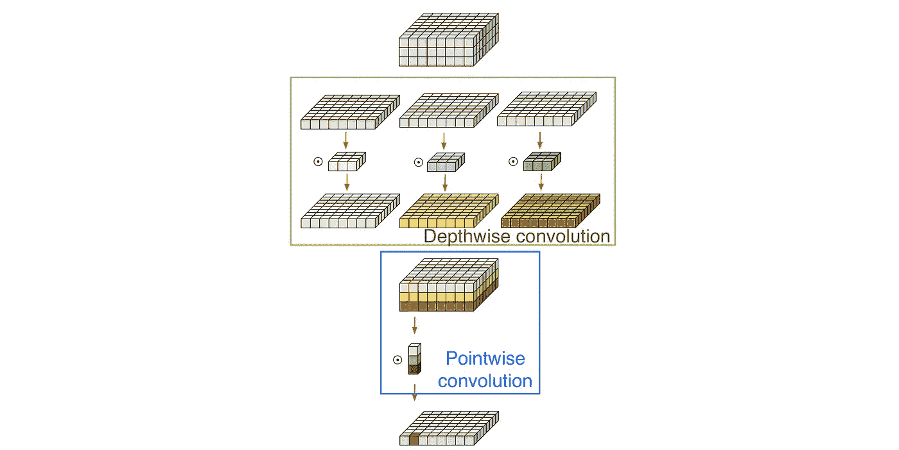

# 设计 CNN 的 7 种不同卷积，将提升你的计算机视觉项目

> 原文：<https://medium.com/codex/7-different-convolutions-for-designing-cnns-that-will-level-up-your-computer-vision-project-fec588113a64?source=collection_archive---------3----------------------->

## 对基本、转置、扩张、可分、深度和点态卷积及其应用的深入评论。

照片由[汉娜·布斯](https://unsplash.com/@hannahbusing?utm_source=medium&utm_medium=referral)在 [Unsplash](https://unsplash.com?utm_source=medium&utm_medium=referral) 上拍摄

最近关于 CNN 架构的研究包括如此多不同的卷积变体，这让我在阅读这些论文时感到困惑。我认为，仔细研究一些更流行的卷积变体的精确定义、效果和用例(在计算机视觉和深度学习中)是值得的。这些变体旨在节省参数计数，增强推理，并利用目标问题的某些特定特征。

这些变体中的大多数都简单易懂，因此我将重点放在理解每种方法的好处和用例上。这些知识有望帮助你理解最近 CNN 架构背后的直觉，并帮助你设计自己的网络。

# 回旋

让我们对卷积的基本形式做一个简短的概述。根据 PapersWithCode 中的描述，

> *卷积***是一种矩阵运算，由一个内核和一个小的权重矩阵组成，它滑过输入数据，与它所在的输入部分执行逐元素乘法，然后将结果相加成为输出。**

**

*这种操作对于处理图像是有利的，因为:*

1.  *它们的参数效率极高，因为图像的不同位置共享相同的权重，因此参数的数量与图像大小不成比例。*
2.  *卷积基本上是平移不变的。也就是说，输出不受图像中常见的小平移和大平移的影响，这与 MLP 不同，MLP 对于 1 像素平移通常会给出非常不同的结果。*

*卷积的输出形状和复杂度可以使用以下参数进行配置:*

*   *内核大小:内核的维度，通常使用(3×3)的内核大小。*
*   *填充:如何填充图像的边缘，以保持卷积后的图像大小。例如，上面的演示使用了 1 个像素的填充。描述像素数和填充这些像素的规则。*
*   *步长:扫描图像时内核的步长。通常设置为 1 以保持数据形状，或者设置为 2 以对其进行缩减采样。上面的演示使用的步幅为 2。*

**

*来源:[伊莱·本德斯基](https://eli.thegreenplace.net/2018/depthwise-separable-convolutions-for-machine-learning/)*

*通过组合通过不同核卷积的每个通道的结果来预测每个输出通道。因此，需要形状为 K×K 的 C_in 核来计算一个输出通道。其中 K 表示内核大小，C_in、C_out 分别表示输入和输出通道的数量。*

***#参数** : **K×K×C_in×C_out***

***计算** : **H×W×C_in×C_out×K×K** (步幅=1 的情况下)*

***用例**:这种卷积层几乎用于计算机视觉的每个子任务。这些包括监督任务，如图像和视频分类、对象检测、分割和合成任务，如图像生成、图像超分辨率、图像到图像传输。还存在视觉之外的应用，例如用于序列建模和 3D 相关应用的 1D 卷积。*

## *逐点卷积(1x1 卷积)*

*逐点卷积是具有 1×1 个核的卷积层的另一种说法。它们也被称为通道上的*卷积*或*投影层*。为什么会有人用这个？有两种主要的使用情形:*

1.  *用于改变输入的维度(也称为多个通道)。*

*   *一些网络如 Inception 连接从不同核计算的特征，这导致过多的通道，因此逐点卷积被应用来管理通道的数量。*
*   *当使用逐点卷积来压缩特征时，计算量大的模块，如自我注意模块(如挤压和激励)更可行。*
*   *当用元素方式的和或积组合两个内积时，我们有时需要匹配通道的数量。*

*该操作可以被视为沿着输入特征图的深度计算多个加权和。它可以有效地总结它们。*

*2.它以可忽略不计的成本创建了通道依赖性。这尤其是通过与缺乏这种依赖性的深度方向卷积相结合来利用的。*

***#参数** : **C_in×C_out***

***计算** : **H×W×C_in×C_out***

## *转置卷积(反卷积/反卷积)*

*反卷积明确计算卷积层的数学逆。虽然它广泛用于类视觉或信号处理，但它在深度学习中并不重要，因为操作的参数可以通过梯度下降来学习。*

***

左:步幅=1，右:步幅=2* 

*转置卷积是使用卷积对图像大小进行上采样的一种更简单的方法。当步幅为 1(左)时，操作与经典卷积没有区别。对于 n>1 的跨距，输出形状扩展了 n 倍。这是通过在像素之间填充 0 来创建所需大小的扩展图像，并对扩展图像执行卷积来实现的。*

*虽然转置卷积不会隐式计算卷积的逆，但这对于深度学习来说并不重要，因为所需的滤波器(可能是逆滤波器)总是可以通过梯度下降来学习。它充分实现了增加数据空间大小的功能。*

*重要提示:虽然转置卷积经常被混淆，但它不是反卷积/反卷积。*

***#参数:K×K×C_in×C_out)***

***用例**:转置卷积用于需要上采样的网络架构。一些例子是用于语义分割的编码器-解码器型网络、自动编码器或图像合成和生成网络中的用途。转置卷积的一个问题是棋盘格伪影，它可能对图像生成/合成造成问题。这个话题超出了这篇文章的范围，应该有一个自己的话题。更多信息，请参考谷歌大脑的这篇文章。*

**来源:**

*   *[*https://en.wikipedia.org/wiki/Deconvolution*](https://en.wikipedia.org/wiki/Deconvolution)*
*   *[*https://medium . com/@ mars Xiang/convolutions-转置与反卷积-6430c358a5b6*](/@marsxiang/convolutions-transposed-and-deconvolution-6430c358a5b6)*
*   *[*https://naokishibuya . medium . com/up-sampling-with-transposed-convolution-9 AE 4 F2 df 52d 0*](https://naokishibuya.medium.com/up-sampling-with-transposed-convolution-9ae4f2df52d0)*

## *扩张卷积(阿特鲁卷积)*

*感受域是模型可以参考的原始图像的范围，用于对该步骤的一个像素进行推断。例如，具有一个 3×3 卷积的模型的输出可以考虑来自相对于每个像素的空间位置的 3 个像素的感受野的信息，而具有两个 3×3 卷积的模型具有相对于该位置的 5 个像素的感受野。*

*增加核大小是增加感受野的一种方式，但是计算量也增加得非常快。对图像进行下采样还具有增加感受野的效果，因为例如 8×8 特征图中的 3×3 卷积覆盖了图像的更多部分。三个 3×3 卷积足以在 8×8 特征空间中考虑用于推断的整个图像。*

*在较低的空间维度上计算特征对于图像分类来说基本上是没问题的，但是对于具有高分辨率输出的任务，尤其是语义分割，这会导致显著的信息损失。*

**

*膨胀卷积是一种卷积，其中内核的像素是间隔的(用 0 填充)。间距也被认为是一个超参数，它通常具有不同的值，从上面演示中的 2 到 DeepLab 模型中的 24 这样的大间距。它在不增加计算量的情况下增加了内核的大小。这种设计能够从更大的感受野进行非常有效的计算，而没有信息损失或增加层数的需要。*

**

*扩张卷积的使用案例[https://paperswithcode.com/method/dilated-convolution](https://paperswithcode.com/method/dilated-convolution)*

***用例**:在语义分割中显示最重要的用途，但在其他任务的轻量级/移动 CNN 架构中也被考虑。*

*提出于:[通过扩张卷积的多尺度上下文聚合](https://paperswithcode.com/paper/multi-scale-context-aggregation-by-dilated)*

## *空间可分离卷积*

**

*来源:[中国汪锋](https://towardsdatascience.com/a-basic-introduction-to-separable-convolutions-b99ec3102728)*

*一些 3×3 矩阵可以表示为两个向量的矩阵乘法。因为 3×3 内核也是一个公共矩阵，所以它*可以*分成一个 3×1 和一个 1×3 内核，但是执行相同的操作。*

**

*资料来源:[中国汪锋](https://towardsdatascience.com/a-basic-introduction-to-separable-convolutions-b99ec3102728)*

*具体来说，如上图所述，空间可分离卷积将原始卷积替换为两个阶段。这样，每个内核的参数数量和操作数量从 9(3×3)减少到 6。然而，众所周知，不是所有的 3×3 核都可以分离，因此空间可分离卷积会限制模型的能力。*

***#参数** : **(K+K)×C_in×C_out***

***计算**:**h×w×C _ in×C _ out×(K+K)***

***用例**:由于参数数量少得多，空间可分卷积有时用于模型压缩和轻量级架构。*

**来源:**

*   *[*https://towards data science . com/a-basic-introduction-to-separable-convolutions-b99ec 3102728*](https://towardsdatascience.com/a-basic-introduction-to-separable-convolutions-b99ec3102728)*
*   *[*https://eehoeskrap.tistory.com/431*](https://eehoeskrap.tistory.com/431)*

## *深度方向卷积*

**

*来源:[伊莱·本德斯基](https://eli.thegreenplace.net/2018/depthwise-separable-convolutions-for-machine-learning/)*

*深度方向卷积不是对每个通道的结果进行卷积和组合，而是在每个通道上独立地执行，并且结果被堆叠。我们可以直观地看到，只有当输入和输出通道的数量一致时，这才会起作用。*

*深度方向卷积具有很高的参数和计算效率，因为参数的数量和计算复杂度都除以输出通道的数量，输出通道的数量通常高达 1024。然而，速度优势与运算数量的减少不成比例，因为深度方向卷积在现代硬件上不如传统卷积优化。*

***#参数**:T4 k×k×C _ in*

***计算** : **H×W×C_in×K×K***

***用例**:深度方向卷积是构建参数和计算效率更高的更复杂变体和卷积块的关键组件。*

## *深度方向可分卷积*

*深度方向卷积，然后是点方向卷积。由于深度方向卷积在通道之间没有连接，我们用点方向卷积连接它们。Xception 的作者发现在深度方向卷积后加上非线性是有用的。完整的过程如下图所示。*

**

*来源:[伊莱·本德斯基](https://eli.thegreenplace.net/2018/depthwise-separable-convolutions-for-machine-learning/)*

*空间可分离卷积在经典卷积中分离 x 和 y 轴。在这种情况下，深度方向可分离卷积可以被视为分离通道维度。*

*与普通深度方向卷积相比，计算复杂度略有增加，尽管仍然比传统卷积小得多。然而，与简单的深度方向卷积不同，它在许多经验实验中有效地模拟了规则卷积，并在现代 CNN 架构中广泛使用。*

***#参数** : ( **K×K+C_out)×C_in***

***计算**:**h×w×C _ in×(K×K+C _ out)***

***使用案例**:exception、V1/V2 移动网络、V1 高效网络(MnasNet)/V2 等等*

*你可以在[例外:深度可分卷积的深度学习](https://arxiv.org/pdf/1610.02357.pdf)的第 2 节中找到深度可分卷积的复杂历史*

*在这篇文章中，我们回顾了一系列卷积变体，这些变体被提议在某些情况下取代传统的卷积层。这些模块各有优缺点，用于解决不同的问题。在后续文章中，我们将回顾卷积设计，它将进一步增强我们创建 CNN 架构的工具箱。*

*请在评论里说说建议或者问题。我会尽量在最多两天内回复你们所有人。*

**令人惊叹的图像(动画)由*[*vdumoulin*](https://github.com/vdumoulin)*在* [*麻省理工学院许可*](https://github.com/vdumoulin/conv_arithmetic/blob/master/LICENSE) *(在许可说明下免费提供！).**