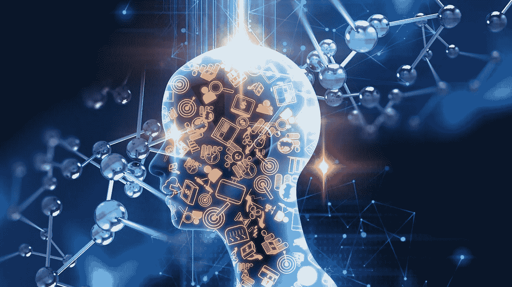

# 2022 年学习人工智能的 7 个简单步骤

> 原文：<https://medium.com/codex/7-easy-steps-to-learning-artificial-intelligence-ai-in-2022-59e04ff2ae0?source=collection_archive---------14----------------------->

## 人工智能是本世纪最重大的突破之一。许多部门的专家研究了它的潜力，并为它找到了新的应用。

图片:[https://wallpaper cave . com/super-artificial-intelligence-wallpapers](https://wallpapercave.com/super-artificial-intelligence-wallpapers)

起初，人工智能一点也不像我们在科幻小说中看到的复杂机器人…