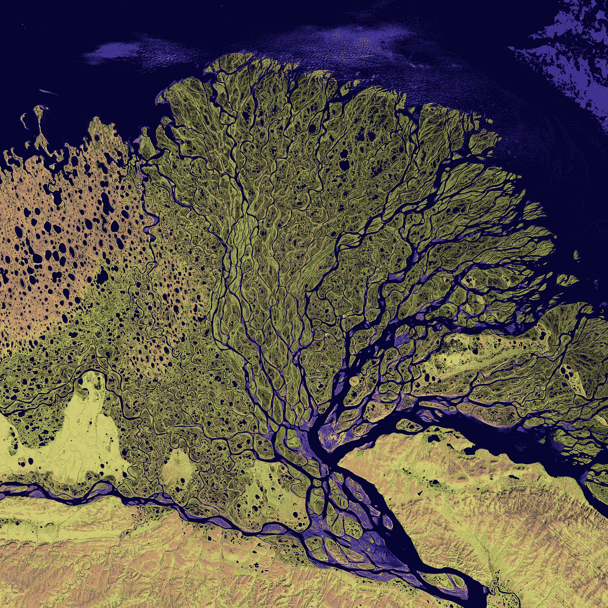

# 7 个免费的自然保护项目空间数据库

> 原文：<https://medium.com/codex/7-free-spatial-databases-for-nature-conservation-projects-cca163eee8e6?source=collection_archive---------10----------------------->

美国地质勘探局在 [Unsplash](https://unsplash.com?utm_source=medium&utm_medium=referral) 上拍摄的照片

在几十个免费的空间数据中，这一个是针对生物多样性**项目的，这些项目需要土地使用、土地覆盖、交通、气候和栖息地数据**。此外，我总结了使用每种平台的优势，并包括关于可用数据的**比例**、**格式**和**投影**的信息。