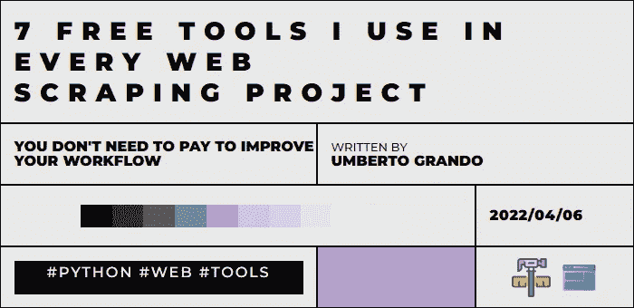

# 我在每个网络抓取项目中使用的 7 个免费工具

> 原文：<https://medium.com/codex/7-free-tools-i-use-in-every-web-scraping-project-59b9856a99f4?source=collection_archive---------4----------------------->

你好世界

今天我们来看看我在做网络抓取项目时经常使用的一些工具。这些工具将分为以下几类:

*   编程；编排
*   排除故障
*   储存；储备
*   数据可视化