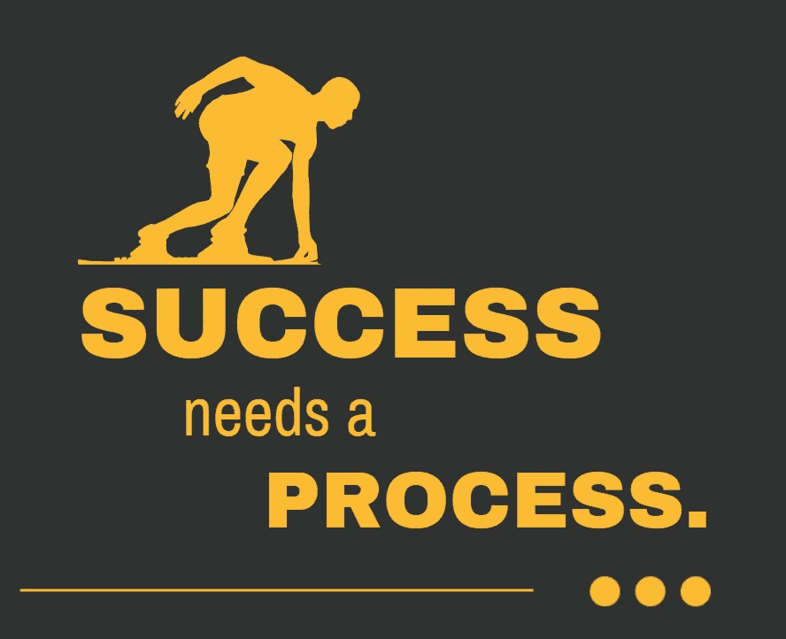

# 成功程序员的 7 个习惯

> 原文：<https://medium.com/codex/7-habits-of-highly-successful-coders-839ed8ab8b1b?source=collection_archive---------2----------------------->

## 你可以很容易地练习成为一个超级有效的程序员的习惯

使用 Canva 创建

成功的程序员与众不同。他们思考方式不同，工作方式不同，他们的习惯使他们与众不同。

成功的程序员以他们的工作为荣，并不断努力提高他们的技能。他们总是在寻找改进的方法…