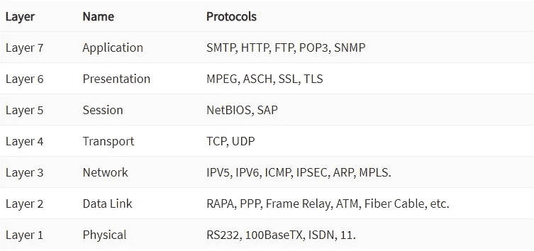

# 易于理解的 7 层网络协议

> 原文：<https://medium.com/codex/7-layer-network-protocols-easily-explained-e11e3e09f34d?source=collection_archive---------13----------------------->

我们谁不是这样呢？我们每天发送和接收成千上万的数据，却不知道到底发生了什么。我们的电子移动设备让我们的日常生活变得更加轻松，同时也决定了我们的生活。在本文中，我将让您深入了解连接到[网络](/codex/a-brief-insight-into-networks-2171f1e9aea1)的设备所控制的过程。

https://unsplash.com/photos/ahi73ZN5P0Y

# OSI 模型简介

开放系统互连(OSI)模型是一个概念框架，它定义了网络如何相互通信以及如何将数据从发送方发送到接收方。

> 要了解更多关于 7 层 OSI 模型的细节，请阅读我的文章:
> [发送&接收——7 层 OSI 模型](/@sebastianstreng96/send-receive-the-7-layer-osi-model-e475829b999)

# OSI 模型协议

[https://www.guru99.com/layers-of-osi-model.html#12](https://www.guru99.com/layers-of-osi-model.html#12)

## 第 7 层

*   SMTP——简单邮件传输协议；
    用于在互联网上传输电子邮件的基本协议
*   **HTTP —超文本传输协议；**
    客户端和 web 服务器之间通信的常用协议标准。
*   **FTP —文件传输协议；**
    通过 IP 网络进行文件传输的网络协议。FTP 用于从客户端向服务器上传文件或从服务器向客户端下载文件
*   **POP3 —邮局协议 3；**
    接收邮件的流程。使用这种传输协议，只有电子邮件从相应提供商的服务器下载。
*   **SNMT——简单网络监控协议；**

## 第六层

*   **MPEG —运动图像专家组；**
    指用于将视听数据编码成数字压缩格式(如电影、视频或音乐)的标准。
*   **ASCH —非对称同步信道跳变**
*   **SSL —安全套接字层；**
    保护互联网连接和两个系统间传输的敏感数据的标准技术。
*   **TLS —传输层安全；**
    用于保护互联网上数据传输的加密协议。它旨在防止在客户端和服务器之间的通信中交换的数据被窃取和滥用。

## 第五层

*   **NetBios —网络基本输入输出系统；**
    允许局域网内不同计算机上的应用程序进行通信的程序。
*   **SAP —会话公告协议；**
    对 TCP/IP 协议的扩展，扩展后包括一个长度字段和一些错误信息选项

## 第 4 层

*   **TCP —传输控制协议；**
    定义如何建立和维护网络对话的标准，应用程序可以通过该标准交换数据。TCP 使用互联网协议(IP ),该协议定义了计算机如何相互发送数据包。
*   **UDP —用户数据报协议；**
    通信协议主要设计用于在互联网上的应用程序之间建立低延迟、容错的连接。

## 第三层

*   **ICMP —互联网控制消息协议；**
    ICMP 的主要任务是传输来自 IP、TCP 和 UDP 协议的状态信息和错误消息。
*   **IPSEC —互联网协议安全；**
    互联网协议(IP)的协议扩展集合。这些扩展使得能够对通过 IP 传输的信息进行加密和认证，并确保在诸如因特网的 IP 网络中的安全通信。
*   **ARP-地址解析协议；**
    将 32 位地址转换为 48 位地址，反之亦然。这是必要的，因为在 IP 版本 4 (IPv4)中，这是当今互联网协议(IP)最常用的变体，IP 地址是 32 位长，但是 MAC 地址是 48 位长。
*   **MPLS——多协议标签交换；**
    不同的标签被分配给 IP 数据包，这使得路由器可以利用网络中的最优路由非常快速地发送数据包。这可以创建更稳定和强大的连接类型。

***其余层仅限于通过电缆或外设等硬件进行数据传输***

# 请查看我的其他文章:

*   [LINQ——如何避免 C#中的嵌套循环](/codex/linq-how-to-avoid-nested-loops-in-c-ed4ae19886e4)
*   [。Net C# —干净的架构&依赖-反转-原则](/dev-genius/net-c-clean-architecture-dependency-inversion-principle-7ea64f586c58)
*   [编程范例—简介](/dev-genius/programming-paradigms-a-very-short-brief-5324908640bd)
*   [C# —面向对象编程](/codex/c-object-oriented-programming-oop-2d92a5cd336f)
*   [C# —简单解释的单一责任](/@sebastianstreng96/c-single-responsibility-easily-explained-e3fabbf0d877)
*   [OCP——真正重要的是什么](/@sebastianstreng96/ocp-what-really-matters-610159d600dc)
*   [提高程序员积极性的 8 大技巧](/@sebastianstreng96/top-8-tips-to-improve-your-motivation-as-programmer-be63b2baaf7e)
*   [网络透视](/codex/a-brief-insight-into-networks-2171f1e9aea1)
*   [发送&接收——7 层 OSI 模型](/codex/send-receive-the-7-layer-osi-model-e475829b999)