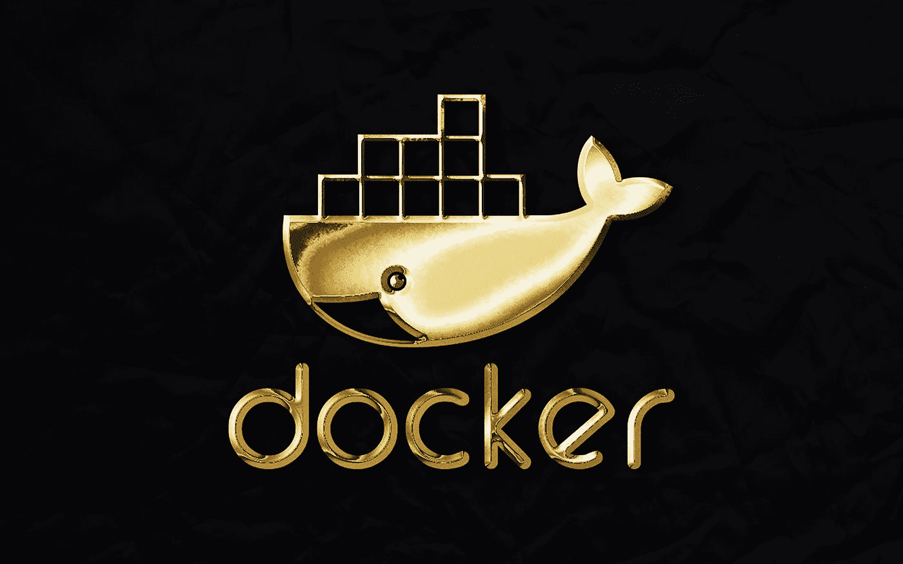

# 开发人员必须尝试的 7 个 Docker 扩展

> 原文：<https://medium.com/codex/7-must-try-docker-extensions-for-developers-f49a57d6278a?source=collection_archive---------9----------------------->

## 面向开发者的 Docker 扩展使得创建和测试新的应用程序变得容易。

鲁拜图·阿扎德在 [Unsplash](https://unsplash.com?utm_source=medium&utm_medium=referral) 上的照片

Docker 在 DockerCon 2022 上宣布了 Docker 扩展，这将帮助开发者使用第三方工具扩展他们的能力。对于正在为工作寻找合适工具的开发人员来说，这是一个好消息。有了 Docker 扩展，他们将…