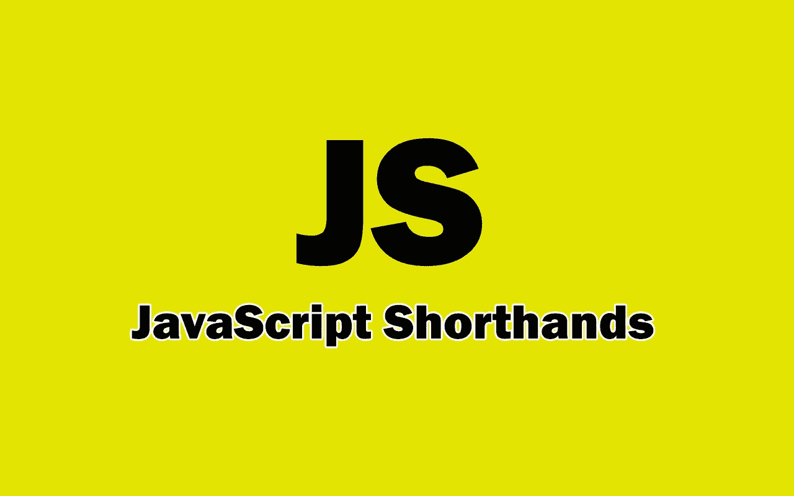

# 你应该知道的 7 个强大的 JavaScript 快捷键

> 原文：<https://medium.com/codex/7-powerful-javascript-shorthands-that-you-should-know-56a953e0c3b?source=collection_archive---------0----------------------->

## 一个有用的 JavaScript 简写列表，可以用来加速编码过程。

作者用❤️️创造的形象。

如今，JavaScript 是一种非常强大的编程语言。你可以用它做很多事情。除此之外，JavaScript 有一个巨大的生态系统，允许您发现许多有用的工具、框架和…