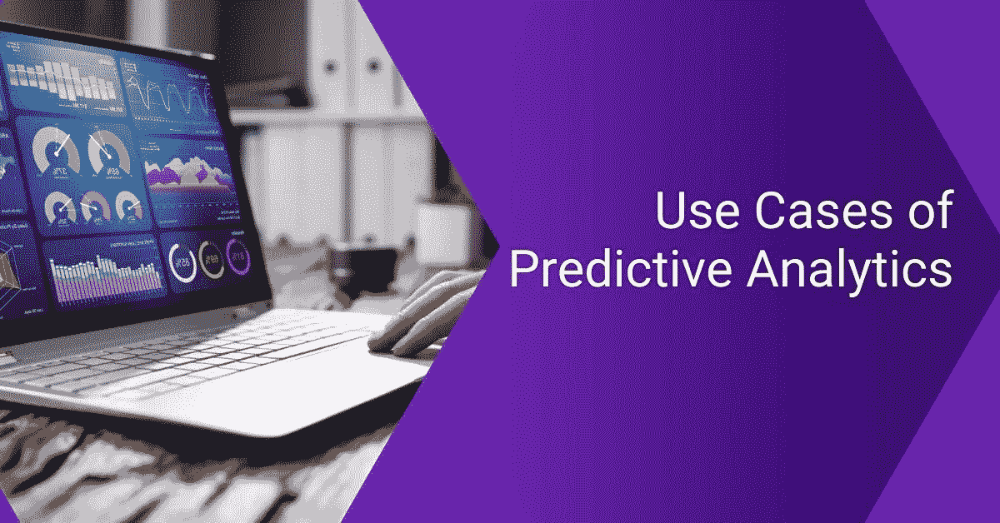

# 预测分析的 7 个真实使用案例

> 原文：<https://medium.com/codex/7-real-world-use-cases-of-predictive-analytics-df731eac4114?source=collection_archive---------22----------------------->

预测未来给企业带来竞争优势。人工智能带来了预测分析——这使预测更进了一步。预测分析，通常被称为高级分析，使用机器学习和商业智能来确定未来的结果。

大多数预测分析模型使用过去的数据并包含变量。历史数据是识别预测分析项目中的模式和趋势的关键。如今，企业需要预测来制造更好的产品，确定服务市场的方式，并降低运营成本。

像亚马逊和网飞这样的公司使用预测分析营销策略来锁定客户并提供更好的用户体验。亚马逊利用过去的购买和浏览历史向用户推荐产品。

另一方面，网飞在其推荐引擎中使用预测分析模型来预测用户行为，并推荐电视节目和电影。它有一个强大的引擎，可以根据用户过去的观看习惯预测准确的偏好。

本文将重点介绍[预测分析在商业和行业中的 7 个真实用例](https://blogs.sap.com/2021/07/09/7-real-world-use-cases-of-predictive-analytics/)。如今，几乎每个行业都在日常运营中使用预测分析。在讨论使用案例之前，我们将首先介绍什么是预测分析。

> **结账:** [**机器学习:你需要知道的一切**](https://www.botreetechnologies.com/blog/machine-learning-everything-you-need-to-know/)

# 什么是预测分析？

预测分析利用历史数据来预测未来的趋势和模式。预测分析使用这些数据，并确定变量之间的相关性。它有助于预测某些变量的未来值，使企业能够降低风险和成本。

例如，公司可以使用产量和收入来确定未来几个月的收入，并确定其盈利能力。该模型将关注两个变量，其中一个是从属变量，另一个是独立变量。

有各种预测分析模型—分类模型、聚类、预测、时间序列等。它们都是基于以多种不同方式排列的历史数据来预测未来值的。

**让我们来看看** [**的应用和现实世界中使用的**](https://www.botreetechnologies.com/blog/top-10-python-use-cases-and-applications/) **的预测模型。**

# 预测分析的 7 个真实使用案例

如今，企业经常使用预测分析来锁定客户并实现更好的运营效果。在营销、制造、房地产、软件测试、医疗保健等领域，预测分析的例子数不胜数。

预测分析模型集成在应用程序和系统中，以确定未来的结果。以下是预测分析项目的 7 个真实使用案例:

**预测购买行为**

*   预测分析的最大用途之一是预测零售业的购买行为。公司使用这些工具来了解他们的客户。公司使用[高级分析](https://www.botreetechnologies.com/blog/simplifying-reporting-and-analytics-with-rpa-technology/)根据以前的购买历史来识别购买习惯。
*   沃尔玛就是一个很好的例子。它使用早期数据来理解特定情况下的购买行为。小型电子商务零售商可以在 PoS 中整合预测分析，以预测客户的购买模式。这有助于更深入、更个性化地了解客户。

**欺诈检测**

*   随着网络安全日益受到关注，预测分析的例子不胜枚举。最重要的是欺诈检测。这些模型可以识别系统中的异常，并检测异常行为以确定威胁。
*   例如，专家可以向系统输入网络攻击和威胁的历史数据。当预测分析算法发现类似的情况时，它会向相关人员发送通知。它将限制黑客和可能使系统处于危险中的漏洞的进入。

**医疗诊断**

*   医疗保健行业是预测分析模块的最大受益者。健康数据对于了解任何患者的历史和当前疾病至关重要。预测分析模型通过基于过去的数据提供准确的诊断来帮助理解疾病。
*   在某些健康因素的帮助下，预测分析可以帮助医生找到疾病的根源。这为他们提供了及时的分析，以便他们可以在早期阶段开始治疗工作。在预测分析模型的帮助下，负面健康影响的传播可以被阻止。

**弃牌**

*   零售商喜欢这种预测分析的应用。弃车是一个大问题。然而，根据过去的历史，模型可以预测客户放弃购物车的可能性。
*   例如，通过将数据提供给“已购买并放弃购物车”模型，该模型可以预测有多少客户会放弃购物车。它还将为公司提供每个客户的详细信息，根据他们之前到商店的次数，他们是会购买还是放弃购物车。

**内容推荐**

*   最相关和可见的预测分析之一[的例子](https://www.botreetechnologies.com/blog/best-ruby-on-rails-projects-examples/)是内容推荐。通过算法和模型，娱乐公司可以根据用户的历史来预测用户想看什么。
*   当你问“哪些公司使用预测分析？”最相关的答案是网飞。这家娱乐公司利用预测性的[算法](https://www.botreetechnologies.com/blog/machine-learning-algorithms-mathematics-behind-linear-regression/)根据流派、关键词、收视率等向用户推荐内容。智能系统使用高度先进的分析来预测用户的行为。

**设备维护**

*   预测分析模型对于制造、医疗保健和其他需要定期设备维护的企业非常重要。意外的设备故障会危及人的生命，也会给公司带来重大损失。
*   例如，通过将物联网与设备集成，制造单位可以输入数据来了解设备何时需要维护。通过这种方式，机器将向人员发出警报，并且可以进行维护，以避免计划外的和意外的故障。

**虚拟助手**

*   结合深度学习的力量，预测分析在与虚拟助理一起使用时会产生奇迹。Siri、Ok Google 和 Alexa 是预测分析项目的真实用例。这些虚拟助手从用户的行为中学习，然后提供准确的结果。
*   公司也使用充当聊天机器人的虚拟助手。它改善了客户体验，因为这些机器人从交互中学习，并预测客户的反应会是什么。它们可以自我学习，使公司能够更好地管理客户，而无需雇佣大量的支持人员。

> **阅读更多:** [**不同行业的 11 大 RPA 使用案例**](https://www.botreetechnologies.com/blog/rpa-use-cases-for-different-industries/)

# 简单地

预测分析营销战略正在给公司的运营方式带来一场革命。它使用历史数据来预测趋势和行为，使公司能够生产更好的产品和提供优质的服务。

我们看到无限的行业使用预测分析，包括金融、医疗保健、零售、制造等等。他们通过识别未来价值、客户行为和维护计划来提高盈利能力，从而获得巨大的收益。

[BoTree Technologies](https://www.botreetechnologies.com/) 是一家领先的[机器学习开发公司](https://www.botreetechnologies.com/machine-learning-solutions)，建立预测分析模型以帮助企业创造更多收入。

[**联系我们**](https://www.botreetechnologies.com/contact) **今天免费咨询。**

*原载于*[*https://blogs.sap.com*](https://blogs.sap.com/2021/07/09/7-real-world-use-cases-of-predictive-analytics/)*。*