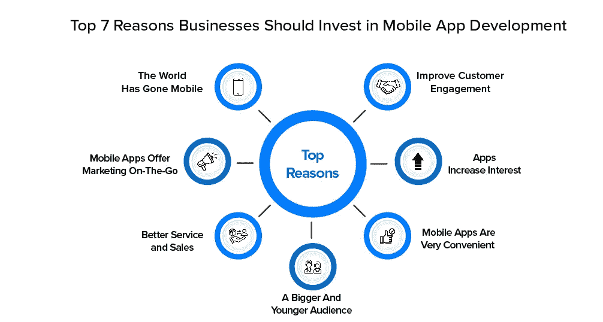

# 企业应该投资移动应用程序开发的 7 个原因

> 原文：<https://medium.com/codex/7-reason-why-business-should-invest-in-mobile-app-development-d7baed72ef3b?source=collection_archive---------8----------------------->

随着越来越多的人使用移动设备，公司不得不开发移动应用程序，对移动应用程序开发的投资也变得越来越重要。这不仅仅是你的竞争对手在做什么的问题，而是当今商业环境中的一种需要。

每个人都应该同意，移动设备行业是世界上领先的行业之一。如今，几乎每个企业都有移动应用程序。在今天的约会中，整个世界都在你的口袋里。我们想到了移动设备。当今世界，每个人都有移动设备。这种移动设备除了通话之外，还拥有一整套智能手机应用程序。

由于不同应用程序的可用性，更多的人使用手机而不是台式机和笔记本电脑。移动设备不仅参与社交媒体和网络渠道，还参与购物、电子商务、食品订购和工业。投资移动应用开发对业务增长非常重要。

移动应用有很多商业好处。以下是你应该投资移动应用来发展业务的一些原因:

**企业应该投资移动应用开发的 7 大理由**

在这里，我们提到了您的企业应该投资移动应用程序开发的 7 个原因:

**1。世界已经移动化**

不可否认的是，这个世界已经移动化了，没有回头路了。顾客通过使用他们的智能手机找到当地的商家。您的在线品牌推广工作通过移动渠道被看到。因此，仅仅有一个网站已经不够了。用户正在远离桌面浏览器，转而依赖移动应用。与淹没 6 英寸手机屏幕的传统网站不同，应用程序作为直观的购物和浏览选择而蓬勃发展。

**2。移动应用提供移动营销**

借助移动应用，您的现有客户可以在一个用户友好的环境中随时随地访问您的业务。经常使用你的应用程序会加强你的品牌或业务。这意味着当他们需要买东西的时候，他们很可能会来找你。你已经使用该应用程序与他们建立了关系，这相当于将你的业务放在了客户的口袋里。

**3。更好的服务和销售**

幸运的是，移动应用程序开发的增长使得购物比以往任何时候都更容易。人们买卖商品和服务的方式正在改变。这也改变了消费者在购买前对产品的看法和评价。这意味着客户比以往有更多的机会做出明智的购买决策。也就是说，你应该有一个专门为你的客户开发的应用程序，为消费者提供他们正在寻找的信息。不要忘记，创造更多收入的最佳实践之一是改善服务。服务和支持都可以使用移动应用程序。

**4。更多更年轻的观众**

大多数年轻人很久以前就开始使用手机了。到今年年底，近 75%的千禧一代将拥有智能手机。使用过时的技术很难吸引年轻一代。年轻人选择信任他们的移动设备，即使他们可以使用传统的 PC。智能手机已经成为与朋友聊天、在线浏览和购买产品和服务的新工具。要接触到这些观众，你必须有一个移动应用程序。

**5。手机应用非常方便**

手机应用比网站更容易使用。应用程序的设计通常主要关注可用性。事实上，这些应用在很大程度上是为了提供更高级别的可用性而设计的。当公司决定开发一个定制的移动应用程序，允许更大的灵活性，并能解决特定的客户需求时，好处甚至更大。安装后，该应用程序将帮助您的客户与您的支持团队、您的服务和支付部门进行沟通。你表现出来的专业性会通过你的 app 增加目标受众的信任和认同。

**6。应用增加兴趣**

当你开发一个应用程序时，它为你提供了一个向现有和潜在客户展示你的产品或服务的简单方法。任何时候，他们想买东西，他们可以简单地使用它作为一个单一的点，以获得所有他们需要的信息。每次你更新内容，你可以通知他们，他们可以第一时间看到你提供的新产品或服务。这邀请并诱惑客户定期检查你的应用程序。

**7。提高客户参与度**

客户互动是任何产品或服务销售的关键。您希望确保您提供的产品或服务易于与客户联系，并且客户可以通过他们的问题、样品或询问与您联系。

使用移动应用的实时聊天、帮助台或地理定位广告功能将确保这一切发生。这种交流方式可以避免不必要的会议和电话。

**最终想法**

随着移动行业像现在这样蓬勃发展，所有企业投资 [**移动应用程序开发**](https://www.quytech.com/mobile-application-development.php) 都是值得的。如果你的业务不是移动的，你也不打算投资移动应用开发，那么你已经落后于你的竞争对手了。即使你的竞争对手不移动，他们很快就会移动。