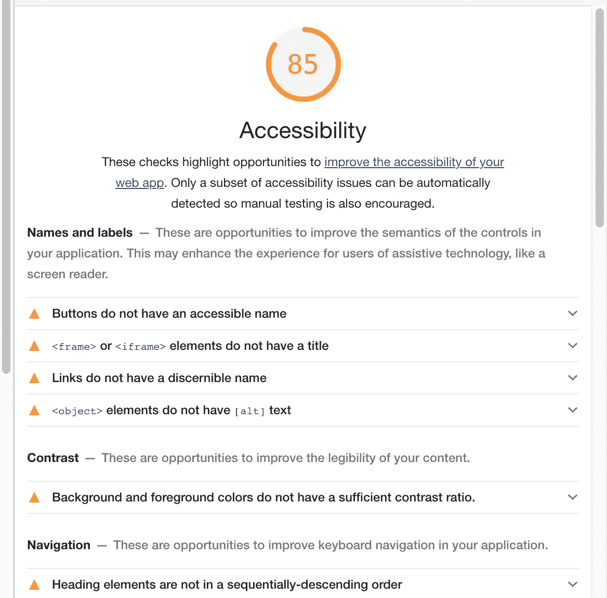
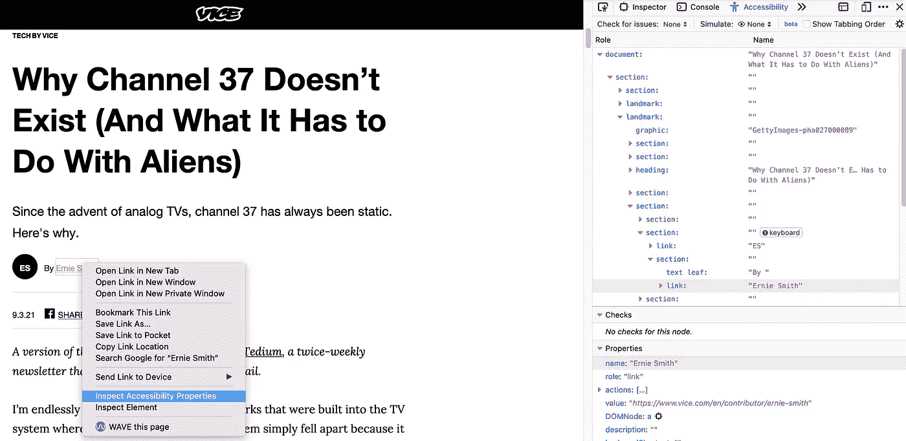

# 提高可访问性测试的 7 个简单方法

> 原文：<https://medium.com/codex/7-simple-ways-you-can-improve-your-accessibility-testing-423e09ed6c6f?source=collection_archive---------8----------------------->

## [法典](http://medium.com/codex)

为使用 Voiceover 做好准备

我在组织中的角色的好处之一是能够从“地面上的靴子”和 50，000 英尺的角度观察团队(及其运营)。当个别 QA 团队听到“检查可访问性”并被简单地指向 WCAG 时，他们所面临的挑战让我感同身受。这句话之后通常是“去搞清楚”之类的话，以及没完没了地浏览各种工具、辅助技术、书签或插件，并下载你能找到的每一个。

不幸的是，每个工具或审计插件都带有一个自以为是的规则集，它是从 WCAG 或 HTML 规范中解读出来的。有时候这些甚至会冲突。多痛苦啊！

我想分享 6 个实用的技巧**任何 QA 团队都可以立即实施**来简化他们的可访问性测试过程。

TL；先列出博士，后解释。

1.  缩小你的测试范围
2.  与已知例子相比
3.  不要从屏幕阅读器开始**(这个真的很重要)**
4.  了解开发人员工具的基础知识
5.  听起来好笑并不代表这是缺陷
6.  选一个冠军
7.  知道去哪里寻求帮助

# 缩小你的测试范围

NVDA，大白鲨，色彩对比分析仪，逆戟鲸，波，斧头，画外音，对讲，DAP，平等网络，Nu 验证器，网站改善，灯塔。这些只是你可以用来对网络进行质量保证的众多工具中的一部分。让我告诉你，你不需要全部。如前所述，其中一些工具听起来不同(在屏幕阅读器的情况下)，具有非常不同的规则集(审计工具)，或者需要一些关于如何有效使用的知识。

您知道吗，大多数可访问性缺陷只是简单的 HTML 问题，大多数工具都可以检测到。这就是为什么当我与团队交谈时，我真的减少了他们的工作范围，并向他们保证他们可以随时添加更多内容。

入围名单:

1.  NVDA + Chrome(桌面浏览器屏幕阅读器测试)
2.  Voiceover + iOS(移动浏览器屏幕阅读器测试)
3.  Deque axe + Chrome(桌面浏览器可访问性审计)

就是这样！

“但是小卡！我们会错过一堆易访问性缺陷！Orca 和 Opera 浏览器呢？我们需要一个矩阵！”

是的，你知道。但在此之前，你可以告诉我，上面是固定的。既然 QA 已经在一个设备上发现了问题，为什么还要测试两个(或三个，或四个)屏幕阅读器和浏览器的组合呢？它肯定也会出现在其他设备上。

# 与已知例子相比

我喜欢看到这样的票:

“Safari-iOS 中的输入声音与 Chrome 中的 Voiceover 不同。请指教”

有一个简单的方法来检查这一点。去网上找一个不同的例子，看看听起来是否一样。一些寻找代码示例的好地方是[MDN(外部链接)](https://developer.mozilla.org/en-US/docs/Web/HTML/Element/input)或 [W3 Schools(外部链接)](https://www.w3schools.com/tags/tryit.asp?filename=tryhtml_input_test)。我真的发现这是一种没有被 QA 充分利用的测试方式。有了这个，你就可以比较你的屏幕阅读器在你的应用程序上说了什么，和它在一个良好编码的第三方网站上听起来像什么。

听起来不一样吗？那可能就有问题了。它们听起来一样吗？那么也许那就是屏幕阅读器的声音。

# 不要从屏幕阅读器开始

如果这篇文章能让你想起什么，那就是这一点。不要用屏幕阅读器开始你的测试。从审计工具开始(比如 Wave、axe、DAP 等)。他们会首先找到你所有的基本 HTML 问题。最初在你的票务系统中提出所有这些问题，因为这将发现 80%的基本编码问题。

良好的可访问性测试的实际策略是:

1.  浏览器审计(Wave、axe、DAP、Lighthouse 等)
2.  手动键盘测试
3.  屏幕阅读器验证

我听说很多 QA 队友(以及参加我的培训之前的开发人员)陷入了听屏幕阅读器声音的困境，以至于他们肯定会犯错误。

## 浏览器审计

这是由 Chrome 中的灯塔审计产生的

我很喜欢自动化，但我们都知道可访问性不能完全自动化，所以这是我们能做到的最好的了。在您的缺陷跟踪系统中单独提出这些问题单，以帮助找出开发人员在哪里有问题。

提出这些问题后，尝试使用 tab 和 space/enter 与所有需要测试的元素进行交互。有用吗？你能激活它们吗？围绕交互元素有焦点环吗？每个浏览器都有自己的风格，但是 [W3 也记录了所有的键盘交互(外部链接)。](https://www.w3.org/TR/wai-aria-practices-1.1/examples/button/button.html)

完成所有这些之后，您就可以继续进行屏幕阅读器测试了。为什么是现在？那么，如果屏幕上的提交按钮不能用键盘操作呢？你肯定它也不能和屏幕阅读器一起工作(或者，如果可以，这个特性也不能通过测试)。

这是为了节省你的时间。如果您需要从屏幕阅读器开始检查整个页面，您将面临大量的测试…

# 了解开发人员工具的基础知识

这是我最近才开始培训的，因为最近浏览器开发工具有了一些很棒的更新。对 Firefox 大喊一声，让你也可以通过两次点击来检查可访问性。

Firefox 开发工具在上下文菜单中有一个内置的“检查可访问性属性”按钮

你需要知道的关于标签的所有信息都在这里。你甚至不需要使用工具。这对于多语言网站尤其重要，因为您可能不理解网站上的另一种语言。上图中的示例显示了链接的内容，以及该元素上可能存在的任何其他属性，如 aria-label 或 aria-describedby(如果您希望我写更多关于它们的内容，请在最后留下注释)。

# 选一个冠军

对于我合作过的所有客户来说，这是最大的区别之一。当有一个人掌握了可访问性知识时，这对整个团队确实有帮助。

这个人获得了所有的可访问性入场券，并从整体上掌握了专业知识，您的团队将有一个参考点和一个不断增长的知识库。

我试图寻找对这个主题感兴趣的人，以及对残疾人整体感同身受的人。

# 知道去哪里寻求帮助

现在去哪里？

你已经测试过，检查过，反复检查过。有些事还是感觉不对劲。这听起来很有趣，它不像你想的那样，事情很奇怪。

嗯，你可以随时在我们的 Discord 服务器上提出你的问题，我们正在那里建立一个无障碍专家社区，并就如何测试、开发和创建数字世界的无障碍项目进行健康(友好)的讨论。

[https://discord.gg/Yp5BmVYMzG](https://discord.gg/Yp5BmVYMzG)

在测试可访问性的过程中，你面临的最大挑战是什么？

你还有其他对你或你的团队有效的技巧吗？

留言评论！我很想读它。