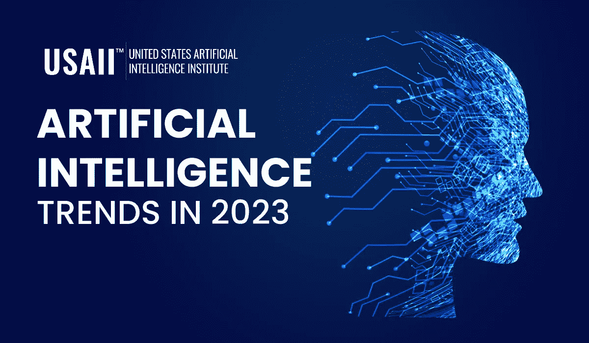
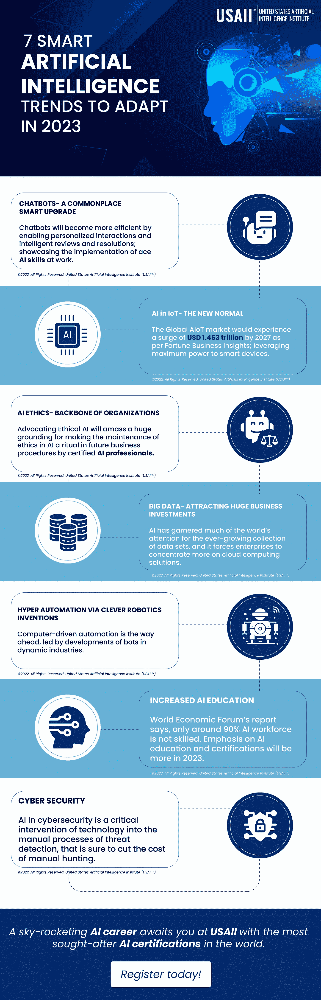

# 2023 年适应 7 种智能人工智能趋势

> 原文：<https://medium.com/codex/7-smart-artificial-intelligence-trends-to-adapt-in-2023-40bb2925feb4?source=collection_archive---------21----------------------->

预测未来领先的人工智能趋势并非易事。 ***人工智能技术*** *，在每一个可能的领域大踏步前进，是王牌技术发挥作用的当代范例。部署可信的* ***AI 技能*** *背靠可信的* ***AI 认证*** *是为后代构建更强大 AI 版图的前进之路。*

几乎在世界经济的每个领域都出现了聪明的技术升级，这导致了超越门外汉的智能的采用。它涉及高端专业知识，并要求独家精度。🔗 [**人工智能技术**](https://www.usaii.org/ai-insights/artificial-neural-network-an-overview) 对研究人员来说已经不是什么新鲜事了。是时候让机器开始巧妙地模仿现实生活中的人类处境了。人工智能一直是一个注定只会迎合科幻小说的技术领域。但现在不是了！

今天，人工智能可以提高各种行业的生产力，如金融、医疗保健、汽车、游戏、生命科学、保险、教育、零售、电子商务、航空等等。在这一点上，人们最感兴趣的是了解这个事实- *现在世界上有多少人工智能？*

> 一个快速的统计数据可以证明这一事实:到 2024 年，全球数字助理的使用预计将翻一番，达到 84 亿美元。零售业中最突出的人工智能用例是客户参与，包括聊天机器人、预测行为分析和超个性化。数字不会说谎，另一个分数显示，到今年年底，人工智能软件 reach 已经达到 620 亿美元大关；比上一年猛增 21.3%(备注 *Gartner* )。

人工智能的广阔领域并没有就此结束。，因为它刚刚开始在各地被感受到。博学的🔗 [**人工智能专业人士**](https://www.usaii.org/) 正试图用合适的商业解决方案来达到目的，这标志着企业商业目标的不断进步。然而，一些技术批评家担心先进人工智能的广泛使用会伤害社会。虽然，这还不能被证明。机器人、聊天机器人、虚拟助手、无人驾驶汽车和自动化设备刚刚开始成为我们日常生活的一部分。

**下面列出了 2023 年人工智能的一些主要趋势，这些趋势将在优化工作和家庭流程方面发挥重要作用:**

人工智能趋势 2023 | USAII

***聊天机器人成为司空见惯的智能升级***

当你正忙着在网上搜索产品或服务时，屏幕上弹出一个窗口询问你是否需要帮助——这就是聊天机器人的作用。这只是我们在日常生活中与聊天机器人联系在一起的众多例子之一。这项技术有助于提高组织的运营效率，并帮助轻松解决大量客户查询，同时最大限度地减少人工干预。

👉 ***物联网中的 AI——新常态***

物联网和人工智能的超人气是顶级科技巨头热衷于投资 most 的原因，以提高效率并获得竞争优势。最大限度地利用典型的人工智能技能，物联网中的人工智能是世界经济多元化领域的巨大进步。

👉 ***AI 伦理——组织的中坚力量***

道德的实施对于人工智能系统提供安全指南至关重要，这些安全指南有助于防止人类的存在风险，解决与偏见有关的问题，并帮助建立友好的人工智能系统。

👉 ***大数据——吸引巨额商业投资***

大数据使企业能够了解模式、趋势和偏好，这是人们与不同系统交互产生的庞大数据库的结果。

👉 ***通过巧妙的机器人发明实现超自动化***

作为 AI-ML 的趋势，它使用自动学习的算法和训练有素的机器人，这有助于减少对人类的依赖，并确保准确性、有效性和速度。业务和 IT 一致性的重大改进是采用这种智能人工智能趋势的另一个原因。

👉 ***增加了 AI 教育***

好处包括培训者-学习者个性化、增强的辅导技能、24/7 通用访问、快速响应时间、任务自动化等等；教育中的人工智能也提高了教学质量。世界知名的🔗 [**最佳** **人工智能认证**](https://www.usaii.org/artificial-intelligence-certifications) 由人工智能行业中的佼佼者提供，旨在通过认证专业人员为大大小小的企业提供安全的关键技能。

👉 ***网络安全应用***

简单的调整不足以击败算法。基于云的人工智能驱动的网络安全具有超越标准反病毒和防火墙的令人难以置信的功能，因为它们可以部署在路由器上。

用这种智能配置的机器来模仿和执行任务是提高网络安全水平的关键。实现人类认知性能的目标将网络安全领域提升到了一个全新的水平。研究人员和开发人员正在快速进步，使各行各业受益。如今，机器使用基于数学、计算机科学、语言学、心理学等跨学科方法进行连接。现在是时候成为一家有影响力的企业，在你个人和职业发展的每个方面部署人工智能。这对有志于人工智能的人来说是一个建立繁荣的人工智能事业的巨大机会。

# **不要等待趋势，创造一个趋势。今天用人工智能推进到大招！**