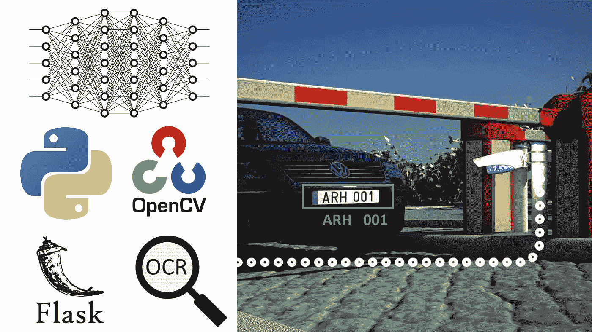
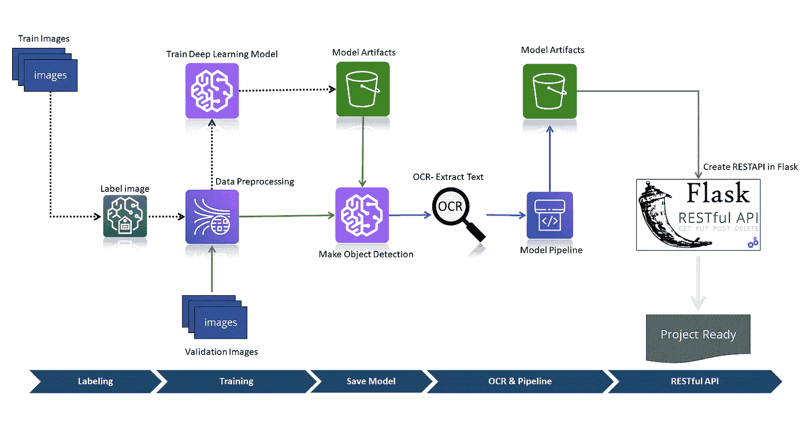
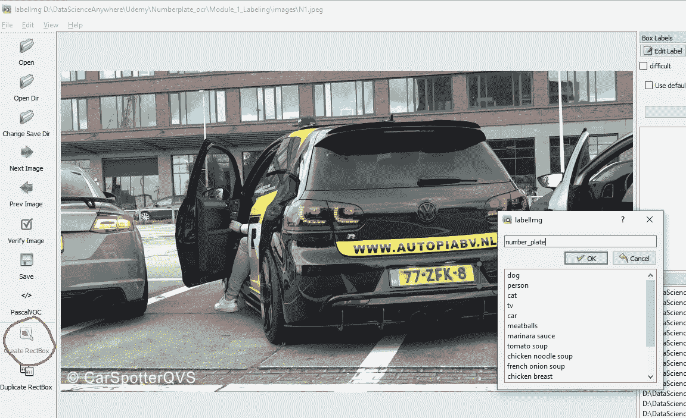
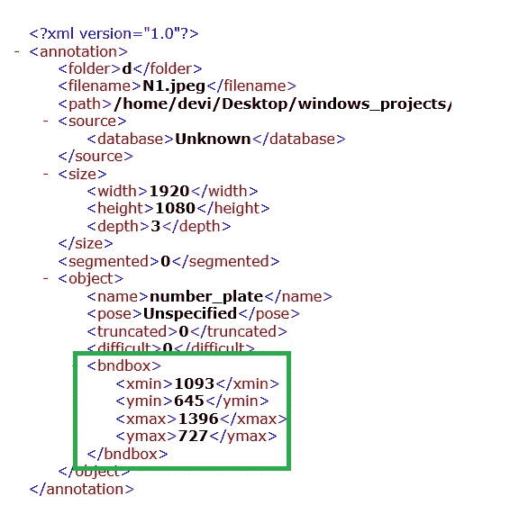
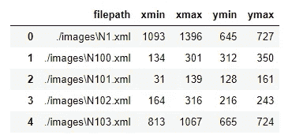
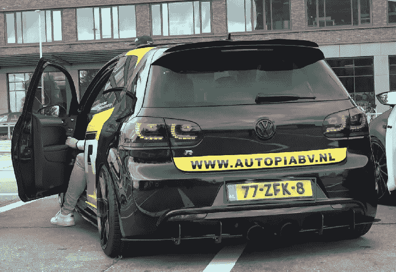
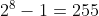
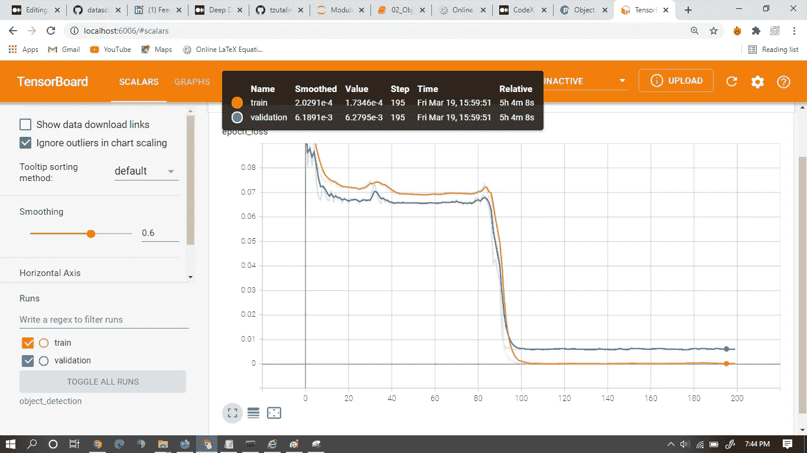
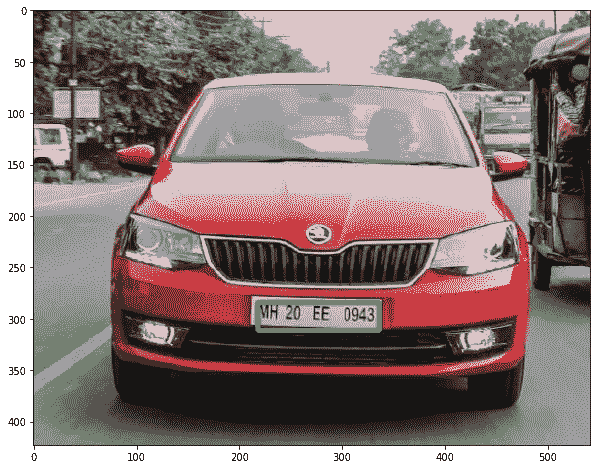
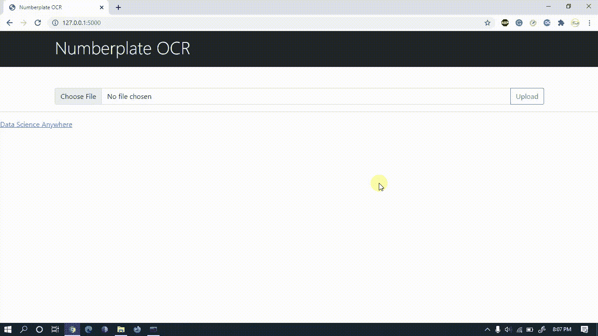

# 用 Python 实现自动车牌识别的 7 个步骤

> 原文：<https://medium.com/codex/7-steps-to-build-automatic-number-plate-recognition-in-python-53e34c9ae583?source=collection_archive---------2----------------------->


托马斯·米洛特在 [Unsplash](https://unsplash.com?utm_source=medium&utm_medium=referral) 上拍摄的照片

## [抄本](http://medium.com/codex)



**图像处理和目标检测**是数据科学的一个领域，在当今世界的各行各业都有广泛的应用。许多行业都在寻找具备这些技能的数据科学家。

本文介绍了如何从头开发一个车牌对象检测模型。我们甚至用 Flask 开发了一个 API。然而，在本文中，我们解释了如何从头开始训练一个**定制对象检测模型**。

为了建立车牌识别系统，我们需要数据。为此，我们需要收集出现**车牌**的车辆图像。[这是我用来构建这个项目的样本数据。你也可以从我的 google drive 下载。](https://drive.google.com/drive/folders/1VRqnQnlYYdTMl1icgW0L_rUEmU-E-NHZ?usp=sharing)

# 项目架构:

现在，让我们来看一下我们构建的车牌识别和 OCR 的项目架构。



图 1:车牌识别项目架构

在上述架构中，有六个模块。标签、训练、保存模型、OCR 和管道以及 RESTful API。但是本文仅限于前三个模块。过程如下。首先，我们将收集图像。然后我们必须使用[图像标注工具](https://github.com/tzutalin/labelImg)对图像进行标记，用于车牌或号码牌的对象检测，图像标注工具是在 python GUI 中开发的开源软件。然后在标记图像后，我们将进行数据预处理，在 **TensorFlow** 2 中建立和训练深度学习对象检测模型(Inception Resnet V2)。一旦我们完成了对象检测模型训练过程，然后使用该模型我们将裁剪包含车牌的图像，该图像也被称为感兴趣区域(ROI)，并将 ROI 传递给 Python 中的光学字符识别 API tessera CT(**pytessera CT**)。在本模块中，我们将从图像中提取文本。现在，我们将所有这些放在一起，建立一个管道深度学习模型。在最后一个模块中，我们将学习使用 FLASK Python 创建一个 web 应用程序项目。至此，我们终于准备好了我们的应用程序。

## 第一步:贴标签

为了建立车牌识别系统，我们需要数据。为此，我们需要收集车牌出现的车辆图像。这是我用来构建这个项目的样本数据。你也可以从我的 google drive 下载。对于标签图像，我使用了[标签图像注释工具](https://github.com/tzutalin/labelImg)。从 GitHub 下载 labelImg 并按照说明安装软件包。打开后，GUI as 给出指令，点击 **CreateRectBox** ，绘制如下图所示的矩形框，并将输出保存在 **XML** 中。

```
pip install pyqt=5
pip install lxml
pyrcc5 -o libs/resources.py resources.qrc
python labelImg.py
python labelImg.py [IMAGE_PATH] [PRE-DEFINED CLASS FILE]
```



图 2:使用图像注释进行标记

这是一个手动过程，您需要对所有的图像都这样做。标注时要小心，因为标注过程会直接影响模型的准确性。[点击这里观看视频教程](https://www.udemy.com/course/deep-learning-web-app-project-number-plate-detection-ocr/?referralCode=BCC3EDB9787790441A19)

## 步骤 2:解析 XML 中的信息

一旦你完成了标记过程，现在我们需要做一些数据预处理。



图 3 XML 格式的图像注释工具的输出

由于标签的输出是 XML，为了将它用于训练过程，我们需要数组格式的数据。为此，我们将从标签中提取有用的信息，即矩形框或**包围框**的对角点，分别为 *xmin，ymin，xmax，ymax* ，如图**图 3** 所示。这在 XML 中是可用的。因此，我们需要提取信息并以任何方便的格式保存它，这里我将把绑定信息转换成 CSV，稍后，我将使用 **Pandas** 把它转换成一个数组。现在让我们看看如何使用 Python 来解析信息。

**解析 XML 数据并将其转换成 CSV 格式**

这里我使用 **xml.etree** python 库解析来自 xml 的数据，并导入 pandas 和 glob。使用 glob 让我们首先获得在标记过程中产生的所有 XML 文件。

在上面的代码中，我们分别获取每个文件并解析成 xml.etree，找到第 2 到 7 行中的对象-> bndbox。然后我们提取 xmin，xmax，ymin，ymax，并将这些值保存在字典中，即第 8 到 17 行。然后，我们将它转换成熊猫数据帧，并保存到 CSV 文件，如下所示。



通过上面的代码，我们成功地提取了每幅图像的对角线位置，并将数据从非结构化格式转换为结构化格式。

现在还提取 XML 的相应图像文件名。

## 步骤 4:验证数据

到目前为止，我们都是手动操作，因此验证我们获得的信息是否有效非常重要。为此，只需验证给定图像的边界框是否正确出现。这里我考虑图像 N1.jpeg 和相应的对角线位置可以在 **df 中找到。**



## 第五步:数据处理:

这是一个非常重要的步骤，在这个过程中，我们将使用 **OpenCV** 将每张图像转换为一个数组，并将图像大小调整为 224 x 224，这是预训练**迁移学习模型的标准兼容大小。**

之后，我们将通过除以最大数来标准化图像，因为我们知道 8 位图像的最大数是



我们将我们的图像分割成 255.0 的原因。用最大值分割一个数组的方式叫做**归一化** (Min-Max Scaler)。

我们也需要标准化我们的标签。因为对于深度学习模型，输出范围应该在 0 到 1 之间。为了归一化标签，我们需要用图像的宽度和高度来划分对角点。最后是 python 列表中的值。下一步，我们将使用 Numpy 将列表转换成数组。

现在使用 **sklearn** 将数据分成训练集和测试集。

## 步骤 6:建立和培训迁移学习

现在我们准备训练一个用于对象检测的深度学习模型。这里，我们将使用带有预训练权重的 **InceptionResNetV2** 模型，并根据我们的数据对其进行训练。让我们从从 **TensorFlow 2.3.0** 导入必要的库开始

我们正在建立的模型是对象检测模型，并且从模型 4 期望的输出数量是对角点。因此，我们将向迁移学习模型添加一个嵌入的神经网络层，如第 5 行到第 9 行所示。

现在编译模型并训练模型

这就是我们训练模型的目的。这个过程通常需要 3 到 4 个小时，取决于计算机的速度。在这里，我向你展示了模型在 TensorBoard 中的丢失。



似乎模型在 100 个纪元后收敛了。

> 注意:为了更好地减少损失，我们需要用至少 10000 幅图像的大量数据来训练模型

## 步骤 7:进行包围盒预测

这是物体检测的最后一步。在这一步，我们将把所有这些放在一起，并得到给定图像的预测。



就是这样！！！。这就是我们如何从零开始开发车牌检测。

本文只解释了项目架构的 50%。下一个过程包括从车牌中提取文本并在 Flask 中开发 RestfulAPI。这是项目的输出



> [点击此处，3 小时视频项目讲解，从零开始搭建号牌 Web App。](https://www.udemy.com/course/deep-learning-web-app-project-number-plate-detection-ocr/?referralCode=BCC3EDB9787790441A19)