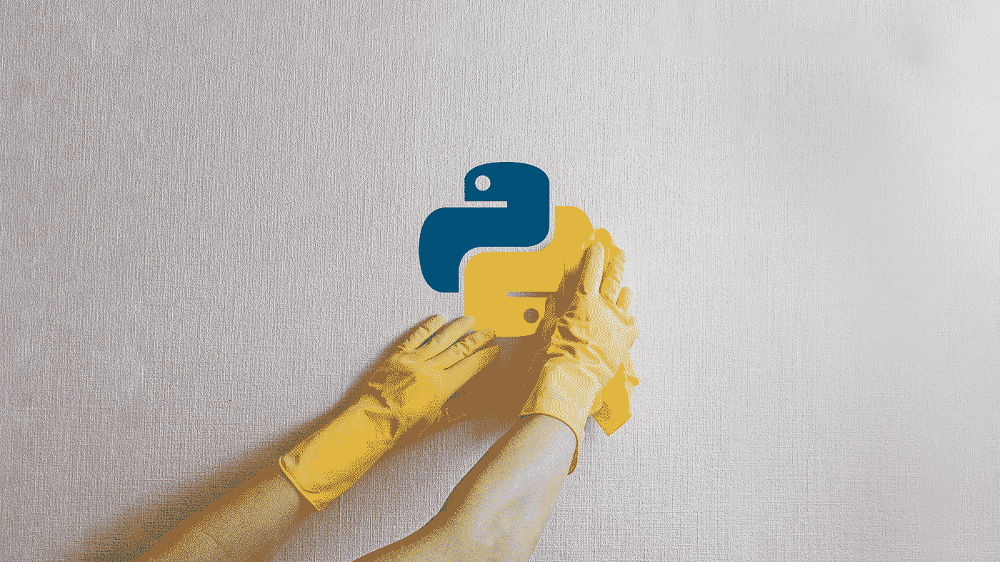

# 编写干净 Python 代码的 7 个技巧🛁🧼

> 原文：<https://medium.com/codex/7-techniques-for-writing-clean-python-code-cba1258e55a6?source=collection_archive---------0----------------------->

## 发现它是多么简单而有效

如果你是一名 Python 程序员，你已经知道 **python 代码不必复杂也能有效。Python 的简单性是它最大的优势之一，也是它在过去十年中如此受欢迎的原因。但是仅仅因为**用 Python** 写干净的代码很容易并不意味着它总是发生…**