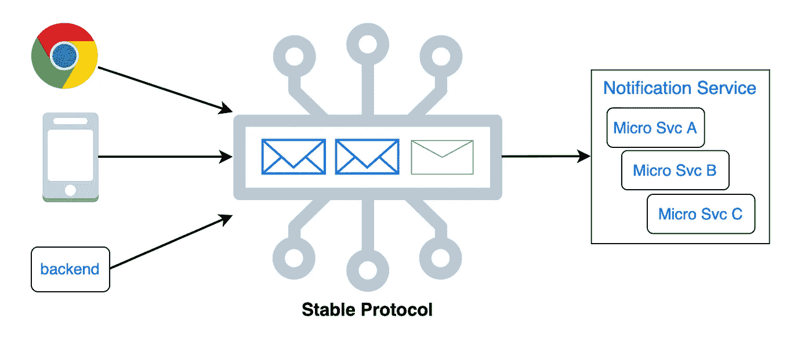
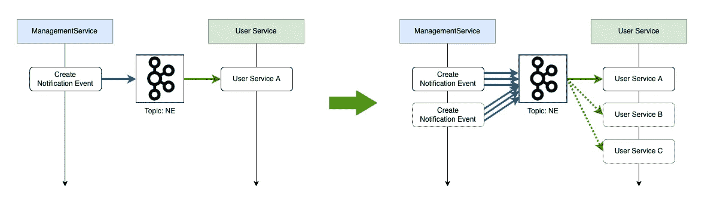
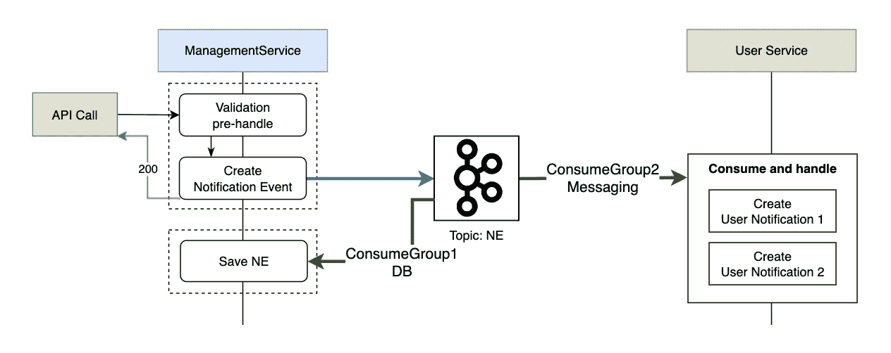
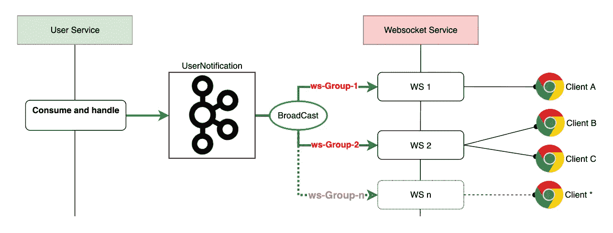
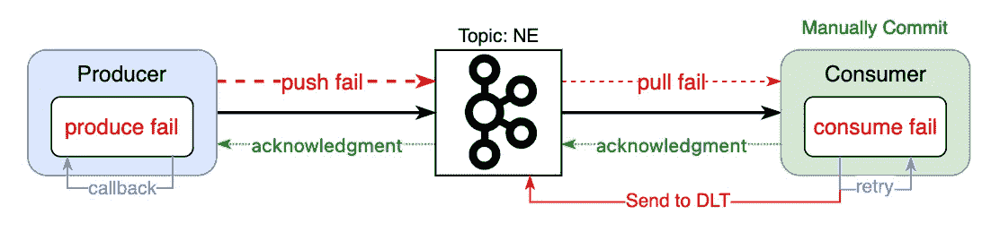
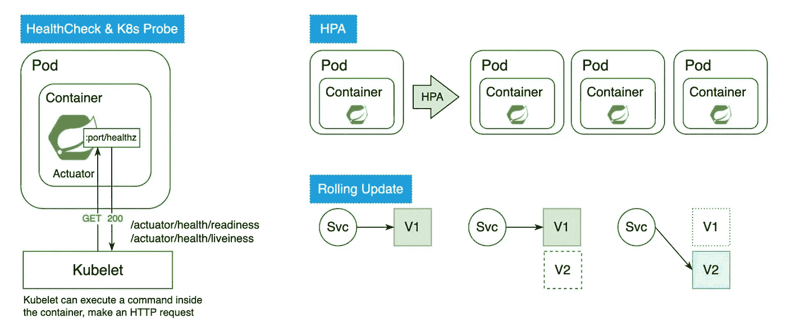
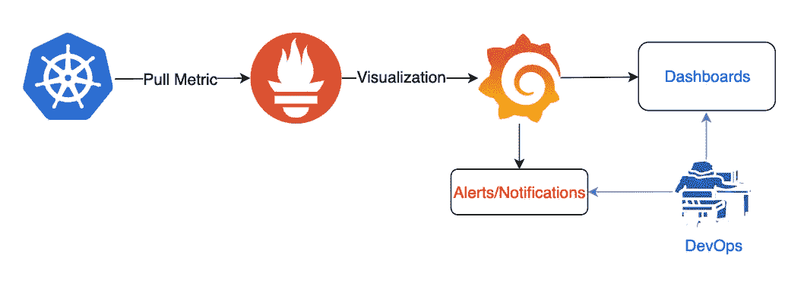

# 7+ things 将帮助您更好地设计基于事件驱动和 Kubernetes 微服务架构的通知服务

> 原文：<https://medium.com/codex/7-things-will-help-you-to-better-design-notification-services-based-on-event-driven-and-kubernetes-e92a1e70b561?source=collection_archive---------4----------------------->

开始前。

*   **7+** 意味着项目将继续增加，因为随着业务和技术的发展，总会有新的部分出现。
*   欢迎不同的想法和观点。让我们互相学习新的东西。

# 1.标准且稳定的协议。向后兼容。



## 为什么:

*   大多数情况下，通知服务的用户是 web 客户端、移动客户端和其他后端服务。因为我们不能强迫所有用户升级到最新版本。然后总是有少数用户仍然使用以前的版本。所以你需要让系统向后兼容。
*   以更好地支持向后兼容。我们需要设计一个稳定的协议，将更改保持在一个块中，这将有助于您将更改保持在最低限度。
*   在协议中，属性 Global_ID 对于记录和监控消息的整个生命周期非常重要。对于大多数常见的解决方案，将有一个自动定时器任务来通过 Global_ID 进行消息状态检查。如果任务发现消息状态在某个阶段是错误的，将触发相关的处理程序来修复它们(重新发送/发送通知给维护人员……)

## 如何:

**协议示例:**

```
from: xxxid,
UUID (Global_ID): xxxxxxxxxxxxxxxxxxx,
content: {
  // only allow the changes happend in content {}.  
  version: 1.1,
  xxx:xxx,
  yyy:yyy,
  ...
},
toUserIds: [xxxx, yyyy, zzzz, ....],
createBy: xxxx,
createDateTime: xxxx-xx-xx,
...
```

# 2.尽可能的无国籍



互不依赖，自动伸缩

*   不依赖任何其他服务，甚至本身。
*   当请求压力来临时，应用服务器可以很容易地在程序维度上进行水平伸缩。与 Kubernetes HPA 完美配合。

# 3.分离消息传递和消息持久性工作流



使用消费者组分离工作流

## 为什么:

对于大多数通知业务需求。核心功能是消息传递。数据持久性主要用于日志记录和跟踪。而且大多数时候对于用户来说，数据只需要看一次(短暂的)。

*   单一责任原则。每个消费者群体可以使用不同的消费策略。例如:DB 端使用 batchConsume。
*   一个工作流中的更改不会影响另一个工作流。
*   增强各自工作流的消息处理能力
*   将消息传递和数据持久性分离，以确保一些意外的异常不会阻塞核心消息传递工作流。

然而。在一些特定的商业场景中。数据持久性非常重要。那就不适合这个项目。

## 如何:

参考图。

# 4.Websocket



不同消费群体的相同主题

## 为什么:

因为 WebSocket 将创建一个连接通道。所以这使得服务器实例成为一个**有状态**服务器。当我们需要扩展吊舱时，我们需要考虑这种情况。

## 如何:

有很多解决方法。在经历了一些之后。我喜欢这个:更好地支持自动伸缩和适应有状态服务。

*   相同的话题，不同的消费群体。每个实例都与一个消费者群体相关。当需要自动缩放时，实例将在使用者组名称后面添加随机的 UUID 字符串。
*   当消息到来时。它将向每个消费群体广播。消费方将检查该用户是否在频道列表中。如果在的话会传递消息的。如果没有将什么也做不了。

# 5.消息质量。



消息传递质量问题

## 为什么:

总会有一些意想不到的问题/错误/情况/非功能需求出现。因此，在生产之前，您至少需要准备处理 95%的问题。

## 如何:

作为一种信息服务。最重要的是信息被准确无误地传递出去。在设计部分我们需要准备一些场景。

1.  至少一次。
2.  我们需要手动设置提交确认。(为避免信息丢失)
3.  生产失败。我们需要准备一个回调来处理生产者未能将消息推送给代理的情况。
4.  消费失败。我们需要准备和定义哪些情况可以重试，哪些情况将直接发送到 DLQ。

*   正常异常。触发重试机制。但是我们需要设置重试次数。和音程。
*   非正常异常。发送到 DLQ。然后手动处理它们。

# 6.高可用性和零停机时间。



运行状况检查& HPA &滚动更新

## 为什么:

下面是遇到的一些现实问题。

**1** 。当我们进行滚动更新时。端点在几秒钟内出现 503 错误或经济故障。

A.请求已转发到新的 pod，但 pod 中的服务尚未完全启动。

怎么解决？设置就绪探测器，并将 initialDelaySeconds 设置为比完全启动时间稍大一些。

B.新版本开始后。kubernetes 将终止以前版本的 pod。但仍有一个长流程调用在其上运行。

如何解决？设置关机时间和适当的时间段。(使用 SpringBoot 2.3+将非常容易)

**2** 。最开始的时候。一些微服务只有一个副本。这一个遇到了一个问题，因为服务停机。虽然库伯内特人会开始新的生活。但是在停机时间和新 pod 完全启动时间之间有一个间隙，即 coz 503。

因此，对于那些无状态服务，更安全的方法是> 1 个副本。

**3** 。在没有预设 HPA 的情况下，当请求压力意外出现时。因为服务器速度越来越慢，吞吐量越来越低。

那么我们可以使用 HPA。但是为了扩大规模，你需要在设置正确的参数之前做一些压力测试。并且仅设置自动放大。

因为缩小规模有点复杂，而且很容易导致信息丢失。所以更好的人工干预。

## 如何:

*   服务运行状况检查
*   服务器正常关机
*   Kubernetes 就绪性和活性探测。
*   库伯内特斯 HPA
*   不止一个副本

# 7.监控和生命周期追踪。

## 为什么:

*   问题越早发现，就能越早解决
*   优秀的 DevOps 可以在问题完全暴露之前提前识别并解决问题，这取决于监控和跟踪。
*   结合 Global_ID，可以以最快的方式定位和解决问题。

我还记得有一次，我们一个优秀的开发者向我们报告了一个 bug，并给出了正确的解决方案，代码的精确位置全部列在 desc 吉拉:)

## 如何:



监视


描摹

***待定……***

我会不断更新和添加新的项目。此外，欢迎您的项目经验(请留下您的意见)。

感谢阅读！下次见！