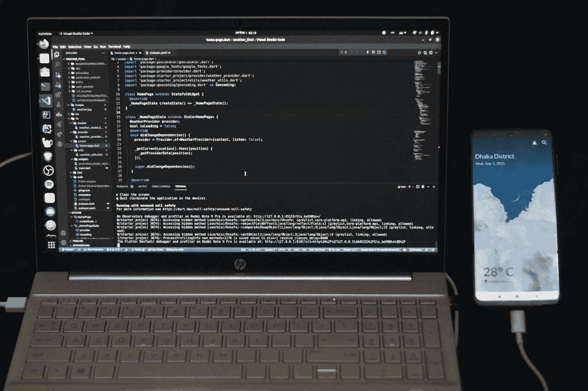

# 你应该知道的 7 个有用的 Flutter 包

> 原文：<https://medium.com/codex/7-useful-flutter-packages-you-should-know-d518246ca7b8?source=collection_archive---------1----------------------->

## 增强你的颤振发展

法希姆·蒙塔希尔在 [Unsplash](https://unsplash.com/?utm_source=medium&utm_medium=referral) 上拍摄的照片

当您可以使用软件包时，为什么要编写自定义功能？包是开发者最好的朋友和生命救星。在我看来，一个好的项目利用了一些可用的最好的包。Flutter 是 Google 创造的最好的移动 UI 框架之一。在这里，我整理了一份清单，列出了 7 个颤振包，将有助于你在…