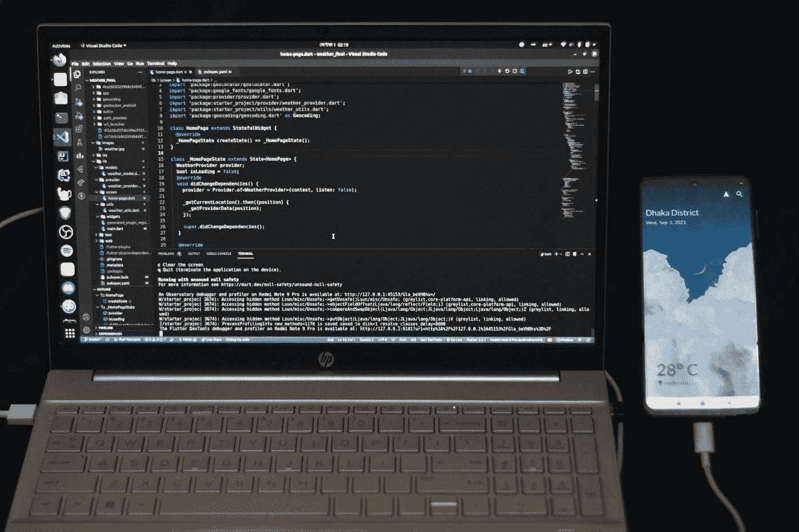

# 你应该在下一个项目中使用的 7 个有用的 Flutter 插件

> 原文：<https://medium.com/codex/7-useful-flutter-plugins-you-should-use-in-your-next-project-77e980e36a5e?source=collection_archive---------2----------------------->

## 增强你的颤振发展

法希姆·蒙塔希尔在 [Unsplash](https://unsplash.com/?utm_source=medium&utm_medium=referral) 上拍摄的照片

当你可以使用一个插件时，为什么要写自定义功能呢？插件是开发者最好的朋友和生命救星。在我看来，一个好的项目利用了一些最好的插件。Flutter 是 Google 创造的最好的移动 UI 框架之一。这里我整理了 7 个扑…