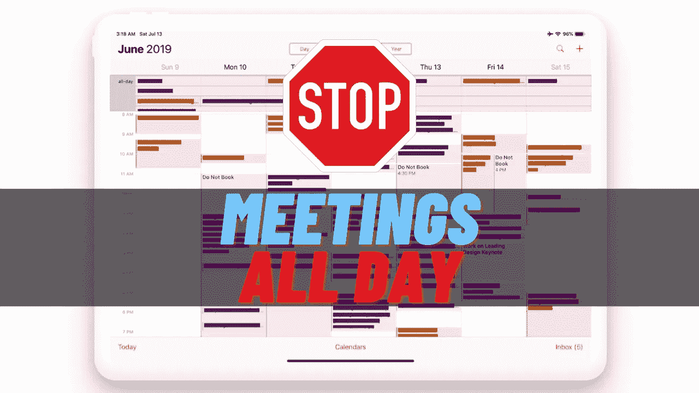

# 消除或减少浪费在不必要会议上的时间的 7 种方法

> 原文：<https://medium.com/codex/7-ways-to-eliminate-or-reduce-time-wasted-in-unnecessary-meetings-76b36365dd3b?source=collection_archive---------12----------------------->

## *如何打发时间取决于你*

**

*如果你像我一样，需要一点时间进入心流状态，你会感到一个不必要的会议即将到来的痛苦。我不喜欢分心。*

*不必要的会议是最糟糕的，因为它们完全打断了我的心流。这需要时间来回到…*