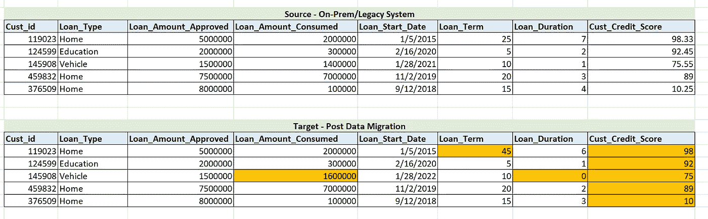

# 加快数据协调过程的 7 种方法

> 原文：<https://medium.com/codex/7-ways-to-speed-up-your-data-reconciliation-process-784006d16664?source=collection_archive---------5----------------------->

## 数据迁移

安德烈·德·森蒂斯峰在 [Unsplash](https://unsplash.com?utm_source=medium&utm_medium=referral) 上拍摄的照片

*   *在将数据迁移到云环境后，您是否投入了数天甚至数月的时间来协调数据？*
*   *您是否每天都在并行执行多个 ETL 工作负载来协调数据？*
*   *您是否正在构建加速器&可重用框架来自动化您的数据协调流程？*

如果您已经完成了所有这些，那么您就会理解执行一个成熟的数据协调周期来证明您的云数据+代码迁移或现代化之旅的成功的痛苦。

虽然所有这些活动仍然是需要的，也是不可忽视的，但本文将帮助您以最小的努力快速完成其中的一些活动。

我参与了一些迁移项目&参与了多个数据协调周期。

在这篇文章中，我分享了我的一些经验，以快速识别问题*。*

*你可能听说过 [80/20 法则](https://www.investopedia.com/terms/1/80-20-rule.asp)——80%的结果可以通过 20%的努力获得。在进行数据协调时，也可以应用同样的方法。*

*这里有一些快速实现这一点的方法。为了解释这一点，让我们使用下面的数据集。*

**

*虚拟数据集—用于解释以下用例*

1.  ***经典计数检查***

*这是每个数据工程师在执行新工作负载后要做的第一步。*

*如果您已经在新的云系统中重新设计或重新编写了您的 ETL 代码，那么第一次计数检查本身可能会失败 **9/10** 次！*

*这种计数检查是目标表中任何缺失记录或重复记录的良好指示器。*

***2。数字列的总和***

*如果计数匹配，那么您可以继续进一步检查以验证列中的数据。*

*你可以对你的数字列求和，然后比较源值和目标值。*

*这种检查有助于您识别单个数字列的问题。这些可能是数据类型问题(例如，Cust_Credit_Score 在目标表中被舍入)，或者可能是 ETL 填充逻辑中的问题(Loan_Duration 被错误地填充)*

***3。最大&最小数值列***

*您还可以对数值列的最大值和最小值进行快速验证。*

*与源数据的任何不匹配都可能表明填充这些属性的 ETL 逻辑存在问题*

***4。按特定列分组进行计数/求和***

*您可以通过对列进行分组来验证计数或总和。*

*这将有助于识别和缩小数据中的任何问题。*

*例如 Sum(Loan_Amount_Approved)，方法是按(Loan_Type)进行分组。这将有助于识别任何特定 Loan_Type 的代码逻辑中是否存在任何问题*

***5。边界条件***

*如果你了解数据，你可以快速检查功能边界条件。*

*例如，信用评分不能超过 100%
定期贷款不能为 0 或超过 25 年(根据业务逻辑)*

***6。功能检查***

*这些是快速的功能检查——您需要一些领域知识来执行这些检查。这些将因用例而异*

*例如，检查信用评分低于 75%的任何客户记录(已批准的贷款)。根据业务逻辑，只有信用评分超过 75%的客户才能获得贷款。*

*如果可能的话，让业务分析师或领域专家参与进来，他们可以快速完成这些检查。他们可能只需浏览一下数据就能发现这些问题。*

***7。样本记录检查***

*最后，您可以尝试提取一些样本记录，并比较这些记录的每个列。*

*对于包含 100 多个属性的表来说，这是很困难的。*

*但是，如果您能够提取一些样本记录——从每个 Loan_Type 类别中提取一个记录，并在 xls 中比较这些记录，这将为您提供一个迁移的 ETL 代码的良好指标。*

*所有这些检查将帮助您发现数据或 ETL 代码迁移后的一些关键问题。其中大部分并不耗时&只需运行几个查询就可以完成。*

*不幸的是，对于其余的 20%问题，您仍然必须执行那些并行运行、完整的数据核对周期&确保每条记录和每列都正确地填充到新系统中。*

*自动化是加速这一过程的唯一方法&您应该尝试构建框架/加速器或使用第三方产品，它们可以帮助您以尽可能少的人工努力快速完成这一过程。*

*感谢阅读！请分享您关于数据协调和其他数据迁移方面的想法或经验。*

* [## 高拉夫·塔尔帕蒂

### 欢迎来到云数据架构系列讲座！通过这个频道，我将分享我的经历…

www.youtube.com](https://www.youtube.com/channel/UCw78SLr6kGc6KJF-uHEm59w)*