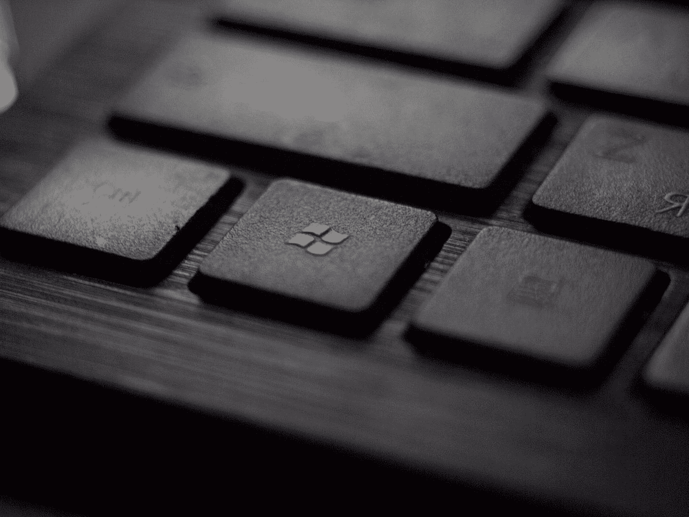

# 提高工作效率的 7 个 Windows 快捷方式

> 原文：<https://medium.com/codex/7-windows-shortcuts-to-boost-your-productivity-f0d401ab2a4b?source=collection_archive---------5----------------------->

最后一个会节省你几个小时！

塔达斯·萨尔在 [Unsplash](https://unsplash.com?utm_source=medium&utm_medium=referral) 上拍摄的照片

你想优化你的电脑体验吗？知道不同的键盘快捷键会节省你很多时间，让你看起来像个专业用户。在这篇文章中，我将向你介绍许多人不知道的特殊捷径！

> 注意:如果你是 Mac 迷，试试用 command 或 control 代替 ctrl 和 windows 键，看看是否有效。

# 锁定你的电脑

你可能以前也遇到过这种情况。你想离开你的电脑一会儿，但是你害怕有人(像一个孩子)会破坏你的工作。为了避免这种情况，您可以通过按下 ***windows + L*** 来锁定您的 PC。所有正在运行的应用程序仍将运行，但您的桌面需要密码才能再次访问。现在，你可以平静地去喝咖啡了；).

# 专业截图

经常会发生这样的情况，你想为你的屏幕拍摄一张照片。你可以用手机或者按 windows + print screen 来捕捉。不过更专业的截图方式是通过***windows+shift+S***。顶部会出现一个包含五个选项的小菜单:

剪切工具菜单

选择第一个进行矩形剪切。然后用指针画出你的剪贴画。第二个是定制形状剪刀。第三是为选定的窗口拍摄。第四是全截图，最后是退出。最酷的是这个镜头会自动复制到你的剪贴板上，这样你就可以把它粘贴到任何地方。此外，右侧会出现一条消息。点击它添加您的触摸！

# 语言和键盘切换

我相信我们大多数人在日常生活中使用不止一种语言或键盘。在它们之间切换的传统方式是 shift + Alt。当你只有两个键盘时，这很方便。但是当你有更多的时候，事情就变得棘手了。要解决这个问题，按住 ***windows*** 键，反复按 ***空格键*** 通过键盘侧菜单切换语言:

侧面键盘菜单

> 提示:试试用这个组合按下 **shift** 或 **ctrl** ，看看会发生什么；).

# 在窗口之间无缝切换

同时打开多个窗口是个人电脑的优势所在。因此，您必须知道这个快捷方式，以便在这些窗口之间轻松导航。按住 ***Alt*** ，然后反复按 ***tab*** 直到到达想要的窗口。也可以通过点击 ***窗口+ tab*** 查看所有打开的窗口和桌面。

# 突出显示所有内容

老实说，当我发现这条捷径时，我觉得自己很愚蠢。我习惯用鼠标选择页面或应用程序上的所有内容。与其浪费时间高亮显示从头到尾的所有内容，不如按下 ***ctrl + A*** 。*就是这样！*

# 恢复网页

最后两个快捷键是针对浏览器的。经常发生的情况是，你关闭了一个标签或者整个浏览器，然后又后悔了。如何轻松恢复关闭的标签页？按下 ***ctrl + shift + T*** 。这是强大的，因为它可以通过你的标签无休止地回到历史。它还能重新打开你上次关闭电脑前一直在使用的标签。

> 警告:如果您从搜索历史记录中删除页面，这将不起作用！或者如果你使用隐姓埋名模式。

# 在网页上搜索关键字

最后但同样重要的是。一个单独的网页总是包含成百上千的单词。如果你在一个页面上搜索一个特定的关键词，你会一行一行的去找吗？？不要！！试着按 ctrl + F，就可以了！输入单词，它会显示你的关键词出现的位置和次数。

> 如果要我写一篇浏览器快捷方式的帖子。为什么不为我鼓掌:)。

# 奖励快捷方式

照片由 [astroblack9](https://www.flickr.com/photos/72803335@N03/) 在 [Flickr](https://www.flickr.com/) 上拍摄

我发现以下捷径值得一提:

*   Windows + 1，2，3 等→打开任务栏第 n 个 app。
*   窗口+ ⬅,⬆,➡,⬇ →改变当前窗口的大小和位置。
*   Alt + F4 →关闭当前窗口或显示电源选项。
*   Windows + ctrl + shift + B →刷新一切(一切滞后时使用)。
*   Windows + I →打开设置。

> 如果你喜欢这篇文章，请分享给你所爱的人，并关注我更多精彩内容:d .感谢阅读。下一集再见！👋