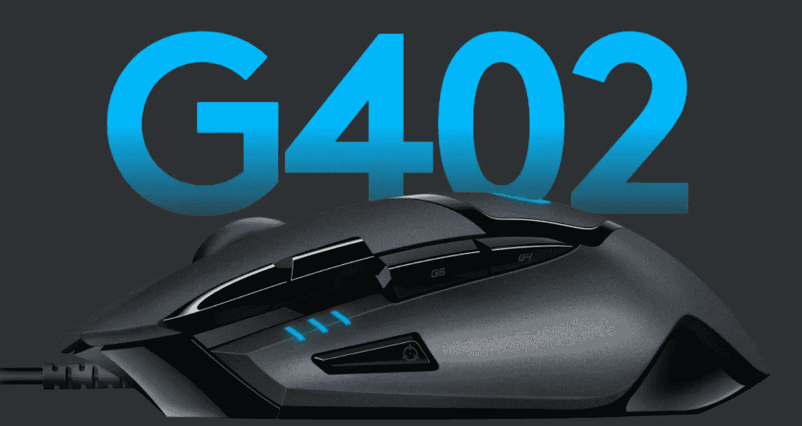
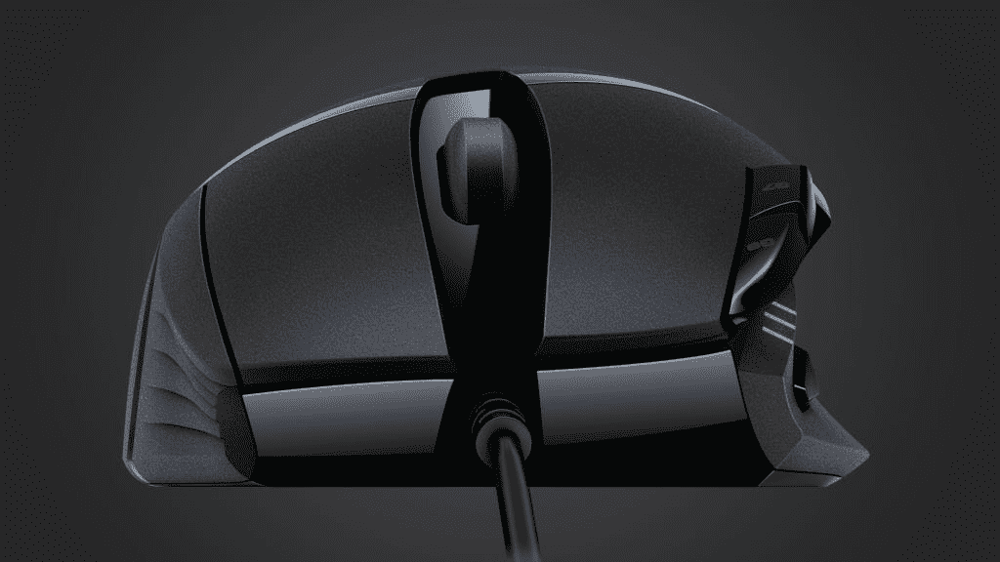
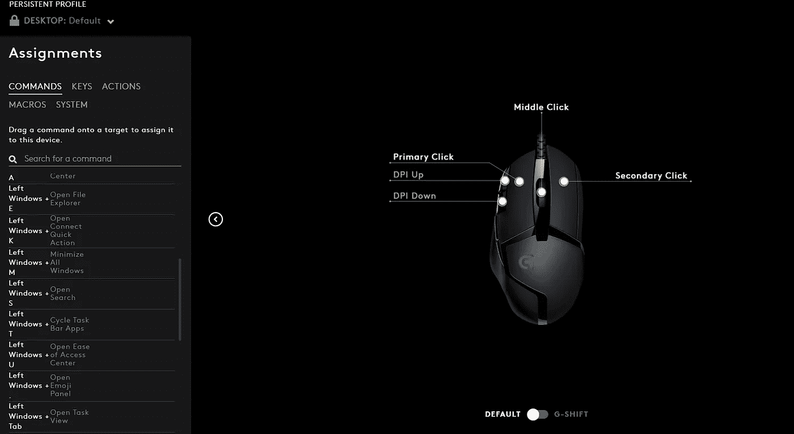

# 7 年后，罗技的 G402 仍然是我最好的生产力提升

> 原文：<https://medium.com/codex/7-years-later-logitechs-g402-remains-my-best-productivity-boost-bf27b47d1bd7?source=collection_archive---------5----------------------->

## 游戏鼠标也可以改变你的工作流程；以下是方法

罗技 G402 Hyperion Fury 游戏鼠标在她所有的荣耀。来源:罗技。

有人说游戏鼠标毫无意义。其他人说键盘快捷键是游戏的名字。但是我不敢苟同。一款设计精良的游戏鼠标不仅能在游戏中为您提供帮助。

这听起来像是一个营销宣传，但这不是你在这里的原因。你想知道为什么你要从一个低质量的鼠标站出来。虽然 30 多美元的设备更像是你自己的延伸，而不是一个工具，但罗技 G402 有着切实的好处。

凭借增强的人体工程学设计、可定制的按钮和坚如磐石的外形，游戏鼠标可以为您提供超越视频游戏领域的服务。老鼠的寿命很少成为问题。即使是不起眼的低价微软鼠标也能跑上几年。但是人机工程学和定制化在将鼠标变成你的鼠标方面还有很长的路要走。

# 迎接罗技 G402 Hyperion Fury

罗技的 G402 可以让我用 8 个可编程按钮做任何事情，从扔手榴弹到处理 Photoshop 图层。它的设计注重功能和舒适度，能够响应每一次点击和动作。罗技知道游戏玩家想要什么:价格实惠，性能稳定可靠。这些支柱甚至在生产力方面也举足轻重。

可定制的按钮让你忘记从一个应用程序到另一个应用程序的键盘快捷键。顶尖的人体工程学意味着手腕疼痛和酸痛是过去的问题。这些好处存在于大多数游戏鼠标上。

就拿一个工程师来说吧，他一天中有一半以上的时间都在玩软件，偶尔还会写点东西/玩玩游戏。这些鼠标不是噱头。这就是为什么游戏鼠标需要放在你的购物车里。

罗技 G402 Hyperion Fury 是一个轻量级冠军。来源:罗技。

# 以下是游戏鼠标如何提高工作效率的

*   **可定制按钮:**如果你不必记住键盘快捷键会怎样？按钮让你做到这一点。很多按钮。一些鼠标提供了 10 多个按钮，这些按钮既容易操作又完全可定制。是的，它们可以基于每个应用进行配置。再见，手指体操。
*   **人体工程学:**一个好的鼠标不仅仅是它的手感。完全适合手握的那种可以防止你的手腕酸痛。当你连续几个小时坐在办公桌前时，减少紧张和改善手臂姿势会有所帮助。你再也不用担心长时间的游戏会话和数据库修补了。现在坐直了。
*   **性能:**不是每个人都需要像素级的精准或者致命的精准。但是任何需要指向和点击的东西都可以使用一些奢侈品。游戏鼠标具有光学传感器，可以让你随意调整灵敏度设置，直到感觉*刚刚*正确。有些甚至让你调整重量和滚轮的工作方式。毕竟，这是你的鼠标*。*
*   美学:除了表演，还有更多工作要做。鼠标右键可以让工作(相对)变得可以忍受。当然，触觉点击、抓地力纹理和一个伟大的滚轮可能不会吸引每个人。成为你的手的延伸很少出现在鼠标功能列表的顶部。让一个人快速进入生产流状态的优质鼠标是被低估的生活帮。给自己找一个优雅的同桌。
*   **运行复杂的脚本:**将快捷键重新映射到按钮是一回事。但是如果你的鼠标可以通过按键做几件事呢？我说的是在不格式化的情况下添加文本或将文件复制到特定文件夹。任何需要多次按键的东西都是公平的游戏。写下所有的事情。
*   使用宏:在办公室工作通常可以归结为一遍又一遍地执行同样的任务。抛开疯狂的定义不谈，宏可以记录击键并将它们分配给一个按钮。你甚至可以控制每次按键之间的延迟。是的，这可以用来切换多个工作流程。像罗技的 G Hub 和雷蛇的 Synapse 这样的软件使得创建宏变得轻而易举。让每一次新闻都有价值。

罗技的 G Hub 是定制游戏鼠标的好方法。来源:图片由作者捕捉。

# 游戏鼠标是值得的非游戏投资吗？

以下是使用 Logitech G402 等游戏鼠标的一些方法:

*   用专用键在浏览器标签间来回切换。
*   特定功能，如音量控制、复制/粘贴等。
*   处理没有重复条目的电子表格和公式。
*   Photoshop/After Effects 快捷键或将几个命令组合成一个按钮。这适用于所有类型的编辑。
*   是的，游戏。技巧，能力，诡计，任何有用的东西。

生产力不仅仅是完成工作。最小化疲劳和开始任务的惰性是高级工具往往拥有的被低估的能力。这还不包括灵活性和美观性。

花几美元买一个坚固的游戏鼠标，让你期待使用它。一个同桌必须能够跟上你的步伐，一个游戏鼠标可以保证这一点，甚至更多。我不是说你会变得超高效，但你会心存感激。

如果你想买一款好的游戏鼠标， [The Verge](https://www.theverge.com/21252193/best-gaming-mouse) 有一些可靠的推荐。他们最推荐的是罗技 50 美元的 G502 Hero，比我 25 美元的 G402 Hyperion Fury 高了一步。一路平安！