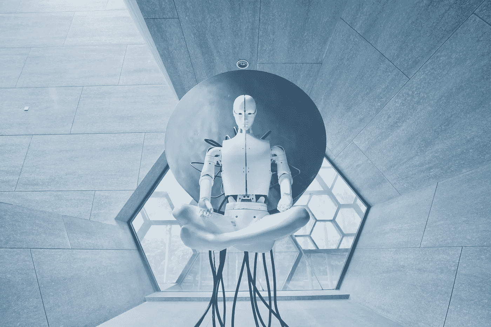

# 到 2032 年受人工智能影响的 10 个行业的 70 个预测

> 原文：<https://medium.com/codex/70-predictions-in-10-industries-impacted-by-ai-by-2032-494ab774bbc5?source=collection_archive---------14----------------------->

## 在 10 个行业中，这些是对人工智能将如何发挥重要作用的预测。

来自 Unsplash 的 Aideal Hwa

# 10 个行业以及一般预测:

1.零售:优化库存、定价和促销。