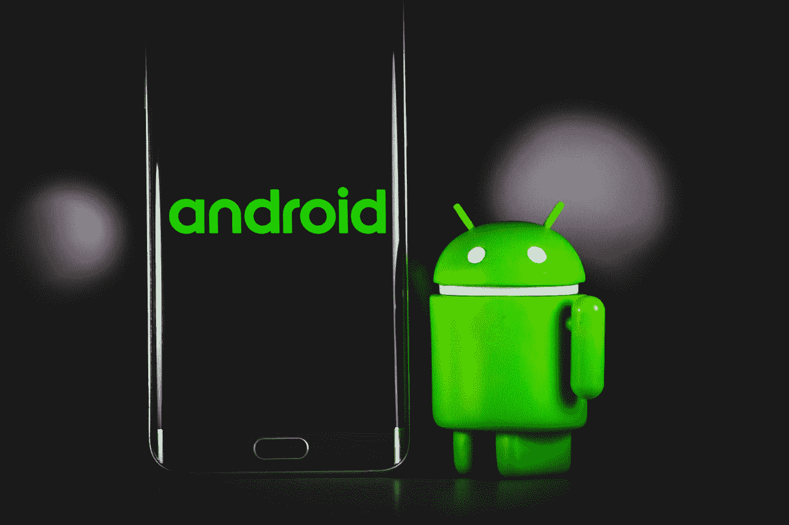

# 面向开发者的 8 款 Android 应用开发工具

> 原文：<https://medium.com/codex/8-android-app-development-tools-for-developers-357a08dfc21e?source=collection_archive---------22----------------------->

## 关于 android 应用开发工具你需要知道的一切

丹尼·米勒在 [Unsplash](https://unsplash.com?utm_source=medium&utm_medium=referral) 上的照片

当你想开发一个应用时，你可能听说过 Android Studio、Unity 3D、Eclipse 和 Gamemaker。但是这些程序到底是什么，以及如何选择最适合您特定需求的程序呢？我们将在本文中讨论这些工具和其他工具。希望…