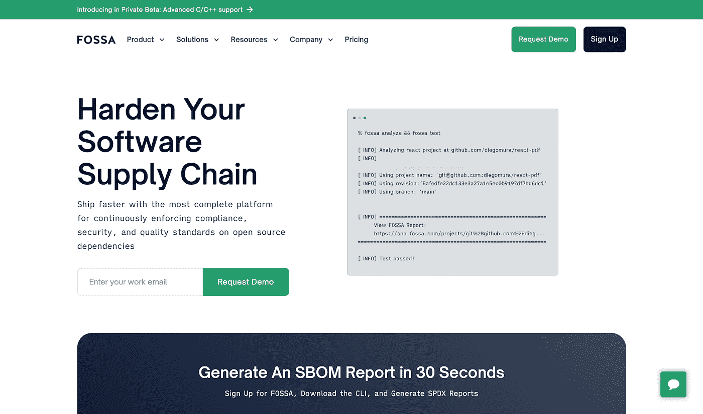

# 8 种降低依赖风险的行业标准工具

> 原文：<https://medium.com/codex/8-industry-standard-tools-to-reduce-dependency-risks-1742368a1555?source=collection_archive---------16----------------------->

[照片](https://unsplash.com/photos/eBRTYyjwpRY)由 [Radek Grzybowski](https://unsplash.com/@rgrzybowski?utm_source=unsplash&utm_medium=referral&utm_content=creditCopyText) 在 Unsplash 上拍摄

**依赖**，当你依赖某样东西(或某个人)时，就是你如何将自己置于危险之中。

一个简单的例子是你写的软件服务。它可能依赖于硬件:如果服务器宕机，服务也会宕机。反过来，服务器依赖于电力和网络连接提供商。如果不满足这些要求中的任何一项，服务将不可用。用户必须设计一个后备计划，以便在人员不可用的情况下减少他们的依赖。

在本文中，我们将介绍 8 种流行且可靠的行业标准工具，以降低依赖风险，以及它们可以为我们的项目做些什么来简化我们的工作并节省我们的时间。

# WhiteSource 翻新

[**white source renew**](https://www.whitesourcesoftware.com/free-developer-tools/renovate/)是一款**免费的**自动化工具，自动解决过时的依赖关系，并将这些更新集成到 DevOps 工作流中，省时省力。用户可以安装并运行 CLI 工具进行依赖项更新。该解决方案实时工作，检测并向用户分发所有可用的更新。

它有多种语言版本，支持所有文件类型，允许用户随时随地检测依赖关系。最后，随着每个新的更新，所有的历史和变更日志都被添加，用户可以对他们的更新进行测试。

# 德普夫

[**Depfu**](https://depfu.com/) 是一个平台，允许用户重新获得对其依赖关系的控制，同时也保持他们的应用程序最新。此外，该平台能够适应用户应用程序的更新速度，不会给安全 CI 系统带来过度压力。

Depfu 为用户提供了丰富的信息，以帮助他们在任何依赖关系更新方面做出明智的决策。如果用户的依赖项包含任何安全漏洞，平台会发出 PRs。最后，Depfu 的仪表板允许用户查看所有依赖项的状态以及 Depfu 正在做什么。

# Requires.io

[**Requires.io**](https://requires.io/) 是一个平台，允许用户以安全和最新的方式跟踪他们的依赖关系。它允许用户保护他们的 Python 项目，并自动监控它们的依赖关系。

用户只需要将他们的帐户连接到这个平台并激活他们的项目，平台就会开始搜索依赖项。用户还可以设置警报，以便在出现问题时收到通知。它还包括简单的代码片段，允许用户修改解决方案的行为。

# Pyup.io

[**Pyup.io**](https://pyup.io/) 保持 Python 依赖关系的安全性、合规性和最新性，并通过在发布新更新时向用户的 GitHub repo 发送自动拉请求来跟踪依赖关系更新。

它在其漏洞数据库中跟踪 200，000 多个依赖项。当一个新的依赖项被添加到平台时，它被实时跟踪并被添加到数据库中。Pyup.io 还扫描每个用户的依赖项的 OSS 许可证，以及私有和公共依赖项。

# 胚芽

[**Gemnasium**](https://github.com/gemnasium) 监控项目依赖性，并提醒用户任何可用的威胁或更新。该平台有一个简单的用户界面，允许用户在一个列表中看到他们所有的项目和服务器。Ruby 和 Rails 应用程序的管理框架是软件的名字。

Gemnasium 为用户提供关于他们的包的依赖状态的信息，以及关于所有这些依赖的报告。最后，它是一个支持所有 Java、npm、PyPI 和 Packagist 依赖项的付费应用程序。

# 凹

[**FOSSA**](https://fossa.com/) 是一个开源管理平台，它检查所有安全性和合规性策略，以消除所有构成威胁的资产和应用程序。它使用自动化的方法来分解整个软件供应链中的风险。

FOSSA 强调了许可证合规性的重大好处，这意味着您将完全了解第三方依赖性，并将能够与整个中央编程框架集成。它提供全面的依赖关系扫描、精选数据库、漏洞评估、灵活的策略引擎和补救指导。

# Libraries.io

[**Libraries.io**](https://libraries.io/) 是一个开源的数据库和发现服务，允许开发者在他们的代码中使用开源的包、模块和框架。用户必须键入他们希望使用的包或框架名称。该解决方案包括 Go、npm、PyPI、CocoaPods、WordPress、CPAN 和其他软件包管理器。

用户只能通过软件包管理器安装可用的库。此外，用户可以在 Libraries.io 上查看趋势包及其描述。最后，用户可以使用他们的 GitHub、GitLab 或 BitBucket 帐户登录平台。

# 索纳库贝

[**sonar cube**](https://www.sonarqube.org/)是一款开源软件，允许大量开发者贡献，并在平台上自动检查他们的代码质量。它提供了精确的度量和注释能力，并指出已经受到影响并将导致错误的特定代码行。

它为您提供了一个复杂的界面，可以处理您放在窗口上的源代码的每个方面。它提供了深入的代码分析、认知复杂性、对 25 种以上编程语言的支持、新的项目度量和产品项目活动，以及 webhooks。

# 结论

我希望我已经涵盖了本文中提到的所有工具。在我看来，这些工具将节省您的时间，自动化您的工作，并确保您的项目不依赖于另一个项目或服务，保护它免受任何可能来自其他项目或服务的损害。