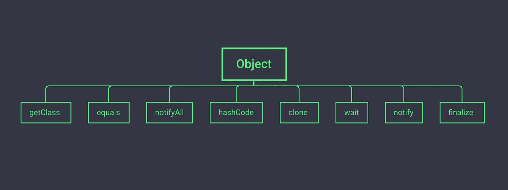

# Java 中 Object 类常用的 8 种方法，作为程序员必须了解

> 原文：<https://medium.com/codex/8-methods-commonly-used-in-the-object-class-in-java-as-a-programmer-must-understand-ab562810270a?source=collection_archive---------6----------------------->

众所周知，Java 中的 Object 方法使用非常频繁。Java 中所有的类都有一个共同的来源，那就是 Object 类，子类会继承 Object 类中所有的公共方法，所以今天就来看看这 8 个方法吧！

# **方法 1: getClass**