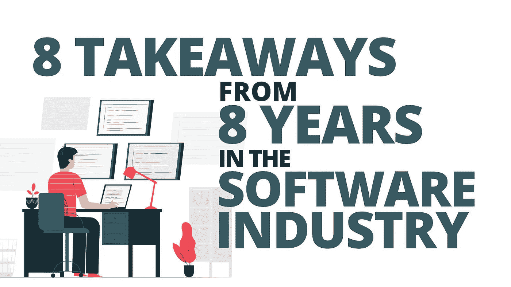
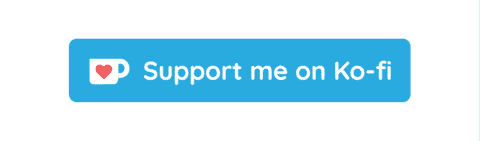

# 在软件行业 8 年的 8 个收获

> 原文：<https://medium.com/codex/8-takeaways-from-8-years-in-the-software-industry-fdc2966e030d?source=collection_archive---------5----------------------->

## 作为一名全职软件开发人员，我学到了什么。

*slides go 创建的图像—*

*最近，我在八年前毕业的那所大学做了一次演讲。*

*看到计算机科学专业学生在第三学期的反应和行为很有趣。*

*当然，我去过那里，这让我想到了从那时起作为一名全职软件开发人员我所学到的东西。*

# *1.你比你想象的要好*

*许多毕业生，甚至经验丰富的工程师都对他们谋生的工作充满信心。*

*例如，我们都知道冒名顶替综合症。但是相信我，如果你对软件开发充满热情，喜欢写代码，并且总是渴望学习更多东西，**你已经知道了很多，你应该得到你的位置**。*

*软件开发是一个有内在动力的领域，我想和其他职业一样。*

*如果你的动力仅仅来自于写代码，那你就没什么好担心的。因为你对编程语言、框架和新技术的兴趣，你已经比其他人有了巨大的优势。*

*希望作为毕业生，你还有这个动力。*

> *抓紧了。*

*有可能你得到了第一份工作，突然之间你比有经验的开发人员工作得更快。*

*也许他们甚至想让你慢下来。几乎可以肯定的是，在提出改变或改进建议后，你会听到这样一句话…*

> *“我们总是这样做”。*

*哦，好痛。*

*但是请不要低头。*

***保持好奇**。*

*保持饥饿。*

*获取经验，如果你和你现在工作的公司的文化不合拍，那就另找一家。*

# *2.你没有你认为的那么好*

*所有这些动机都无法改变这样一个事实，那就是你在大学里学到的很多东西都只是理论，不适合现实世界。*

*是的，也许写一个 UML 图会很棒。但是真的有必要吗？*

*我是说，真的真的有必要吗？*

*测试驱动开发是一种很好的实践，但是有时候你就是没有时间。我知道从长远来看，这可能会确保高质量，但是业内人士通常考虑的是短期的，或者只是需要一个快速的特性。*

> *这的确很痛，但这就是现实。*

*即使你不想听，但确保需求以好的代码结束是你的工作。*

*如果在给定的时间内不太可能做到这一点，那么**你有责任告诉你的老板**。如果这样的事情没有成功，也许是时候去别处看看了。*

*问题是，如果公司不理解不良行为的后果和员工的消极情绪，他们将永远不得不寻找新人。*

*但是作为一名毕业生，在你过早判断你雇主的文化之前，永远要有**尊重和一点耐心。他们可能有他们的理由。***

# *3.通过辅助项目学习*

*只在工作的时候写代码是绝对没问题的。*

> ***这真的没什么不好。***

*你有你的责任，你有压力，你应该在沙发上放松一下。*

*然而，许多人通过兼职项目学到了很多东西，甚至可能因为兼职项目或在兼职项目中获得的新技能而获得更好的工作机会。*

*举个例子，我对某些在工作中无法使用的技术( [Web API 2](https://docs.microsoft.com/en-us/aspnet/web-api/overview/getting-started-with-aspnet-web-api/tutorial-your-first-web-api) )感兴趣。*

*他们有自己的**遗留单片应用程序**并为此使用了相当老的 web 服务技术。*

*试图让事情变得更好，并提出一些改进建议**一点帮助也没有。***

> *所以我通过一个兼职项目学习了 Web API 2，申请了一份新工作，那里需要有这方面知识的人，事实上**得到了这个职位**。*

*但这不仅仅是为了得到一份更好的工作和学到你不会学到的东西。*

***边项目好玩！***

*你正在做你想做的事情。*

*你是你自己的老板，只有你决定你要做什么以及何时去做。*

*最后，你变得富有成效，从无到有，创造了一些东西。*

*我就是喜欢这个事实。*

# *4.软技能很重要*

*很多次，我都面临着这样的偏见:技术人员通常坐在地下室，见不到阳光，气味难闻，也无法与其他人交谈。*

> *我很想结束对我这类人的这种看法。*

*幸运的是，世界已经发生了很大的变化。*

*尽管如此，有时候一些个人发展可能会有所帮助。我认为自己是一个内向的人。这永远不会改变。*

*对我来说，这意味着我独自一人充电。*

*外向的人和其他人在一起时可能会获得能量。*

> *我不是那样的人。*

*这并不意味着我不喜欢和其他人在一起，但这可能会让人筋疲力尽。*

*这就是为什么我喜欢独处或和家人在一起，因为这不会耗尽我内心的电池。我想你明白了。*

*不管怎样，内向或害羞有时会阻碍你实现目标。这就是软技能发展的切入点。*

*我强烈推荐约翰·桑梅兹的《软技能:软件开发人员的生活手册》这本书*。**

*学会更开放，更经常地微笑，在咖啡机旁聊天，学习一些谈判技巧，不时地锻炼身体。*

*所有这些不仅增加了你的日常幸福，也增加了你提升职业生涯的机会**。***

# ***5.沟通至关重要***

***我已经提到了内向者和外向者的区别。***

***这一次不是在办公室里更加开放，而是与你的团队和老板进行沟通。***

***我不能充分地陈述这一点。***

> ***沟通在软件开发的每个部分都是关键。***

***沟通围绕着软件开发生命周期的每个阶段。***

***作为一个内向的人，你仍然可以在与你的团队沟通方面表现出色。***

*   ***谈谈你目前面临的问题。***
*   ***向你的同事展示你最近学到的东西。***
*   ***告诉你的老板或项目经理，她的一些要求可能不会真正实现，但你已经有了解决这个问题的想法。***

***根据我的经验，大多数更大的问题都是由于缺乏沟通引起的。***

***要么是需求不够清晰，要么是任务分配不正确，或者最糟糕的是，开发人员不敢告诉任何人他们犯了错误。***

*****住手！*****

***和你的队友谈谈。***

***你晚上会睡得更好。***

# ***6.如果你放弃了，你就不是一个放弃者***

***如果你不喜欢你的工作，辞职可能更好。***

***当然，留下来的理由有很多。你可能有责任让你的工作变得必要。但是也许你仍然可以选择**申请其他东西**。***

***然而，如果你完全靠自己，没有任何责任，真的没有理由辞职，除非你害怕或懒惰，或者两者兼而有之。***

***寻找别的事情然后放弃真的没关系。***

***如果有必要，权衡利弊。我只想说清楚，如果你认为有更好的地方适合你，你不应该让别人来评判你。***

***我认识一些痛苦的人，他们不会改变自己的现状，并且用忠诚和类似的事情作为借口。***

> ***如果你真的会死，千万不要为一个能在一周内取代你的公司而累死。***

***这是一个很大的负面影响，很抱歉，但有些人必须清醒过来。***

***有足够多的大公司和雇主愿意雇佣你，并创造一个你每天早上都想进入的空间。***

***(*几乎每天早上*。有些日子真糟糕。你知道我的意思。)***

# ***7.学习永不停止***

***很简单的道理。***

***尤其是在软件行业。***

***科技发展如此之快，**你必须一直学习新的东西。保持好奇心，阅读文章，尝试新事物。*****

***我相信你已经需要一些时间通过工作中的文章和视频来学习了。如果没有，从今天开始！***

***在工作中花些时间做这些是绝对没问题的。没有人能连续八小时写代码。***

***这并不意味着你必须学习现在流行的每一种新的编程语言或框架。知道这东西存在就够了。***

***如果你很好奇，想开始一个新的兼职项目，那太好了！去吧！***

***但是做好你的日常工作，并在做的同时学习一些新的东西，在大多数时候就足够了。我们经常会遇到新的挑战，掌握它们不仅是一种很棒的感觉，而且**会提高你的技能**。***

***你能做的最糟糕的事情就是停留在你目前的水平，拒绝任务，因为你不知道如何立即解决它们。***

*** [## 帕特里克·上帝

### 以简单有趣的方式教授代码。有什么要求吗？请在评论里告诉我。编码快乐！😊

www.youtube.com](https://www.youtube.com/c/PatrickGod) 

# 8.不要太认真了

> 最后，这真的不重要。

人们经常把自己的工作看得太重。

对我来说，独自写代码是我的动力。我喜欢结果和用代码解决问题。

学习新技术对我来说很有趣。我有很多次第一次接触不同的编程语言、框架、库、游戏引擎，这让我感到非常兴奋。

例如，在 web 开发中，从 jQuery 到 Knockout 或 Angular 双向绑定的飞跃是惊人的。

用 Unity 做游戏让我觉得我可以创造任何我想要的东西。这就是这一切的意义。

当然，有时候你不得不做一个并不令人愉快的项目。但如果你仔细观察，也许你还是会发现一些有趣的事情，或者对自己的新挑战。

只是不要太认真，不要给自己太大压力。从长远来看，制作软件应该是有趣的。永远不要忘记:

> [可以编码。他们不能。那真是太酷了。](https://learnpythonthehardway.org/book/advice.html)*** 

# ***但是等等，还有呢！***

*   ***[▶️](https://emojipedia.org/play-button/) ️Enjoy 很多。NET & Blazor 教程上 [**YouTube 上**](https://www.youtube.com/c/patrickgod) **。*****

***

在 YouTube 上订阅编码教程*** 

*   ***❤️ ️Let's 在 [**上连接 Twitter**](https://twitter.com/_PatrickGod) ， [**LinkedIn**](https://www.linkedin.com/in/patrickgod) 或 [**上连接媒体**](/@patrickgod) 。***
*   ***📧 [**订阅我的简讯**](https://mailchi.mp/364b891b448f/dotnetdev) 提前获取即将推出的教程&在线课程。NET，Blazor &更！***

******