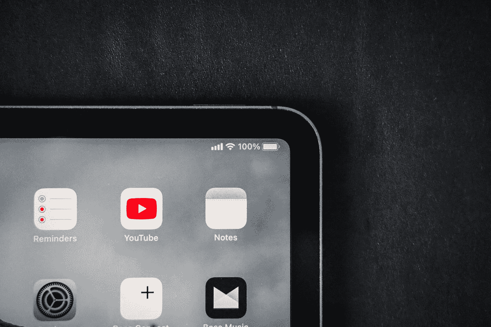

# 关于苹果笔记本的 8 件事会让你大吃一惊

> 原文：<https://medium.com/codex/8-things-about-apple-notes-that-will-blow-your-mind-26d433d46550?source=collection_archive---------1----------------------->

奥马尔·阿尔·戈森在 [Unsplash](https://unsplash.com?utm_source=medium&utm_medium=referral) 上拍摄的照片

世界已经数字化了。电子邮件取代了信件，打字取代了写作，视频电话取代了面对面的会议。由于有数千种不同的移动应用程序，不断交流的能力从未如此轻松。有一个应用程序可以处理所有事情，从消息、笔记、构思、提醒和待办事项。