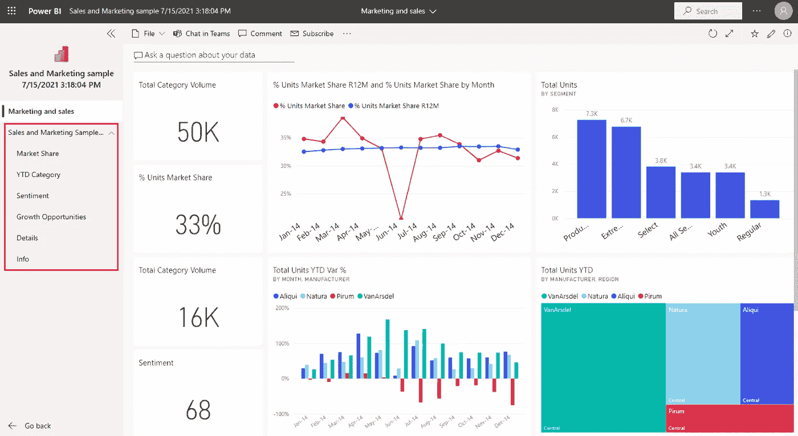
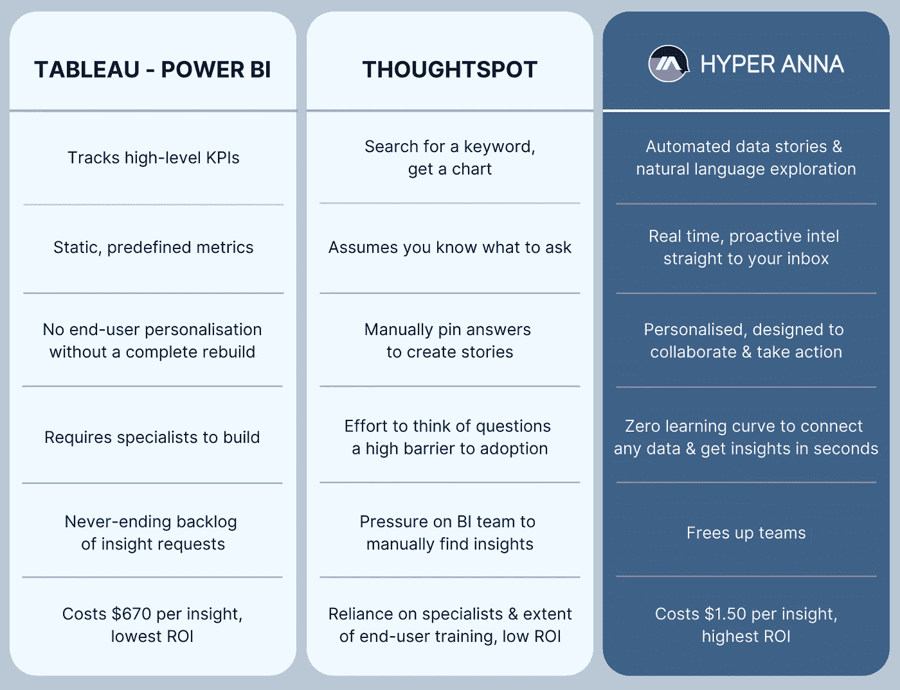

# 我不想让你知道的 8 件事

> 原文：<https://medium.com/codex/8-things-tableau-power-bi-dont-want-you-to-know-8fb645116a7d?source=collection_archive---------2----------------------->

## 购买(或构建)仪表板时需要考虑的问题。

权力 BI 和 Tableau 不想让你知道的 8 件事

# 场景:“我想要一个仪表板”

听起来很简单。仪表板的使用情形很简单，即监控高级 KPI 的能力。但是，尽管仪表板很普遍，这并不意味着它们实际上被业务团队用来获得洞察力。事实上，现实是暗淡的:传统 BI 工具的利用率低得令人难以置信，在 17-30%之间(来源: [BARC](http://barc-research.com/category/the-bi-survey/) ， [Gartner](https://www.gartner.com/doc/3753469) )。

恰当的例子——看看下面的销售仪表板。除了报告一些指标之外，这是否有助于回答紧迫的问题？转移指针让你接近达成交易？激发灵感或下一步行动？

这就是你的仪表盘的样子:图表和数字。零见识。

# 权力 BI 和 Tableau 不想让你知道的 8 件事

如果你想要一个销售仪表板，这里是你真正的，含蓄的要求:

1.  **我为员工而不是技术** *—我希望数据分析师为我构建一个仪表板。由于这依赖于一个专业的开发人员，我不介意等待几周或几个月来建立它。*
2.  **时间对我来说并不重要** *—我明白我不仅是在为软件付费，也是在为开发人员构建报告的时间付费。如果这份报告不是更广泛的组织的优先事项，我知道我的洞察请求将留在待办事项中，等待优先处理。*
3.  它只会和我今天要求的一样聪明。我能够看到的洞察力的深度和广度完全是预先决定的，我对此没有意见。我的用例只是监控高级 KPI，仅此而已。
4.  **将需要更多的钱** *—我认识到，如果我想问仪表板过滤器范围之外的问题，我将不能这样做。我需要依靠其他人来回答出现的问题。这意味着我需要更多的时间和金钱。*
5.  **此处无见解** *—我认识到仪表板仅报告一些关键数字。但它不是一个产生洞察力的工具。*
6.  这对我的团队没有帮助 *—作为一名领导者，我认识到如果我团队中的人想要深入挖掘洞察力，他们会陷入两种困境之一:1)将数据摘录导出到 Excel 并试图自己进行分析，或者 2)他们会盲目地做出决策，没有解决关键问题的洞察力。在后一种情况下，我认识到团队可能会不知所措:分析是复杂的，耗时的，容易出错的，需要专业知识，并且需要培训以知道对数据提出正确的问题——他们缺乏分析技能和经验，这影响了他们的信心或从头获得洞察力的愿望。他们还认识到，向数据团队寻求见解通常是徒劳的——拿到一张罚单，然后在积压的数据请求中等待优先处理。*
7.  **仪表板设计是主观的***——我认识到我的仪表板的质量、设计和建造时间取决于开发者。但是这种花哨的功能可能也没有必要，因为我跟踪高层数字的用例完全是预先确定的。*
8.  **感觉我们已经交付了一些东西** *—我认识到推出仪表板是一个“安全的选择”，因为几乎每个公司、每个部门、每个经理都有一个用例来监控高级 KPI，并通过他们的微软套件访问 Power BI。但是我知道我的团队，客户经理，不会从报告中得到很多。是的，它可能会成为我们团队会议的讨论点，但因为它缺乏洞察力，它不会帮助我们以不同的方式思考，加快决策或激发协作，从而帮助我们更快地达成交易。*

# 有没有更好的获得洞见的方法？

是啊！随着[增强分析](https://www.gartner.com/en/information-technology/glossary/augmented-analytics)和[自助商业智能](https://www.gartner.com/en/information-technology/glossary/self-service-business-intelligence)的推出，人们现在可以轻松地自助洞察哪些团队、地区或行业胜过其他人——如果不依靠数据分析师，他们将很难获得这些信息。

传统的 BI 工具 [Tableau](https://www.tableau.com/) 和 [Power BI](https://powerbi.microsoft.com/) 是让数据专家构建仪表板的同义词:帮助企业跟踪高级 KPI，并通过图表和可视化了解他们的数据。由于这些工具已经有大约 18 年(Tableau)和 7 年(Power BI)的历史，有相当多的仪表板开发人员乐于构建定制的解决方案。但是，解决方案(最终交付成果)是预定义的，而不是个性化的，需要专家来构建和维护(这需要很高的价格)。因此，虽然传统的 BI 工具被用作顶线数字的来源，但它们并不适合需要洞察力的经理或销售人员，也不适合回答他们当前的问题。事实上，有一个问题是[仪表板的未来是否是无仪表板的](https://scribblr42.medium.com/the-future-of-dashboards-is-dashboardless-6f746ea7d850) …

相比之下，像 ThoughtSpot 和 Hyper Anna 这样的工具是新一代 BI 工具的一部分，旨在增强商业智能功能。

*   [**ThoughtSpot**](https://www.thoughtspot.com/) 的建立是为了解决一个类似谷歌搜索的用例:“我想问我的数据问题&得到答案。”
*   [**Hyper Anna**](https://www.hyperanna.com/) 就是为了解决这个问题而打造的:“我需要洞察力。所以如果我的数据中有真知灼见，我想尽快知道。无需等待。不依赖专家。没有问一个问题。”

我们在下表中总结了主要差异。

力量 BI vs 画面 vs 思想点 vs 超安娜

# 想了解更多信息吗？

今天的文章是更长的白皮书的一部分，回顾了旧的和新一代的商业智能工具。如果你想更深入地了解，可以看看这篇文章，其中我们更详细地比较了四种 BI 工具:[Power BI vs Tableau vs ThoughtSpot vs Hyper Anna](https://hyperanna.medium.com/sales-analytics-how-do-the-new-bi-players-thoughtspot-hyper-anna-compare-to-power-bi-tableau-ed14909d1846#88c5)。

[**在此获取免费指南→**](/geekculture/sales-analytics-how-do-the-new-bi-players-thoughtspot-hyper-anna-compare-to-power-bi-tableau-ed14909d1846)

新的 BI 玩家 ThoughtSpot 和 Hyper Anna 与 Power BI 和 Tableau 相比如何？

**_ _ _ _ _ _ _ _ _ _ _ _ _ _ _ _ _ _ _ _ _ _ _ _ _**

**关于 HYPER ANNA —** 全球排名第一的自动化分析平台，被微软、IAG、新加坡电信和西太平洋银行等全球公司所使用。https://www.hyperanna.com/