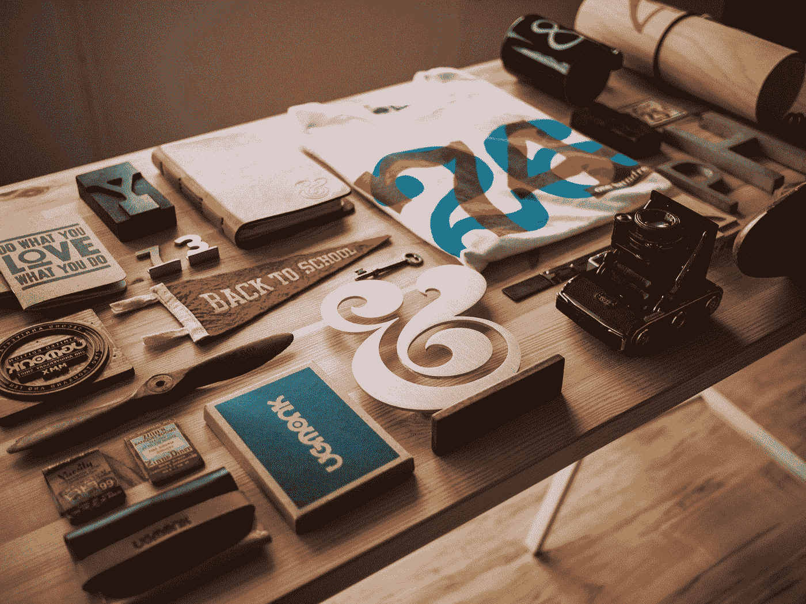

# 8 设计网站:我喜欢这个秘密网站

> 原文：<https://medium.com/codex/8-website-for-design-i-love-this-secret-website-7863fcd9a833?source=collection_archive---------3----------------------->

## CSS 很难，但是这些工具让它变得简单了一点。

杰夫·谢尔登在 [Unsplash](https://unsplash.com?utm_source=medium&utm_medium=referral) 上的照片

CSS 是一种允许你设计网页风格的语言。有许多免费的工具可以帮助你的 CSS 工作。本文将介绍三种最流行和最有用的 CSS 工具。

# Uiverse.io