# 为期 8 周的 SQL 挑战—丹尼餐厅第 1 周

> 原文：<https://medium.com/codex/8-week-sql-challenge-dannys-diner-week-1-49709bef08cd?source=collection_archive---------4----------------------->

马得已经开始了一个非常有趣的为期 8 周的 SQL 挑战，这是为 SQL 初学者或有经验的 SQL 用户。每周，你会有一个案例研究和一些问题。

如果你想加入这个挑战，这里有链接:[https://8weeksqlchallenge.com/case-study-1/](https://8weeksqlchallenge.com/case-study-1/)。

**此处可在线购买马得官方答案:【https://www.datawithdanny.com/courses/serious-sql】T2* *

第一周的案例研究是丹尼的餐馆—

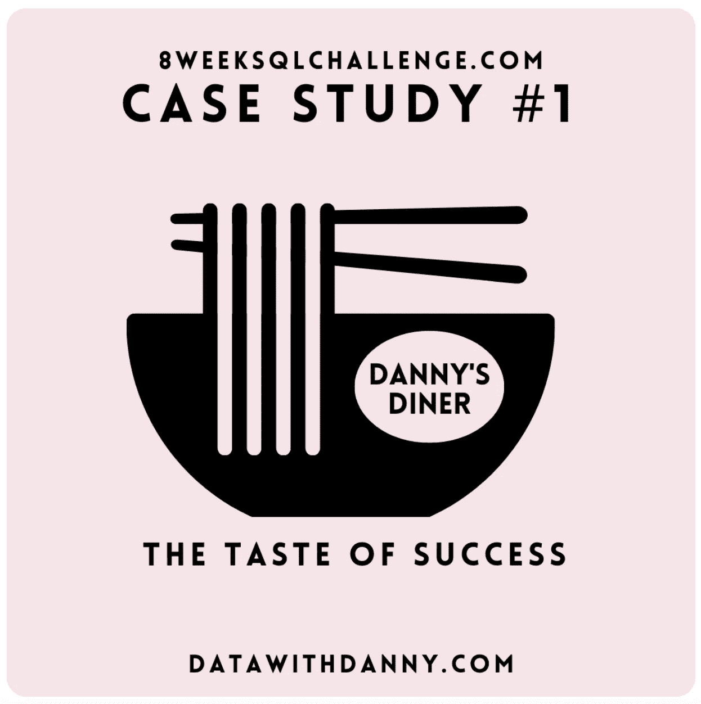

来自:【https://8weeksqlchallenge.com/case-study-1/ 

这是表格之间的关系—

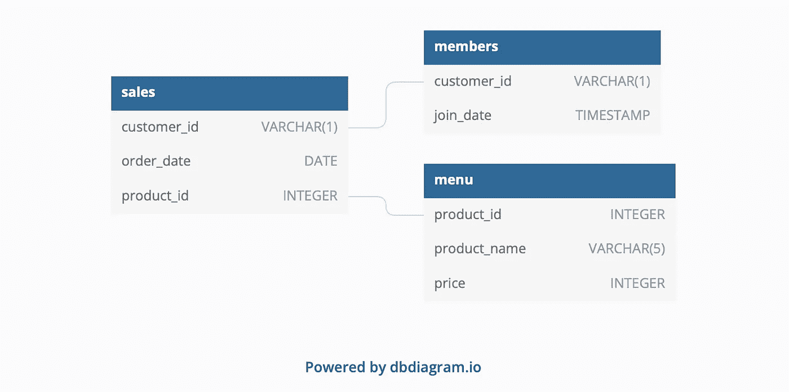

来自:[https://8weeksqlchallenge.com/case-study-1/](https://8weeksqlchallenge.com/case-study-1/)

这些是案例研究问题:

1.  每位顾客在餐厅消费的总额是多少？
2.  每位顾客光顾餐厅有多少天了？
3.  每位顾客从菜单上购买的第一个项目是什么？
4.  菜单上购买最多的项目是什么？所有顾客购买了多少次？
5.  每位顾客最喜欢的商品是什么？
6.  顾客成为会员后最先购买的物品是什么？
7.  顾客在成为会员之前购买了哪件商品？
8.  每位会员在成为会员前的总物品和消费金额是多少？
9.  如果每消费 1 美元相当于 10 个积分，寿司有 2 倍的积分乘数——每个顾客会有多少个积分？
10.  在客户加入计划后的第一周(包括他们的加入日期),他们在所有项目上都获得了 2x 积分，不仅仅是寿司——客户 A 和 B 在 1 月底获得了多少积分？

下面是我如何编写查询的，我将使用 PostgreSQL v13。由于我没有购买官方答案，这些结果是我理解问题的方式，它不是官方答案。

如果您发现了任何错误或认为有改进的潜力，请留下您的评论或联系我。谢谢:)

1.  每位顾客在餐厅消费的总额是多少？

```
SELECT customer_id , SUM(price) AS total_spent
FROM dannys_diner.sales s
JOIN dannys_diner.menu m 
ON s.product_id = m.product_id
GROUP BY customer_id
ORDER BY customer_id;
```

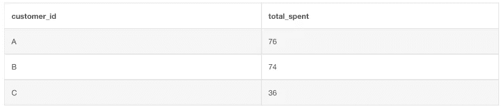

结果

2.每位顾客光顾餐厅有多少天了？

```
SELECT customer_id , COUNT(DISTINCT(order_date)) AS date
FROM dannys_diner.sales s
JOIN dannys_diner.menu m 
ON s.product_id = m.product_id
GROUP BY customer_id;
```

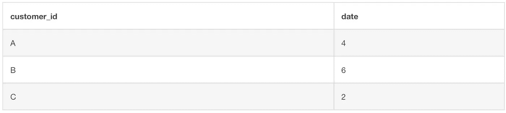

结果

3.每位顾客从菜单上购买的第一个项目是什么？

```
WITH
 first_purchase
AS
 (
  SELECT
   s.customer_id,
   s.order_date,
   m.product_name,
   DENSE_RANK() OVER(PARTITION BY s.customer_id 
          ORDER BY s.order_date) AS rank
  FROM dannys_diner.sales s
  LEFT JOIN dannys_diner.menu m 
  ON s.product_id = m.product_id
  LEFT JOIN dannys_diner.members ms 
  ON s.customer_id = ms.customer_id
 )
SELECT 
 customer_id,
 product_name, 
 order_date
FROM first_purchase
WHERE rank = 1
GROUP BY customer_id, product_name, order_date;
```

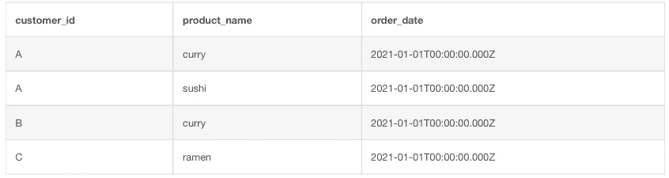

结果

4.菜单上购买最多的项目是什么？所有顾客购买了多少次？

```
SELECT m.product_name, COUNT(order_date)
FROM dannys_diner.sales s
JOIN dannys_diner.menu m 
ON s.product_id = m.product_id
GROUP BY product_name
ORDER BY COUNT(order_date) DESC
LIMIT 1;
```

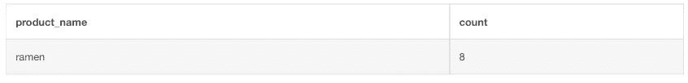

结果

5.每位顾客最喜欢的商品是什么？

```
WITH
 popular_item
AS
 (
SELECT s.customer_id, m.product_name,COUNT(m.product_name) AS order_count,
DENSE_RANK() OVER (PARTITION BY s.customer_id ORDER BY COUNT(m.product_name) DESC) AS rank
FROM dannys_diner.sales s
JOIN dannys_diner.menu m
ON s.product_id = m.product_id
GROUP BY s.customer_id, m.product_name
)SELECT customer_id, product_name
FROM popular_item
WHERE RANK = 1;
```

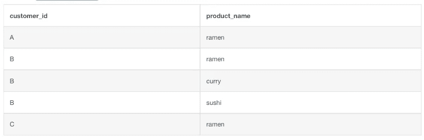

结果

6.顾客成为会员后最先购买的物品是什么？

```
WITH
 first_member_purchase
AS
 (
 SELECT
 s.customer_id, s.product_id, s.order_date, ms.join_date,
 DENSE_RANK() OVER(PARTITION BY s.customer_id 
 ORDER BY s.order_date) AS rank
 FROM dannys_diner.sales s
 INNER JOIN dannys_diner.members ms 
 ON s.customer_id = ms.customer_id
 WHERE s.order_date >= ms.join_date 
 )
SELECT customer_id, product_name, order_date
FROM first_member_purchase fmp
INNER JOIN dannys_diner.menu m 
ON fmp.product_id = m.product_id
WHERE rank = 1
ORDER BY customer_id;
```

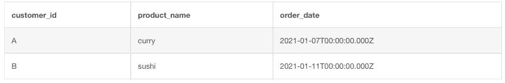

结果

7.顾客在成为会员之前购买了哪件商品？

```
WITH
 first_member_purchase
AS
 (
  SELECT
   s.customer_id, s.product_id, s.order_date, ms.join_date,
   DENSE_RANK() OVER(PARTITION BY s.customer_id 
          ORDER BY s.order_date DESC) AS rank
  FROM dannys_diner.sales s
  INNER JOIN dannys_diner.members ms 
  ON s.customer_id = ms.customer_id
  WHERE s.order_date < ms.join_date 
 )
SELECT 
 customer_id, product_name, order_date
FROM first_member_purchase fmp
INNER JOIN dannys_diner.menu m 
ON fmp.product_id = m.product_id
WHERE rank = 1
ORDER BY customer_id;
```

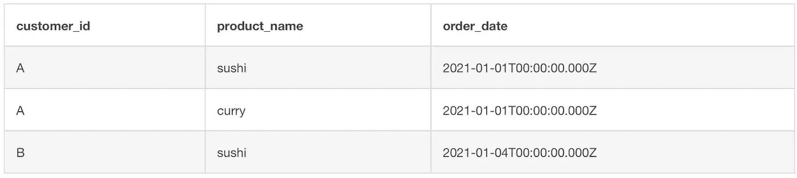

结果

8.每位会员在成为会员前的总物品和消费金额是多少？

```
SELECT 
 s.customer_id,SUM(price)
FROM dannys_diner.sales s 
INNER JOIN dannys_diner.menu m 
ON s.product_id = m.product_id
INNER JOIN dannys_diner.members ms
ON s.customer_id = ms.customer_id
WHERE s.order_date < ms.join_date
GROUP BY s.customer_id
ORDER BY s.customer_id;
```

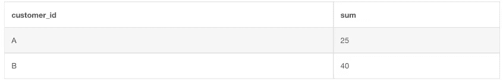

结果

9.如果每消费 1 美元相当于 10 个积分，寿司有 2 倍的积分乘数——每个顾客会有多少个积分？

```
SELECT 
 customer_id, SUM(points)
FROM 
(
SELECT customer_id, 
  CASE WHEN m.product_name = 'sushi' THEN price*20 ELSE price*10 END AS points
FROM dannys_diner.sales s
INNER JOIN dannys_diner.menu m
ON s.product_id = m.product_id
) AS total_points
GROUP BY customer_id
ORDER BY customer_id;
```

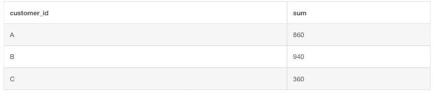

结果

10.在客户加入计划后的第一周(包括他们的加入日期),他们在所有项目上都获得了 2x 积分，不仅仅是寿司——客户 A 和 B 在 1 月底获得了多少积分？

```
WITH
 first_week_program
AS
 (
  SELECT
   s.customer_id, 
   CASE WHEN m.product_name = 'sushi' AND
    s.order_date BETWEEN ms.join_date + CAST(-1 || 'day' AS INTERVAL) and 
    ms.join_date + cast(6 || 'day' AS INTERVAL) THEN m.price*20
   WHEN product_name = 'sushi' OR
    s.order_date BETWEEN ms.join_date + CAST(-1 || 'day' AS INTERVAL) 
   AND
   ms.join_date + CAST(6 || 'day' AS INTERVAL) THEN m.price*20
   ELSE m.price*10 END AS points
  FROM dannys_diner.members ms
  LEFT JOIN dannys_diner.sales s 
  ON s.customer_id = ms.customer_id
  LEFT JOIN dannys_diner.menu m 
  ON s.product_id = m.product_id
  WHERE s.order_date <= '20210131'
 )
SELECT customer_id, SUM(points) points
FROM first_week_program
GROUP BY customer_id;
```

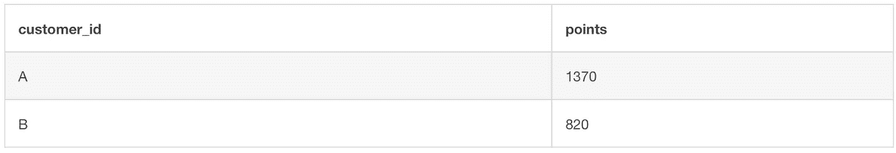

结果

额外问题

1.  使用可用数据重新创建下表输出:

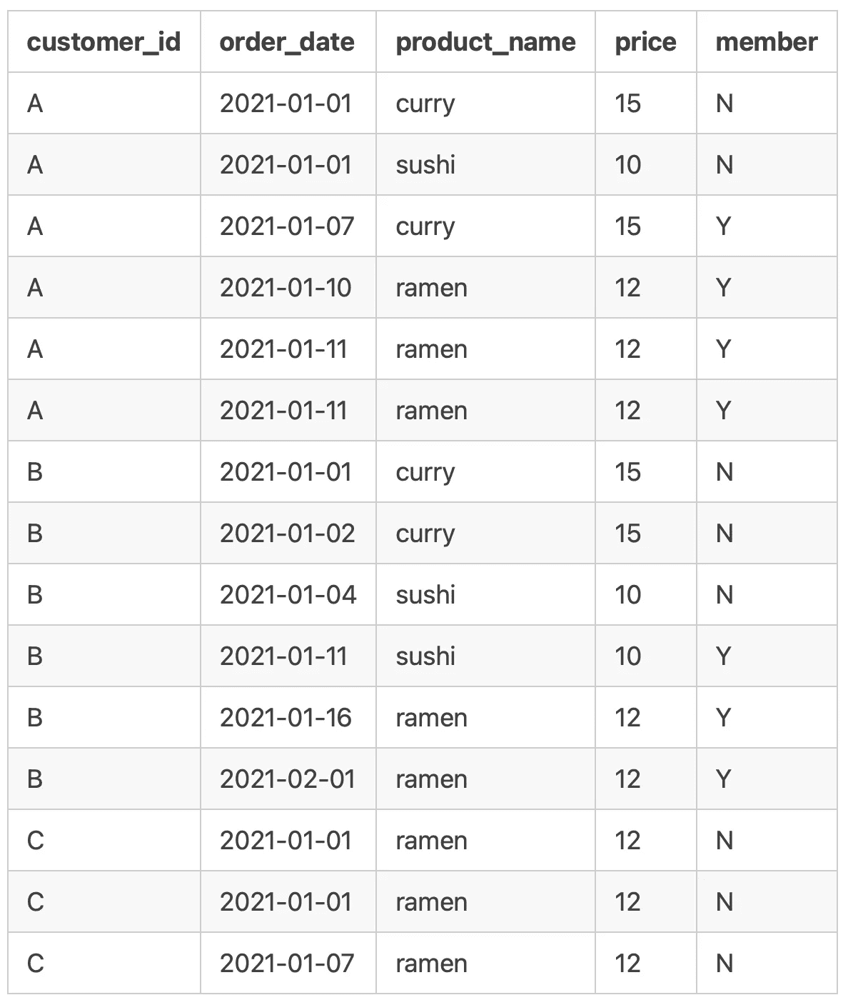

来自:【https://8weeksqlchallenge.com/case-study-1/ 

```
SELECT s.customer_id, s.order_date, m.product_name, m.price,
CASE
 WHEN ms.join_date > s.order_date THEN 'N'
 WHEN ms.join_date <= s.order_date THEN 'Y'
 ELSE 'N'
 END AS member
FROM dannys_diner.sales AS s
LEFT JOIN dannys_diner.menu AS m
 ON s.product_id = m.product_id
LEFT JOIN dannys_diner.members AS ms
 ON s.customer_id = ms.customer_id;
```

2.Danny 还需要关于客户产品的`ranking`的进一步信息，但是他故意不需要非会员购买的排名，所以他希望当客户还不是忠诚度计划的一部分时，记录的值为空`ranking`。

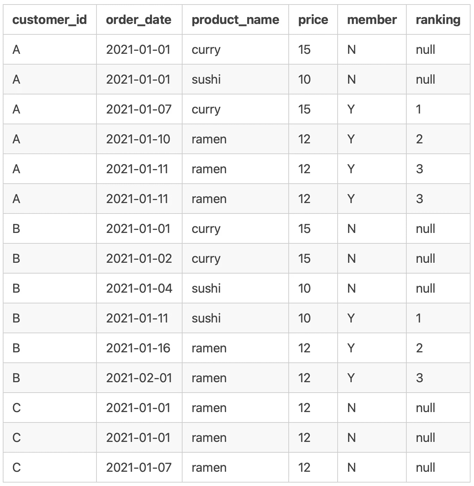

来自:【https://8weeksqlchallenge.com/case-study-1/ 

```
WITH summary AS
(
SELECT s.customer_id, s.order_date, m.product_name, m.price,
CASE
 WHEN ms.join_date > s.order_date THEN 'N'
 WHEN ms.join_date <= s.order_date THEN 'Y'
 ELSE 'N' END AS member
FROM dannys_diner.sales AS s
LEFT JOIN dannys_diner.menu AS m
 ON s.product_id = m.product_id
LEFT JOIN dannys_diner.members AS ms
 ON s.customer_id = ms.customer_id
  )

 SELECT *, CASE WHEN member = 'N' THEN NULL ELSE RANK() OVER(PARTITION BY customer_id,member ORDER BY order_date)
 END AS ranking
 FROM summary
```

我为它做了一个桌面仪表盘，希望丹尼的餐馆能继续发展！你可以在这里和它互动:[https://public.tableau.com/app/profile/yunchenwu#!/?newProfile= & activeTab=0](https://public.tableau.com/app/profile/yunchenwu#!/?newProfile=&activeTab=0)

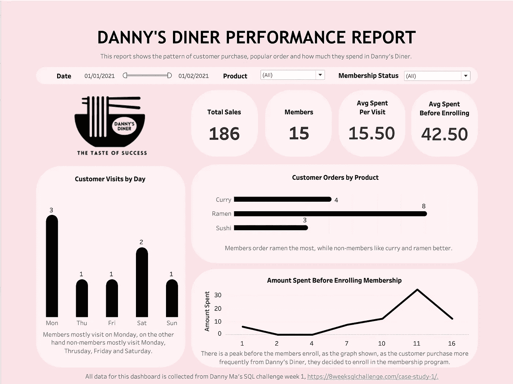

***查看其他媒体作者对马得为期 8 周的 SQL 挑战赛第 1 周*** 的 SQL 查询

[***黄***](https://medium.com/u/85a16e906d26?source=post_page-----49709bef08cd--------------------------------)

[](https://medium.com/u/3a868671baeb?source=post_page-----49709bef08cd--------------------------------)

*[***奥尔昆阿然***](https://medium.com/u/e4e5c3630003?source=post_page-----49709bef08cd--------------------------------)*

*[***比拉帕***](https://medium.com/u/8078da1f619c?source=post_page-----49709bef08cd--------------------------------)*