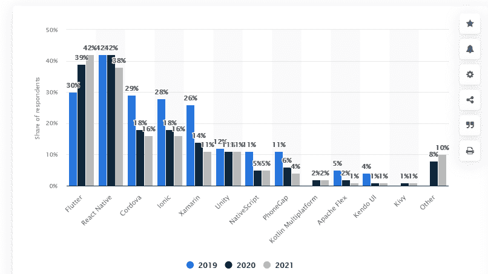

# Flutter 的 9 大优势:对移动 App 开发有好处？

> 原文：<https://medium.com/codex/9-advantages-of-flutter-good-for-mobile-app-development-1fc6eb1099ff?source=collection_archive---------10----------------------->

Flutter 吸引了整个开发社区的注意，这是有充分理由的。Google 推出了 Flutter 作为开源的移动应用开发技术。

Flutter 是移动应用程序开发的首选技术，因为它能够加快开发过程。此外，它降低了整体开发成本，这进一步帮助了创业公司和企业。

使用 Flutter，开发人员可以利用 Google 的 UI 工具包来设计和构建本地应用程序，同时利用令人难以置信的用户界面。

# 理解颤振的波动

自 Flutter 首次推出以来，已经有四年多一点的时间了，它已经在 GitHub 上获得了 [131K 颗星星。除此之外，我们还检查了堆栈溢出调查 2021，它发现 13.55%的调查受访者喜欢使用和使用 Flutter。](https://github.com/flutter/flutter)

有几个原因有助于我们理解 Flutter 在移动应用程序开发中的激增和大规模采用:

# 1.跨平台开发

每个高效的[移动应用开发公司](https://www.inexture.com/services/mobile-app-development/)都希望减少开发所需的时间，同时优化开发成本和投入的精力。

Flutter 允许他们一次为不同的平台构建一个应用程序，因此具有跨平台兼容性。开发人员最终会编写更少的代码，这导致了令人满意的结果。

# 2.易于使用的插件

Flutter 拥有广泛的内置 UI 用例及功能。除此之外，开发人员可以访问额外的小部件和工具，通过投入最少的努力获得更好的结果。更多的插件意味着开发者可以轻松扩展开发视野。

# 3.可扩展的应用

Flutter 应用程序开发人员使用 Google 的 Firebase 支持结构来创建无服务器和可扩展的应用程序。这不仅有助于提高开发速度，还能让公司在需要时快速开发应用程序。

# 4.成长中的社区

超过 200 万名 Flutter 应用程序开发人员正在形成一个由志同道合的专业人士组成的庞大而紧密的社区。下图显示了全球开发者对不同跨平台移动应用开发框架的使用情况。

此外，[堆栈溢出调查](https://insights.stackoverflow.com/survey/2021#technology)称，超过 5000 名开发人员希望使用 Dart，但他们目前使用的是 JavaScript。

来源: [Statista](https://www.statista.com/statistics/869224/worldwide-software-developer-working-hours/)

# 扑动优于 Xamarin 和自然反应

除了 Flutter，其他跨平台解决方案也被移动应用程序开发服务使用，如 Xamarin 和 React Native。虽然这些技术有自己的优势和社区支持，但 Flutter 是首选的解决方案。

这是因为 Flutter 提供了对综合开发环境的访问，包括 API、小部件、CLI 工具等。此外，这些工具和小部件是可定制的。

当你[雇佣颤振专家](https://www.inexture.com/hire-flutter-app-developers/)时，他们定制和理解这些工具集成的能力对于了解他们对技术的理解是很重要的。而且 Flutter 因为有谷歌撑腰，被认为更靠谱。

其他几个原因表明了为什么 Flutter 正在制定移动应用开发服务的新标准，这也可以称为使用 Flutter 的好处。

# 颤振的 9 大优势

# 1.单一代码库

Flutter 采用一次编写的方法，这意味着您只需编写一次代码，就可以在任何地方运行，具体取决于平台。如果没有 Flutter，一个移动应用程序开发公司将不得不雇佣不同的开发者来为不同的平台构建应用程序。

但说到 Flutter，开发人员只需编写一次代码，它就可以在 Android 和 iOS 设备上无缝运行。这减少了构建应用程序所需的工作量。这提高了开发速度，同时减少了时间。

# 2.热重装

这是 Flutter 的最佳特性之一，也是它在推出后的几年里广受欢迎的原因。热重载允许 Flutter 开发人员立即看到视图组件中对代码所做的更改。这意味着开发人员不需要在每次简短编辑后重新编译代码。

这为他们节省了大量的时间和精力，否则他们会反复编辑代码，直到得到想要的结果。通过热重载，开发人员可以创建一个并排的编码和视图组件窗口。当他们编码时，视图组件显示最终结果。除了快速编写代码之外，热重载对于修复 bug 尤其重要，开发人员可以体验实时代码修改。

# 4.镖

Dart 是一种客户端优化的编程语言，有助于在任何平台上快速构建应用程序。和 Flutter 一样，Dart 也是谷歌在 2012 年开发并推出的。

我们在 Flutter 中看到了来自 Dart 的几种可能性，包括高效的编码环境和多平台支持。Flutter 应用程序开发人员必须在使用 Dart 方面训练有素，经验丰富。

# 5.本地性能

使用 Flutter 开发应用程序意味着开发人员可以构建具有高性能接口和本机性的类似本机的应用程序。一个 Flutter 应用程序开发者可以很容易地将所有平台特有的差异合并到代码中，比如滚动、导航、图标、字体等。

换句话说，无论应用程序将在哪个平台上运行，Flutter 都可以帮助交付与该平台相关联的本机接口。

# 6.更快的发展

使用 Flutter 的移动应用程序开发公司可以更快地构建应用程序，因为它只需要编写一次代码，就可以在任何地方运行。在竞争激烈的市场中，更快的上市时间对于企业的成功至关重要。除了单一代码库，热重装功能也有助于提高开发速度。

这是因为开发人员可以快速查看编辑内容并加快错误修复过程。一切都归结于一个事实，即首先在市场上推出的应用程序有更高的机会获得流行和大规模采用。

# 7.面向 MVP 的开发

组织更喜欢雇佣一家了解并有 Flutter 开发经验的移动应用开发公司。Flutter 最适合 MVP 开发，原因有几个，包括更快的开发和简单性。

对于一家初创公司或任何寻求融资的企业来说，展示 MVP 增加了成功的机会。此外，颤振开发需要更少的时间和资源。如果这不是全部，Flutter 与 Firebase 兼容，这消除了为开发 MVP 版本创建单独后端的需要。

# 8.减少测试工作量

想象一下开发一个没有颤振的应用程序。你将需要两个或更多的开发团队来迎合 Android 和 iOS。一切都将翻倍，包括时间、成本和开发。

使用 Flutter，在降低成本和开发复杂性的同时，您还可以加快测试所需的时间。由于应用程序被快速测试和验证，它有助于加速开发过程的完成。

# 9.Flutter 易于设置和维护

Flutter 有一个单一的代码库，更容易维护和设置。简单的设置意味着用 Flutter 启动开发过程会更快。除此之外，简单的维护简化了测试和错误修复工作。维护和测试团队不必在窗口之间来回切换，因为它支持热重装。

以上各点总结了 Flutter 移动应用程序开发服务快速、简单、结构化，可以加速开发过程。使用 Flutter 开发一个应用程序可以创建一个直观和高级的用户界面，根据需求集成相关和有效的小部件和 API。

# 颤振的工作示例

由于其简单的编码和更快的开发，Flutter 已经被用于各种应用程序和商业解决方案。考虑到这一点，这里列出了用 Flutter 构建的最流行的应用程序。

# 颤振 2.5 的变化综述

Flutter 2.5 是升级和改进历史上的大发布之一。Flutter 的最新版本带来了一些改进，并解决了开发者和用户报告的一些性能问题。

在新版本中，您将使用 Android 全屏支持和更多的材料，以及支持可切换键盘的更新文本编辑功能。

与此同时，iOS 开发的性能也得到了增强，包括着色器预热和 iOS jank 的减少。

# 结论

Flutter 是一项 [**改变手机 app 开发游戏规则的技术**](https://www.inexture.com/flutter-a-game-changing-technology-for-mobile-app-development/) 。使用它，Flutter 应用程序开发者可以构建任何类型的应用程序，包括游戏、实用程序、电子商务、生活方式等。，并为其添加定制的特性和功能。

由于框架的内置功能，所有这些都可以在很短的时间内完成。几乎每个移动应用程序开发公司都需要有一个 Flutter 专家团队来吸引更多的客户，因为 Flutter 是构建先进的、面向市场的解决方案或应用程序的完美技术之一。

如果你知道更多关于 Flutter 的优点或者有任何问题，请使用下面的评论框。

*原载于 2021 年 10 月 7 日 https://solutionsuggest.com***。**