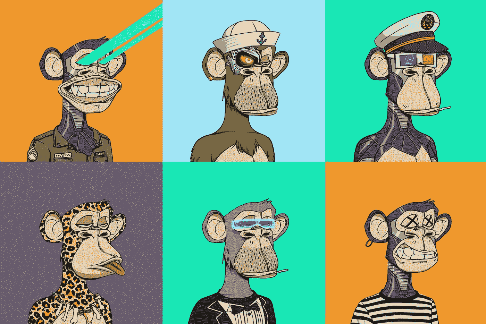

# NFT 是一项糟糕投资的 9 个原因:猿币困境

> 原文：<https://medium.com/codex/9-reasons-why-nfts-are-a-bad-investment-ape-coin-dilemma-e500c3c14c82?source=collection_archive---------3----------------------->

来源:*无聊猿游艇俱乐部&纽约客*

NFT 现在是一个热门话题，这是有充分理由的。它们为投资者和持有者提供了巨大的潜力。但是如果你想买一个，首先做好调查是很重要的。因为如果你不知道你在做什么，你可能会损失很多钱。

# 那么什么是 NFT 呢？