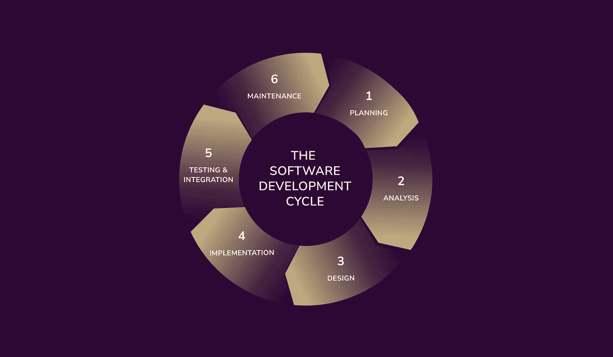

# 9 个软件开发生命周期模型

> 原文：<https://medium.com/codex/9-software-development-life-cycle-models-c16bee2a917a?source=collection_archive---------9----------------------->

不同的软件开发生命周期方法以不同的方式承担开发过程。然而，有一个共同的因素:他们的目的。系统开发方法旨在快速有效地创建高质量的软件。专业人士区分了九种软件开发生命周期模型:

*   瀑布模型
*   迭代模型
*   敏捷模型:看板和 Scrum
*   增量模型
*   螺旋模型
*   v 型车
*   精益模型
*   RAD 模型
*   软件原型模型

要选择合适的 SDLC 模型，您必须考虑必要的专业知识水平、预算、时间以及与流程相关的其他因素。然而，明智的做法是理解所有软件开发模型和方法的细节，以便为您的项目选择一个最佳选项。在本文的其余部分，您将会看到每种 SDLC 模型的详细描述以及它们的具体用法。

# 瀑布模型

瀑布软件开发生命周期是第一个也是最简单的 SDLC 模型。这种方法看起来像一个流程，因为它的各个阶段紧密相连，并且按顺序一个接一个。然而，与其他系统开发方法相比，瀑布代表了一种非常严格的软件开发方法。

瀑布模型系统开发生命周期的阶段是:

*   分析；
*   设计；
*   发展；
*   测试；
*   维护。

在瀑布模型中，一个阶段的结果成为下一个连续阶段的输入。因此，在进行下一步之前完成每一步是至关重要的。在这个模型中，每个 SDLC 阶段只能进行一次。

## 赞成的意见

*   具有严格活动顺序的结构良好的流程；
*   容易区分任务的优先顺序，设定准确的截止日期；
*   在每个阶段完成之前对其进行测试的机会；
*   瀑布模型示例的每个阶段都有一个具体的结果和一个定义好的评审过程。

## 骗局

*   缺乏灵活性；
*   高风险；
*   不适合着眼于长期的项目；
*   软件工程中的瀑布模型不提供在项目启动前检测其优缺点的可能性。

# v 型车

V-model 是瀑布方法的扩展。这种 SDLC 模型将测试(也称为“验证”步骤)融入到每个阶段。

V 模型包括几个验证阶段，例如:

*   业务需求分析；
*   建筑设计；
*   系统设计；
*   模块设计；
*   编码阶段。

该 SDLC 模型包括各种测试选项，可执行多种功能:

1.  单元测试在代码级别执行测试，这有助于在软件开发生命周期的早期阶段处理错误。
2.  集成测试发生在架构设计阶段，执行内部模块的验证。
3.  系统测试验证软件功能，并确定其与外部模块的交互水平。
4.  验收测试提高了软件的负载和性能，并揭示了它与其他系统的兼容性。

## 赞成的意见

*   最小风险；
*   易于理解，管理简单；
*   所有的 V-model 阶段都按照严格的顺序依次进行。

## 骗局

*   耗时的开发；
*   没有风险分析行动；
*   V-model 一旦进入测试阶段就很难修改。

# 增量模型

增量模型是线性的，因为所有阶段都是相互接续的。在这种模式中，SDLC 由小型项目组成，每个项目都导致一个成熟的产品。一旦所有这些系统被组合成一个最终的软件系统，产品就可以投入使用了。

增量模式包括四个阶段:

*   需求分析
*   设计
*   编码
*   测试

## 赞成的意见

*   对新技术的逐渐适应；
*   适应需求变化的灵活性；
*   增量模型有助于预测与项目预算相关的风险。

## 骗局

*   它的阶段是严格和相对困难的；
*   问题会对系统架构造成损害；
*   增量模型需要一个优秀的项目计划和设计。

# 螺旋模型

螺旋模型 SDLC 是一系列迭代和线性开发阶段，侧重于分析。螺旋开发生命周期有四个阶段:

*   识别
*   风险分析
*   设计
*   开发和测试

Spiral 是所有 SDLC 方法中最灵活的模型，因为它结合了瀑布方法和原型方法的特点。该模型强调目标定义和风险评估，这对实施阶段至关重要。它也是基于客户评估，并包括一个客户互动的线性方法。

## 赞成的意见

*   灵活的设计和原型制作；
*   准确捕捉需求；
*   高效的风险管理。

## 骗局

*   更复杂的管理系统；
*   没有具体的截止日期；
*   过多的文档。

# 敏捷模型

SDLC 中的敏捷模型结合了软件开发的迭代和增量阶段。这种方法最大限度地提高了系统的适应性，使我们能够快速、经济地推出产品。

敏捷软件开发生命周期由以下阶段组成:

*   规划
*   需求分析
*   设计
*   编码
*   单元测试
*   验收测试

敏捷的主要焦点是对变化和持续开发的快速响应，因此它将在整个 SDLC 过程中提升您的产品。

## 赞成的意见

*   风险和资源需求最小的现实方法；
*   与客户的持续沟通和互动；
*   管理文档的最低规则。

## 骗局

*   敏捷方法生命周期需要整体计划的可用性和快速的项目管理实践；
*   它依赖于与用户的交互；
*   缺少文档和不断变化的需求。

看板和 Scrum 是两种强大的敏捷方法，它们有相同的原则，但不同的实践。让我们仔细看看它们。

# **看板**

有了看板，大任务被分成了更小的部分。当任务通过传统阶段时，它们在棋盘上被组织和移动:

*   要做的事(计划的)
*   在发展中
*   在检查中
*   已完成(完成)

## 赞成的意见

*   非常容易实现——易于理解，不需要结构改变或特殊设置；
*   灵活性——可以根据项目的需要和优先级随时添加、删除或阻止任务；
*   促进持续改进；
*   促进协作和团队精神。

## 骗局

*   缺乏时间框架；
*   看板需要持续关注，因为它可能会很快变得过时和/或过于复杂。

# 混乱

尽管使用 Scrum 方法，你也可以将大任务分成小任务，但这与看板有很大的不同。Scrum 依赖于规定的角色(产品负责人、Scrum Master、开发团队)和 sprints——2-4 周的工作时间框架。

## 赞成的意见

*   明确工作量和截止日期；
*   来自客户的持续反馈确保了最佳结果；
*   持续的沟通有助于更快、更容易地发现和解决问题。

## 骗局

*   只适合有经验和忠诚的团队；
*   整个项目没有预计的成本估价和时间限制。

# 精益模型

精益 SDLC 模型关注软件效率和最终结果的快速交付。这个系统开发模型包括敏捷模型的各个方面，以减少软件浪费和成本。

第一个原则是消除浪费阶段。然后是完整的系统优化过程和软件结构化过程。下一个陈述——团队授权有助于避免产品开发过程中的轻率决策。

## 赞成的意见

*   降低成本；
*   其简化的方法允许在更短的时间内交付更多的功能。

# 骗局

*   精益 SDLC 严重依赖团队决策；
*   比其他系统扩展性差；
*   需要强有力的文件。

# 重复的

软件开发生命周期的迭代模型致力于改进系统的有效部署。首先，您必须确定实现附加需求的软件部分。在该模型的最后阶段，获得软件的新版本。

## 赞成的意见

*   迭代模型易于使用；
*   能够以较低的成本改变项目的范围和要求；
*   轻松识别和消除风险。

## 骗局

*   在软件开发过程中可能需要额外的资源；
*   需要更多的管理关注；
*   没有高技能的资源无法分析风险。

# 快速应用开发模型

快速应用程序开发模型是一种不需要具体计划的程序开发方法。这个 SDLC 模型包括创建一个原型；即与实际项目具有相同功能的产品的工作模型。

使用 SDLC 中的快速应用程序开发模型实现的项目遵循迭代和增量阶段。RAD 模型阶段包括:

*   业务和数据建模
*   过程建模
*   测试
*   营业额

## 赞成的意见

*   可以测量 SDLC 的进度；
*   增加软件开发组件的可重用性；
*   缩短 SDLC 生命周期所需的时间。

## 骗局

*   需要专业的开发者和设计师；
*   依赖于建模技能；
*   更困难的管理过程。

# 软件原型模型

开发人员更喜欢软件原型模型，因为它有助于在软件发布的早期阶段揭示客户的需求。软件开发阶段允许结合用户对产品的意见，从而确定项目可能的改进。

软件原型模型有四个阶段:

*   需求识别
*   原型开发
*   原型审查
*   审查和改进原型

## 赞成的意见

*   允许用户在测试阶段更多地参与项目；
*   减少花费在 SDLC 上的成本和时间；
*   为与客户的互动提供快速沟通解决方案。

## 骗局

*   软件原型模型会使 SDLC 过程过于复杂；
*   大量多样的原型和实际系统可能会让用户感到困惑。

正如您所看到的，每个 SDLC 模型都有其优点和缺点。选择最适合您的项目的方法似乎很有挑战性。为了做出正确的选择，带领您的项目走向成功，请使用我们的****软件开发生命周期模型终极指南，加深您对 SDLC 的理解。****