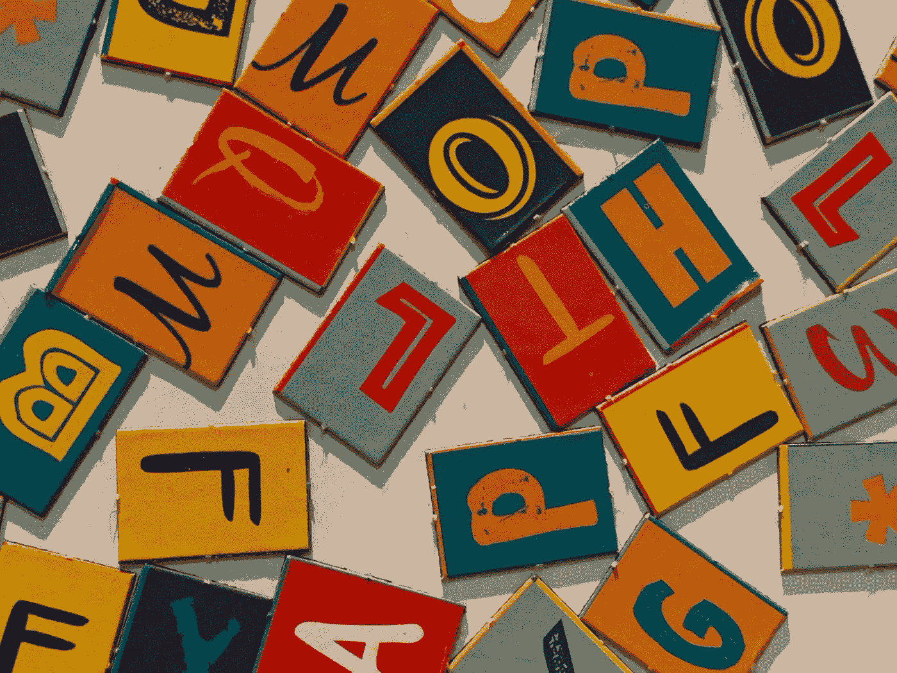

# 网页设计中的 9 个排版技巧

> 原文：<https://medium.com/codex/9-tips-on-typography-in-web-design-9808c47540d1?source=collection_archive---------16----------------------->

## 用这些排版技巧改进你的网页设计！

照片由 [Unsplash](https://unsplash.com?utm_source=medium&utm_medium=referral) 上的[苏伦兰议员](https://unsplash.com/@sure_mp?utm_source=medium&utm_medium=referral)拍摄

字体设计通常是网页设计中被忽视的一个方面，但却是最重要的一个方面。糟糕的排版会使网站难以阅读，看起来不专业。另一方面，好的排版可以让一个网站看起来很精致，很专业。在设计时，有几件事要记住…