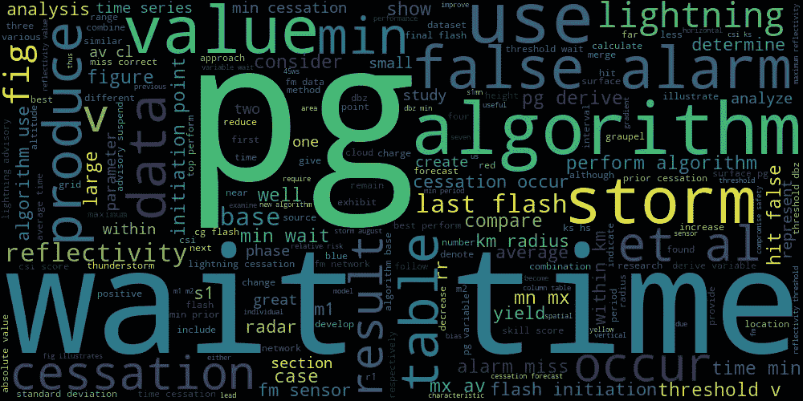
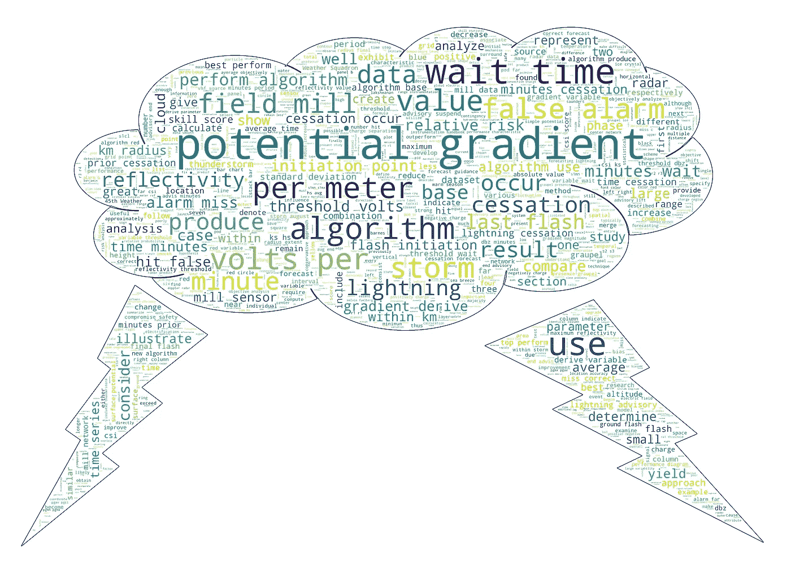

# 用 Python 轻松创建单词云的初学者指南

> 原文：<https://medium.com/codex/a-beginners-guide-to-easily-create-a-word-cloud-in-python-7c3078c705b7?source=collection_archive---------4----------------------->

这里是使用 Python 创建单词云(或标签云)的一步一步的初学者指南(包括代码)。

词云是给定文本中最常用和相关的词的拼贴，或者更简单地说，是文本块的视觉表示。词云中的词越突出、越大，该词与给定文本越相关。看看下面的例子(来源:【https://github.com/amueller/word_cloud】T2)。

一个基于《星球大战》原始剧本文本的单词云示例。来源:https://github.com/amueller/word_cloud

在这个例子中，我们将从我的[硕士论文](http://purl.flvc.org/fsu/fd/FSU_migr_etd-8884)的 PDF 文件中创建一个单词云，题目是:

> 使用来自肯尼迪航天中心和卡纳维拉尔角空军站的场磨网络的数据预报闪电停止。

在我们深入研究代码之前，先简要说明一下所需的库。虽然通常最好的做法是在脚本开始时导入所有的包/库，但这里我们将在使用它们时导入每个包/库。我觉得这是更有用的解释目的，因为我们通过每一步的过程。对于这个具体的例子，依赖关系包括 *PyPDF2* 、 *NLTK* (各种方法)、 *WordCloud* 、 *re* 、 *numpy* 和 *Image* 。

现在让我们开始吧！第一步是加载文本数据，这些数据可能来自不同的来源，包括:

*   网络:[漂亮的汤库](https://www.crummy.com/software/BeautifulSoup/bs4/doc/)是从网络上抓取文本的首选包。查看提供的文档链接！
*   文本文件(如 TXT):要读取文本文件，首先使用内置的**打开**函数打开文件，如`f = open('path_to_file.txt')`，其中 *f* 是我们在其中分配 file 对象的变量，“path_to_file.txt”是显示感兴趣文件路径的字符串。接下来，使用 **read** 方法从 file 对象中访问内容，例如`file_data = f.read()`。这段代码将包含在。txt 文件并把它放在一个字符串中。
*   PDF 文档:在 Python 中，有各种第三方包可以用来读取 PDF 文件。这里我们将使用 [**PyPDF2** 模块](https://pythonhosted.org/PyPDF2/index.html)中的 [**PdfFileReader** 类](https://pythonhosted.org/PyPDF2/PdfFileReader.html)，可以通过`conda install -c conda-forge pypdf2`安装 conda，也可以通过`pip install PyPDF2`安装 pip。对于我们的示例，我们的文本存储在一个 PDF 文档中，可以通过以下代码在 Python 中加载该文档:

使用 PyPDF2 库从 Python 中的 PDF 加载文本数据

接下来，我们需要执行一些基本的文本处理步骤，这些步骤通常在自然语言处理(NLP)任务中使用。一个令人惊叹的用于 NLP 的 Python 库是 [NLTK](https://www.nltk.org/) (自然语言工具包的简称)，它将是你在文本处理和特征提取过程中最好的朋友。

我们将首先使用 NLTK 来标记我们的文本，这仅仅意味着将 PDF 中的所有文本分割成一系列独特的单词。我们可以用下面的代码创建 PDF 中所有单词的列表:

使用 NLTK 对 PDF 中的单词进行标记

在上面的代码中，我们首先从 nltk.tokenize 导入了 *word_tokenize* 方法，这是在 nltk 中拆分文本最常用的方法。然后，我们创建一个空列表，其中将包含标记化的单词。然后，for 循环逐页进行，并将每个单词追加到*单词*列表中。请注意，在本例中，我将查询的页面限制在 18–96 页，以排除封面和标题页、参考列表和其他不相关的文本。相反，要包含所有页面(在自动化流程中或在多个文档间循环时，这是首选)，通过`for pages in range(0,pdfReader.numPages):`开始循环。*单词*列表现在包含了我们文档中的所有单词！接下来，我们需要降低单词列表的复杂性。

我们语言的一些特征，如大写、标点和常用词(a、of、the)可以被删除，以帮助降低复杂性，并创建一个更具信息量的词云。这里，我们通过以下方式降低复杂性:

*   **去除大写**:

*   **删除停用词**，这些停用词是不含信息的词，如“是”、“是”、“the”等。，这对一个句子没有多大意义。这可以使用 NLTK 提供的停用词列表和列表理解来完成:

*   **去掉标点符号**:

为了进一步简化我们的单词表，我们接下来对数据进行词条化。词汇化是一种将单词简化为词干或词根形式的技术。例如，“is”、“was”和“were”都可以追溯到词根形式:“be”。我们将从 NLTK 的 *WordNetLemmatizer()* 类中使用 NLTK 的 *lemmatize* 方法来将我们的单词缩减到它们的词干。这种方法基于词性(POS)标签进行词汇化。因此，我们使用另一个 NLTK 方法， *pos_tag* ，首先导出每个单词的 pos，然后将其用作 *lemmatize* 方法的输入。以下代码块执行此任务:

使用 NLTK 对单词列表进行词汇化。[get _ wordnet _ pos(word)函数的代码源](https://www.machinelearningplus.com/nlp/lemmatization-examples-python/)。

现在我们准备好创建我们的单词云了！这里我们将使用 Python 的 [wordcloud 库](https://pypi.org/project/wordcloud/)，可以使用 pip `pip install wordcloud`或者 conda `conda install -c conda-forge wordcloud`下载。以下代码使用 WordCloud 默认值创建并保存图像:

这是由此产生的单词云:

word_cloud.png

我们可以用这张图片来结束今天的工作。然而，有一些方法可以让我们更上一层楼。首先，这里有各种缩写，需要读者阅读文档才能完全理解。为了使图像更具信息性，我们可以用整个术语替换缩写(例如，pg =电位梯度),并删除没有更多上下文的无用单词。

最后，为了真正让我们的单词云流行起来，我们可以在文本填充图像的地方添加一个遮罩。我很快用微软画图创建了下面的蒙版。在我们更新的单词云中，单词将只出现在黑色区域，而白色区域将保持空白。

迅雷 _cloud_mask.png

给定我们优化的单词列表和图像掩码，我们可以通过以下方式创建更新的单词云:

这是最终的结果！

word_cloud_masked.png

我希望这篇文章对你创建你的第一个单词云有用。如果你有任何问题和快乐编码，请随时留下评论！