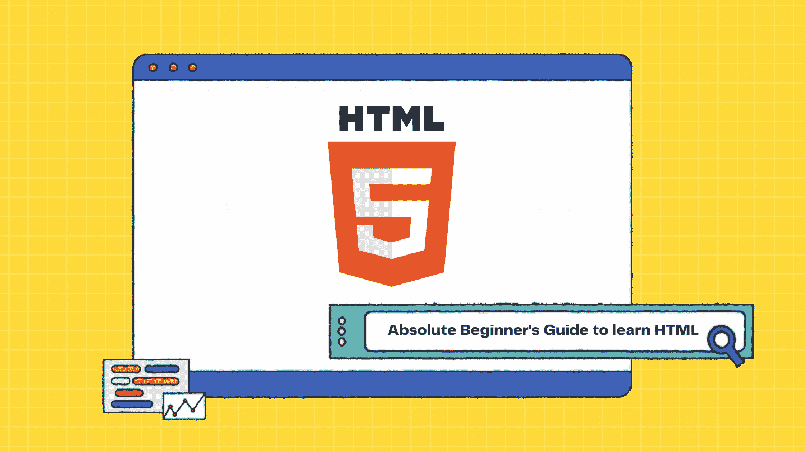
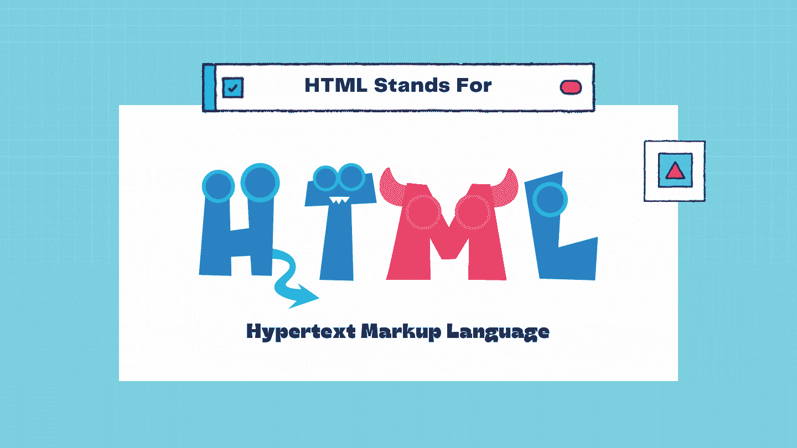
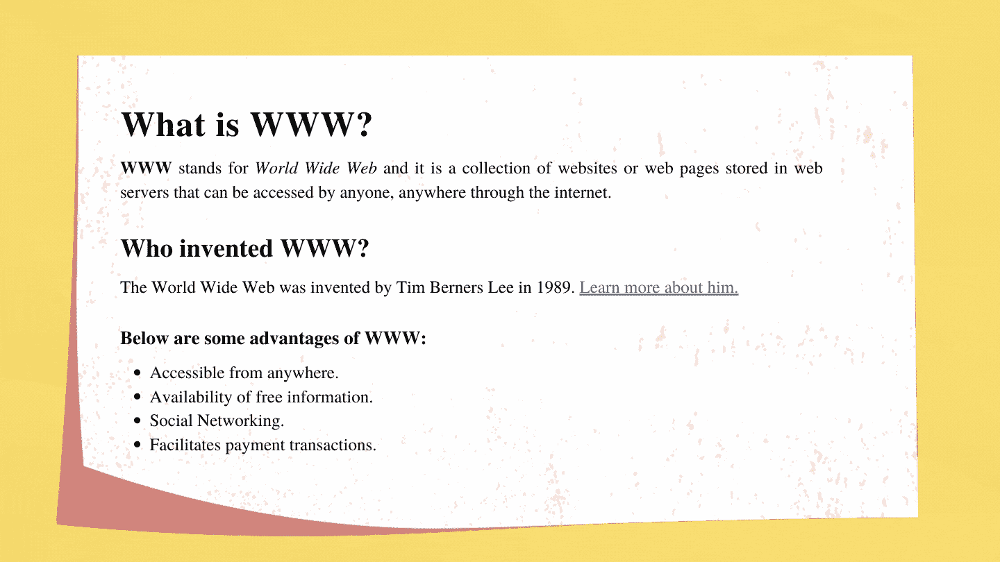
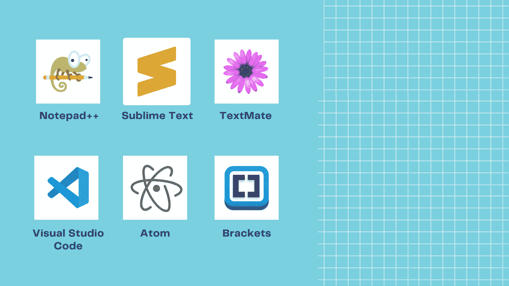
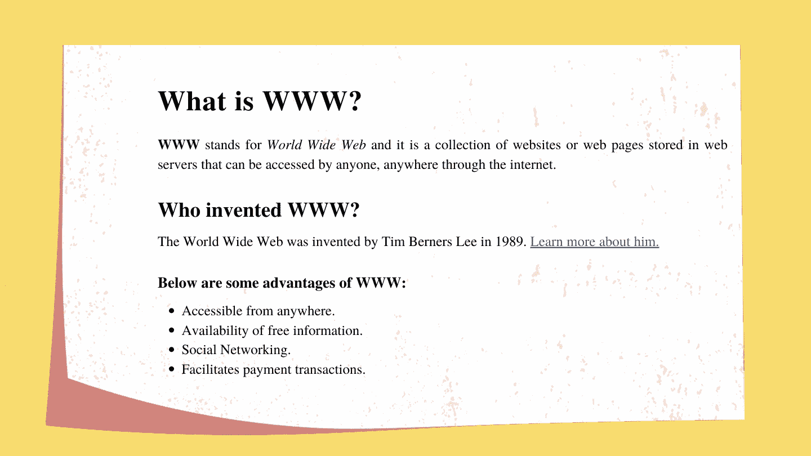
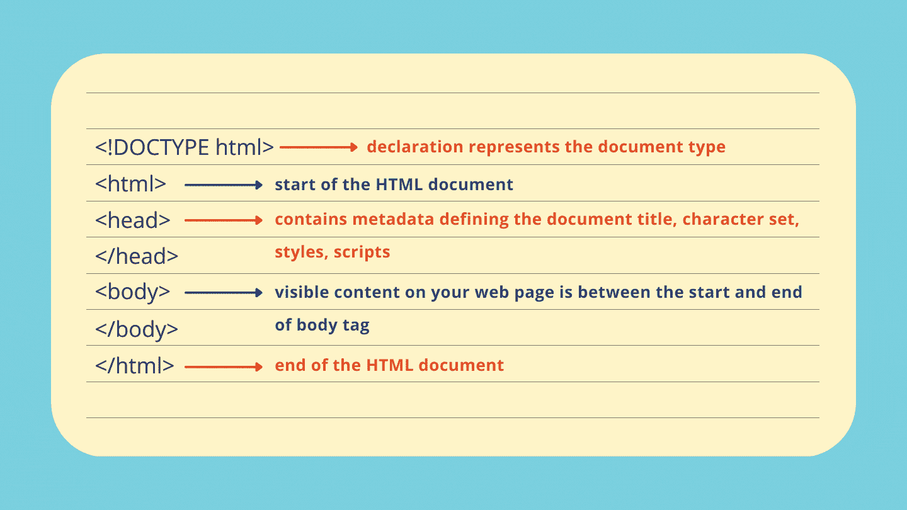
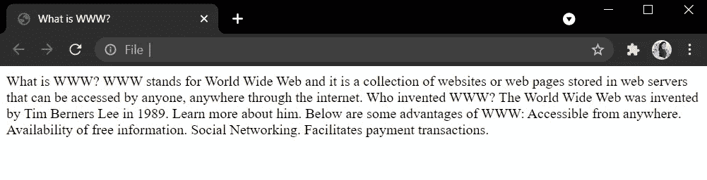
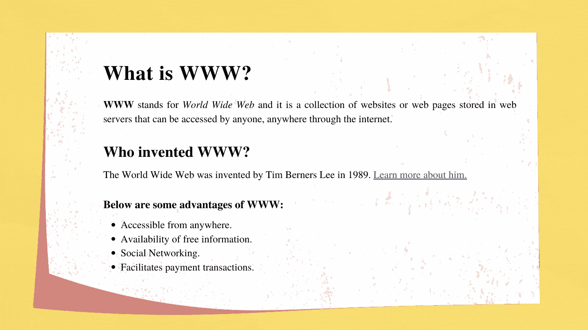
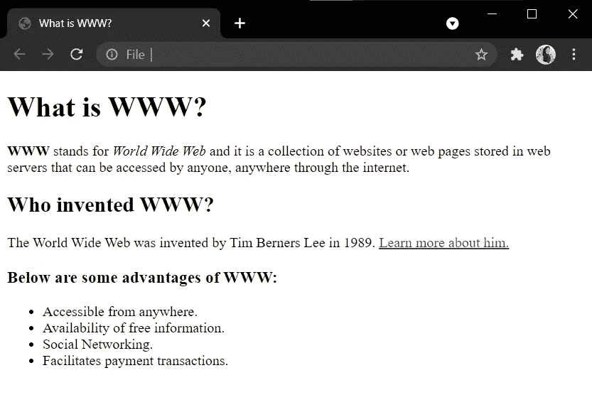

# HTML 初学者指南

> 原文：<https://medium.com/codex/a-beginners-guide-to-html-eda23fe8ad7a?source=collection_archive---------12----------------------->

## 学习 HTML 的基础知识

你是想学习网站如何运作还是想成为一名专业的网站开发人员？我们前端 web 开发需要的关键技术是 HTML、CSS 和 Javascript。从这三种给定的技术中，你可能需要知道的第一件事是 HTML，因为如果我们的网站没有一个结构，我们将无法添加样式或交互性。那么 HTML 代表什么呢？

看起来吓人吗？不要害怕，因为 HTML 是最容易学习的前端语言之一，不像其他编程语言那样复杂。

HTML 是一种标准的标记语言，它描述了网页的结构，包括所有的文本、图像、表格、链接以及更多的元素。超文本指的是包含其他文本链接的文本，用于在网络中导航。点击名为“超文本”的特殊文本，你就会被引导到互联网上不同的网页。**标记**是指以特定格式构建文档数据并告诉浏览器如何显示这些数据的符号或代码。

HTML 的第一个版本是由蒂姆·伯纳斯·李在 1993 年写的。从那时起，HTML 就有了不同的版本，现在，标准化的版本是 HTML 5。

假设您想将下面写在 word 文档上的内容转换成 HTML 文档。

你应该从哪里开始？首先，我们必须选择一个文本编辑器来编写和编辑 HTML 代码。如果你不知道如何安装文本编辑器，只需打开 Windows 上的记事本应用程序，或者如果你是苹果用户，打开文本编辑并开始使用。

如果你是一个打算做大量编码的人，下面是一些可以使用的最流行的文本编辑器。

让我们试着理解文档的结构。

为了给出文本，所需类型的格式化 HTML 使用三个主要的构造块，称为标记、元素和属性。

先说 HTML 标签。 **HTML 标签帮助网络浏览器理解如何格式化和显示常规文本。HTML 中使用的尖括号叫做标签。标签成对出现，称为开始/开始标签和结束/结束标签。两者之间唯一的区别是结束标记包含一个“/”(斜线)符号。**

一个基本的 HTML 文档可能包含以下带有主标签的结构。

让我们在 body 标记的开始和结束之间添加我们在 word 文档中编写的内容，因为它显示了可见的内容。打开你想要的任何文本编辑器，开始编写下面的 HTML 代码。

要在浏览器上查看，我们需要用。htm '或'。“html”文件扩展名。因此，让我们将文档保存为“index.html”。现在，在您最喜欢的 web 浏览器中打开该文档。

所有的格式都到哪里去了？如果我们只是在 HTML 文档中添加文本，它将只显示普通文本。为了格式化和转换文本，我们使用标签。标签有很多种。我们将讨论可用于格式化上述内容的最常见的标签。

**HTML 标题:**显示标题或副标题。六种标题类型以定义最重要标题的 **< h1 >** 开始，以定义最不重要标题的 **< h6 >** 结束。

**HTML 段落:< p >** 定义段落标签，总是以一个新的行开始，在段落前后有一个边距。

**HTML 列表:**用于订购一组项目。有两种主要类型的列表，称为有序列表/用 **< ol >** 标签定义的编号列表和被定义为 **< ul >** 的无序列表/项目符号列表。列表中的每个列表项都将以一个 **<李>** 标签开始。

在上面的内容中，可以看到' **WWW** '被格式化为粗体。HTML 允许在文本中包含附加格式以显示特殊内容。下面是其中的几个。

**粗体文本:** < b >

**斜体文字:** < i >

**重要文字:** <强>

**强调文字:** < em >

让我们将格式化标签添加到前面的代码中。

现在，您可以在浏览器中打开文档并查看它了！

你能看到标题是如何变得更大、更粗，并且在不添加任何 CSS 样式的情况下变得更具视觉吸引力吗？我们还可以注意到，只需使用标签，上下页边空白就会自动添加到段落中，一些文本会以粗体和斜体显示。

HTML 元素是从开始标签到结束标签的所有内容，包括开始和结束标签之间的内容。格式为“ *<标记名>内容</标记名>* ”。空元素是没有任何内容或结束标签的标签，例如用于换行的< br >标签。包含其他元素的元素被定义为嵌套元素。

您可以注意到添加了一个链接来了解更多关于 Tim Berners Lee 的信息。HTML 链接使您只需点击它们就可以导航到不同的网页。我们使用锚标记“”来表示超链接标记，这里我们添加了一个名为“href”的属性来表示链接的目的地或路径。**HTML 属性提供了关于开始标记中元素的附加信息，它以名称/值对的形式出现。**

最后，让我们讨论一下如何给 HTML 文档添加注释。如果有人打开你的 HTML 文档，并试图找出你做了什么呢？HTML 注释有助于理解代码，并且不会显示在浏览器中。您可以看到在前面的例子中，我是如何在开始的 body 标记之前和结束的 body 标记之后添加注释的。

总之，本文给出了如何开始使用 HTML 的指南。因此，您需要练习编写更多的 HTML 代码来熟悉 HTML。

如果你渴望了解更多并在线尝试不同的 HTML 代码行，请查看 W3School 的 HTML 教程。

我们将在接下来的文章中讨论如何使用 CSS 添加颜色和不同的样式来使内容更具吸引力。所以跟着我，保持联系！😄❤️

[查看我的博客](https://nisandij.com/blog/)阅读更多关于生活、设计和科技的有趣文章！🔥