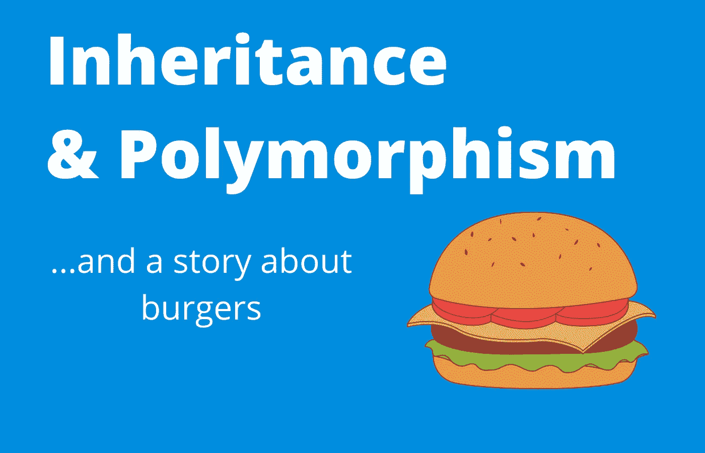

# 理解继承和多态的初学者指南

> 原文：<https://medium.com/codex/a-beginners-guide-to-understanding-inheritance-and-polymorphism-fea726d62e11?source=collection_archive---------15----------------------->

用初学者可以理解的浅显语言对软件开发中的继承和多态进行了高度概括。

遗传、多态性和象征性汉堡

# 介绍

如果你刚开始进入软件开发的世界，你可能听说过面向对象编程(OOP)这个术语，在 OOP 中有几个核心…