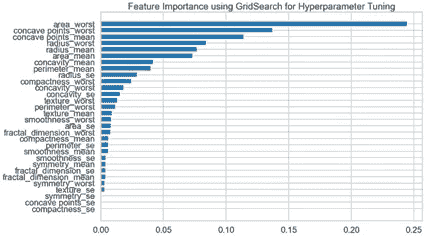

# 一个二元分类问题:乳腺癌肿瘤

> 原文：<https://medium.com/codex/a-binary-classification-problem-breast-cancer-tumours-b5260fbafba5?source=collection_archive---------9----------------------->

对于我的第一个顶点项目，作为我的[训练营和跳板](/@indrani.banerjee121/my-experience-with-springboards-data-science-career-track-46976c6d281c)的一部分，我决定尝试用非常著名的[威斯康星州乳腺癌数据集](https://archive.ics.uci.edu/ml/datasets/breast+cancer+wisconsin+(diagnostic))开发一个机器学习模型。这个项目的目标是说明跳板中教授的[数据科学方法(DSM)，对我个人来说，我想专注于我一直在阅读的机器学习算法。当然，行业中有很多不同的数据科学方法，例如](https://towardsdatascience.com/the-data-science-method-dsm-35200eb4984) [CRISP-DM、OSEMN 和 KDD](/@aj.ramirez23/3-most-popular-data-science-metho-e61f6600b83f) 等等。作为一名初学者，我在 Springboard 遵循的 DSM 方法是这样的:

1.问题识别
2。数据角力
3。探索性数据分析
4。预处理和训练数据
5。造型
6。证明文件

正如我在[这篇文章](/@indrani.banerjee121/my-experience-with-springboards-data-science-career-track-46976c6d281c)中提到的，全职工作之外的训练营令人疲惫不堪。我开始患上冒名顶替综合症，我开始怀疑我听的所有讲座、我提交的所有微型作业以及我重温的所有数学是否真的被理解了。我认为最好是分而治之:我将使用两个顶点项目中的第一个[来专注于机器学习算法，而第二个项目将有一个强大的数据争论元素。当我决定选择威斯康星数据集时，这个决定是我思考的核心:数据集是干净的，没有缺失的数据，它是有标签的，这使它非常适合监督学习模型，并且特征都是数值连续数据，这使它非常适合大多数机器学习算法！基本上，数据集很容易使用！](https://github.com/iban121/Springboard/tree/main/CapstoneProject_2)

# 数据和问题识别

威斯康星数据集非常适合监督学习模型，因为它由 569 个样本组成，每个样本都被标记为良性或恶性，每个样本有 33 个特征。在实际项目中，这是您与业内专家讨论确定项目范围和可能的度量标准的时刻。由于这是不可能的，我为这个项目设定了三个“常识”目标——成功标准:

1.  恶性肿瘤分类准确率达到 90%以上。
2.  与假阴性率相比，恶性肿瘤的假分类率更高，因为医学诊断很少依赖于一种测试。因此，较高的假阳性率会导致更多的测试，而这很少发生在假阴性病例中。
3.  用减少数量的特征对肿瘤进行正确分类是可能的。

# 数据争论

这是数据科学中至关重要的一步，据我所知，这是数据科学家花费大部分时间的地方。DSM 中这一步的目标是清理数据，确保在必要时将数据转换为数字数据(因为大多数机器学习算法都需要数字数据)，决定如何处理数据集中的缺失值，识别并决定如何处理离群值。威斯康星州数据集是一个干净的数据集，569 个样本中没有任何缺失字段。有一个限制值得注意——数据集是不平衡的。这意味着良性肿瘤的样本比恶性肿瘤多。有一些方法可以平衡这一点，但由于我希望这个项目的重点是应用机器学习算法，我决定不修改数据集。

# 探索性数据分析

他们说一张图胜过千言万语，我觉得这在 DSM 的这个阶段得到了最好的诠释。同时。describe()方法确实为我们提供了每个特性的汇总统计数据的数据框架，但是很难深入了解这些数据。

我通常跑。在 DSM 的早期描述()方法。在这里，您可以看到，甚至 ID 也包含在汇总统计数据框中。我们并不真的需要这个，所以我很早就放弃了这个专栏。

为了获得汇总统计数据的图形视图，特别是每个特性的数据点的分布，我使用 Plotly 创建了盒须图。我是 Plotly 的忠实粉丝，因为它非常容易使用，并且可以创建交互式的情节。我根据每个特征的数据点的范围来划分特征:肿瘤的平均面积的值在 143.5 到 2501.0 之间，而肿瘤凹度的数据点在 0.0888 到 0.427 之间。由于范围变化如此之大，最好将具有相似范围的属性分开，以增加我们的图的可解释性。然后，我绘制了直方图，以了解每个特性的数据点的偏斜度。

这些图表有什么意义？我们使用它们来快速识别异常值，并了解每个数据点的分布情况。这也让我们知道我们是否需要扩展我们的数据集。例如，有一个良性样本，其最差凹度值为 1.252。有趣的是，恶性肿瘤的每个特征值的范围比良性肿瘤小得多。这可能是我们的数据集不平衡而有利于良性肿瘤的结果，也可能是恶性肿瘤的一个重要特征。

由于这些特征是数字和连续的数据，我还查看了不同特征之间的相关性，并使用热图对此进行了可视化。

我为什么要这么做？我概述的目标之一是尝试开发一个基于简化特征的模型。但是我们为什么要这么做呢？就机器学习算法而言，我们拥有的功能越多越好。然而，我也质疑拥有更多功能的实际用途。随着新冠肺炎疫情接近尾声，我们在世界各地都看到我们的医疗保健系统在两年内被拉伸到边缘的影响。如果我们能够有效地找出哪些特征可以被删除而不影响我们模型的准确性，那么医疗保健专业人员就可以收集更少的肿瘤信息，从而加快诊断过程。

我正在寻找彼此高度相关的特征，希望能够去掉这些特征中的一个。逻辑是，如果两个特征高度相关，那么我们只需要在模型中使用其中一个特征，因为另一个特征会跟着使用。我们可以从热图中看到，平均半径和平均周长高度相关。我绘制了这两个特征的对比图，以便更好地了解它们之间的联系。

我首先创建了一个散点图(左)，然后使用 Seaborn 的 regplot 来处理回归线(右)。我们可以看到，橙色回归线更好地拟合了趋势，这是一条二阶线，称为二次拟合。我经常和我的数学学生讨论这个例子——仅仅因为某个东西有很高的相关系数并不意味着我们就盲目地相信它是相关的。我们应该经常深入研究数据！我继续对笔记本中显示高度相关的其他特征进行了相同的分析:平均面积和周长、平均面积和平均凹度。我意识到我想更仔细地观察平均面积和平均凹度:它们的相关系数为 0.69，但该图并没有显示线性关系。因此，我使用 Statsmodel 为这两个特征创建并评估了一个简单的线性回归模型，为面积平均值和其他特征创建并评估了一个多元线性回归模型[。](/codex/not-so-simple-linear-regression-multiple-linear-regression-2140146f1706)

与 R 平方值为 0.439 的简单线性模型相比，多元线性回归模型产生了高得多的决定系数，R 平方值为 0.799。然而，标准误差相对较高，所以我得出结论，我不能自信地放弃 33 个特性中的任何一个。

# 预处理和训练数据

既然我已经排除了丢弃特征，我就为机器学习准备数据集。

首先，诊断栏有 B 和 M 来表示良性和恶性肿瘤。我必须将这种分类数据转换为指示变量:这基本上意味着我将诊断列替换为良性肿瘤的 B 列，其中恶性样本的值为 0，良性样本的值为 1。这就是所谓的特征编码，有很多种不同的方式。我和熊猫一起去的。get_dummes()方法，因为它很容易解释:正如我提到的，你得到了标有 B 的干净的列。

其次，我使用 Scikit Learn 的 train_test_split 将数据分别拆分为 75:25 比例的训练和测试数据。然后，我使用 Scikit Learn 的标准定标器对数据进行定标。如果你感兴趣，可以看看这篇关于各种不同缩放技术的文章。看看我的[笔记本](https://github.com/iban121/Springboard/blob/main/CapstoneProject_2/Notebooks/Preprocessing%20and%20Modelling.ipynb)，看看数组 X_train_scaled 和 X_test_scaled 的值与原始数据帧有何不同。

数据集现在已经准备好，可以训练我们的模型了。这个项目是一个二元分类项目:我们希望我们的模型查看 75%的数据集，并了解不同特征值的组合有助于区分恶性肿瘤和良性肿瘤。所以，我必须决定使用哪种算法。

我首先使用了一个来自 Scikit Learn 的虚拟分类器。这通过将肿瘤分类为恶性或良性而不试图在数据中找到任何模式来创建分类模型。这是作为基础模型，一个与我们的其他分类模型进行比较的模型。

结论呢？这个模型有 64%的准确率。这将是我们希望在其他分类模型中看到的最小数量。

在详细介绍我创建的各种不同模型之前，我想先介绍一下我为每种算法遵循的一系列步骤:

我首先创建了一个模型，并查看了他们的评估指标。

然后，我使用 GridSearchCV 和 10 重交叉验证进行超参数调优。每个机器学习算法的第一个模型相对简单。然而，这些算法中有许多可以进一步“调整”以提高它们的性能。GridSearchCV 本质上将我们的训练集分成 10 组，因为我进行了 10 重交叉验证。然后，它遍历参数值的每个组合，使用 9 个组生成模型，然后使用第 10 个组测试模型。

产量？我们可以提取最佳参数，即每个参数的值，这些值为我们提供了最佳性能模型。

# 模型 1:逻辑回归

首先，重要的是要认识到逻辑回归是一种我们可以用于分类问题的回归方法。有几种不同类型的逻辑回归:二项式、多项式和序数。作为我们的目标变量，肿瘤的诊断/标记有两种可能的结果，恶性或良性，二项式逻辑回归是最合适的。我不会在这篇关于逻辑回归理论的文章中深入探究，但是如果你感兴趣的话，可以看看这篇文章。

正如我前面提到的，我使用 GridSearchCV 来确定最佳参数:' C' = 0.1，' penalty: l2 '和 solver: liblinear。

C 是正则化参数，也是最重要的参数之一。在我们的模型中，C 值基本上控制了不可能的高回归系数。这意味着我们可以使用 GridSearchCV 改变 C 的值，并选择一个可以帮助我们避免过度拟合的值。值 0.1 相对较低，这意味着我们告诉模型，如果一些数据点表明系数应该非常大，那么它不应该注意这些，因为数据集可能无法完全代表世界上所有可能的乳腺癌肿瘤。

第二个超参数是 l2 被确定为最优的惩罚。罚超参数是一种正则化形式，本质上也有助于避免过度拟合。‘L2’意味着我们已经选择了[脊回归](https://www.cs.cmu.edu/~gpekhime/Projects/CSC2515/project.pdf)。后果如何？从数学上来说，这降低了权重，并允许更好的泛化:该模型更擅长对看不见的数据集进行预测。最后，“liblinear”用于求解器超参数。这被称为大型线性分类库，并使用所谓的坐标下降算法。老实说，数学很快就变得很复杂，但是如果你想更深入一点，看看[这个](https://www.stat.cmu.edu/~ryantibs/convexopt-F18/lectures/coord-desc.pdf)！

最好的逻辑模型有 98%的准确率，假阴性率比假阳性率高，所以没有实现我们的第一个目标，但实现了我们的第二个目标。

# 模型 2: K 个最近邻居

k-最近邻算法使用的逻辑是，如果点有共同点，比如说它们属于同一组，那么它们将彼此靠近。所以点与点之间的距离越小，它们被归入同一类的几率就越高。我们可以设置希望模型使用的相邻点的数量值，以确定最小距离，即 k 值。

根据 GridSearchCV，最佳参数被确定为 leaf_size = 1，n_neighbors = 3 和 p=2。同样，我现在不会在这里深究数学，但是 leaf_size 本质上控制了一个节点中的最小点数:这里我们每个节点只有一个样本。其次，n_neighbors 是要考虑的相邻点的数量。这里我们有一个值 3，所以我们的模型将考虑 3 个最近的邻近点。最后，我们所说的“两点之间的距离”是什么意思？这就是最后一个参数 p 出现的地方。功率参数可以具有值 1 或 2，并且它们分别指示是使用[曼哈顿距离公式还是欧几里德距离公式](https://www.analyticsvidhya.com/blog/2020/02/4-types-of-distance-metrics-in-machine-learning/)。我们最好的成绩是使用欧几里德距离获得的。

该模型的准确率为 99%，并且它是第一个实现比假阴性率更高的假阳性率的模型——我们终于越来越接近了！

# 模型 3:支持向量分类器

支持向量分类器可能很难理解，所以我发现最好从视觉上来思考这个问题。想象一下，我们画出每个数据点，然后我们看到在哪里可以画出一条“线”,最好地将数据点分成它们的目标组。在这种情况下，我们希望绘制数据点，并得出一个边界，大多数良性肿瘤在一侧，恶性肿瘤在另一侧。下图中的虚线，你可以把它们想象成支持向量，红色实线作为我们的‘边界’，有时叫做最优超平面。

作者:拉赫玛姆—自己的作品，CC BY-SA 4.0，【https://commons.wikimedia.org/w/index.php?curid=73710028 

最佳参数确定为{'C': 1，' gamma': 0.0001，' kernel': 'rbf'}。在这种情况下,“C”控制我们对错误分类点的惩罚程度。如果 C 较低，则错误分类点的惩罚较低。这导致我们的模型以这样一种方式绘制边界，在两个类之间没有非常精确的分离。

现在，让我们花点时间来理解伽玛和内核参数。“rbf”代表径向基函数核，是最常用的核之一。它基本上是计算两点之间的距离。查看[这篇文章](https://towardsdatascience.com/radial-basis-function-rbf-kernel-the-go-to-kernel-acf0d22c798a)，它详细介绍了 RBF 核函数。因此，如果我们有一个低的伽马值，那么我们基本上意味着我们的模型将把具有更大距离或更大半径的点组合在一起，并可能导致欠拟合。相比之下，高 gamma 值将只需要将它们之间距离非常小的点组合在一起，从而导致过度拟合。

最好的 SVC 模型的准确率为 93%,比我调优超参数之前的准确率 64%有了显著提高。然而，这并没有实现比假阴性率更高的假阳性率，而假阴性率是我们成功的标准之一。

# 模型 4:随机森林分类器

随机森林分类器由许多单独的决策树组成，它们一起工作来产生它们自己的预测。然后，选择标签预测最频繁的级别作为模型的预测。如果你不太清楚决策树是如何工作的，[看看这个页面](https://www.mastersindatascience.org/learning/machine-learning-algorithms/decision-tree/#:~:text=A%20decision%20tree%20is%20a,that%20contains%20the%20desired%20categorization.)。使用 10 重交叉验证再次确定最佳参数:n_estimators = 23，max_depth = 4。max_depth 参数决定了我们的树被允许分裂的次数，n_estimators 决定了每个随机森林模型中决策树的数量。该模型的准确率为 97%，假阳性率和假阴性率相等。

使用随机森林分类器的另一个优点是很容易提取特征重要性。我用两种不同的方法解决了这些问题:使用。来自随机森林的特征重要性，并且也使用基于排列的计算。如果你想了解更多关于它们的特性，请看这里的文档。

当我试图进一步调整模型时，看一下我的笔记本，但我基本上得出结论，三个最重要的特征是“面积 _ 最差”、“凹点 _ 最差”和“凹点 _ 平均”字段，因为它们具有 1%的重要性。

# 模型 5:梯度推进分类器

梯度提升分类器本质上是一组机器学习算法，通常是相当弱的学习模型，它们一起使用来创建更高精度的累积模型。因此，想象一个模型在只保留正确猜测的基础上调整其性能。然后，使用另一个弱学习模型，这一次在分类不良的数据集上测试，并且再次保留正确的分类，丢弃不正确的分类。当预测数据点的正确类别时，最终结果将具有更高的精确度。

最佳模型的准确度为 98%,三个最重要的特征被确定为周长最差、凹点最差和半径最差，面积最差紧随其后。我们开始看到类似的特性被认为是重要的特性——我们正在取得进展！

# 模型 6: XGBoost 分类器

XGBoost 代表极端梯度提升，它类似于随机森林分类器，从某种意义上说，它也是一种集成学习算法。与随机森林分类器不同，在随机森林分类器中，大多数树同意的分类被选为预测，XGBoost 类似于梯度增强分类器，并使用一系列“较弱”的学习模型来创建强模型。“提升”本质上最小化了偏差，并有助于避免模型的任何欠拟合。

总体精度为 95%，识别出的最重要的特征是周长最差、半径最差和凹点最差。

# 系统模型化

决策时间！现在，我们必须选择符合成功标准的“最佳”模型。因此，最佳模型是叶大小= 1，n 个邻居= 2，p =2 的 KNN 模型。

需要强调的是，n_estimators = 23 且 max_depth = 4 的随机森林分类器也非常有用，因为这突出了重要的特征，如面积最差、凹点最差和凹点平均值。

当使用排列确定特性重要性时，这三个特性再次被确定为最重要的。删除具有低要素重要性值的要素确实显示了模型度量的轻微改善。然而，KNN 模型在帮助我们实现选择一个假阳性率高于假阴性率的模型这一目标的意义上略胜一筹。

# 证明文件

作为 DSM 的一部分，我能够通过[报告](https://github.com/iban121/Springboard/blob/main/CapstoneProject_2/Classification-of-Breast-Cancer-Tumours.pdf)和[演示](https://github.com/iban121/Springboard/blob/main/CapstoneProject_2/Classification_of_Breast_Cancer_Tumours.pptx.pdf)来展示我的项目。我还把[的笔记本都上传到了 GitHub](https://github.com/iban121/Springboard/tree/main/CapstoneProject_2/Notebooks) 上。

老实说，当我完成这个项目时，我对自己的作品相当满意。前面还有很长的路要走，所以我将在这篇文章之后写几篇文章，更详细地介绍我是如何决定使用哪些模型指标以及为什么要这样做的。敬请期待！