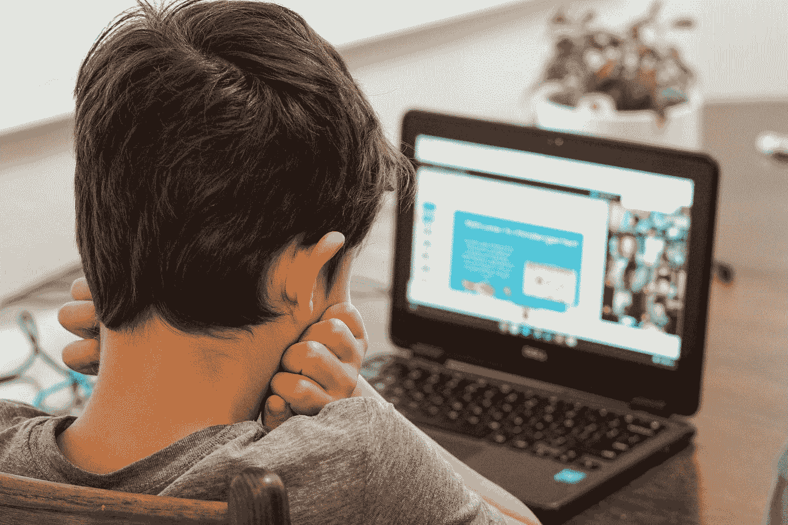

# 一个来自过去的爆炸，有人还记得帕斯卡吗？

> 原文：<https://medium.com/codex/a-blast-from-the-past-does-anyone-still-remember-pascal-ad3ca377fb86?source=collection_archive---------3----------------------->


照片由 [Unsplash](https://unsplash.com?utm_source=medium&utm_medium=referral) 上的[扎克船只](https://unsplash.com/@zvessels55?utm_source=medium&utm_medium=referral)拍摄

随着当今技术的快速发展，每个人都在寻找编程的最新趋势，但是像 Pascal 这样的旧编程语言还有用武之地吗？

对于那些甚至没有听说过 Pascal 的人来说，它是一种命令式和过程式编程语言，最早出现于 1970 年，旨在鼓励良好的编程实践。它是一种强类型、内存安全的编程语言，非常小巧高效。它有多种 IDE 实现，如 Turbo Pascal 或 Borland Pascal。它影响了现代流行编程语言的发展，如 Java、Go 和 VHDL。

用 Pascal 编写的 hello world 程序看起来像这样:

```
program Hello;
begin
  writeln ('Hello, world.');
  readln;
end.
```

即使你不熟悉 Pascal，语法也很清楚，很容易理解每一行的内容。

问题是，它在今天仍然适用吗？我们从以下几个方面来看看:



照片由[托马斯·帕克](https://unsplash.com/@thomascpark?utm_source=medium&utm_medium=referral)在 [Unsplash](https://unsplash.com?utm_source=medium&utm_medium=referral) 拍摄

信不信由你，帕斯卡仍然在学校里教授。

是的，你没看错。虽然用 Pascal 从事职业的机会不多，但许多人认为这是一门很好的语言。基于这个想法，并且因为它比 C++更接近自然语言，pascal 仍然在世界各地的高中被考虑。在一些国家，Pascal 可以成为国家考试中的编程语言。

作为一个学习 Pascal 作为第一编程语言的人，我可以告诉你，我对没有学习 C++作为第一语言有些遗憾，但编程的概念在两者中是相同的，一旦你成为一名有经验的程序员，你可以非常快地学习另一种语言。

**Pascal 相当低级，可以在极其有限的系统上以最高效率运行。**

这是 Pascal 语言及其 ide 的关键特性之一。它几乎可以在任何东西上运行。在一个现代世界里，每个人都有一台电脑或一部手机，比发射火箭到月球所用的系统更强大，这似乎没有多大意义，但这使它成为在嵌入式系统和各种工厂和工业工作场所中仍在使用的旧的和过时的电脑上使用的完美语言。

我可以给你们举一个实际的例子，来自我曾经工作过的一个工厂，那里有一台老式的计算机，在 DOS 下运行 Pascal，它监控一台发电机，并在屏幕上绘制电压电平图，同时向发电机发出速度调节命令。因此，即使它被用在一个不那么以 it 为中心的环境中，它仍然是生产工作流的一部分。也许有人会说，工业设备监控和实时调整有更好的解决方案，这是对的，但考虑到快速响应时间和极低的实施成本，这是一个完美的解决方案。

想到 Pascal 时想到的另一个流行程序是一个工具，它可以帮助你为索尼生产的 Playstation 便携式游戏机制作一个服务记忆棒。这使您能够恢复一个砖砌的(损坏的)控制台的功能。虽然它有时被用于盗版目的，但我仍然认为它值得一提。

上面的例子是我个人遇到的事情，但我知道仍然有商业和军事服务因为可靠性因素仍然使用 Pascal。

你还能在现代系统上使用 Pascal 吗？

答案是当然可以！有一个名为 Free Pascal 的现代 IDE 正在不断更新，它将 Pascal 引入了现代计算机和操作系统，但也引入了许多非常有限或古老的系统，如 AVR 微控制器和 DS 等旧的任天堂游戏机。

你可以在这里查看:

 [## 免费 Pascal-Pascal 和 Object Pascal 的高级开源 Pascal 编译器-主页

www.freepascal.org](https://www.freepascal.org/) 

**结论**

Pascal 非常神奇，在它最初发布 50 多年后，仍然有一些相关性。它的轻量级资源消耗和速度使它难以置信的快和容易运行，即使在非常旧和有限的系统。这是一个学习编程的好方法，尽管你可能也想考虑 C/C++。