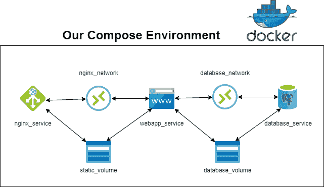
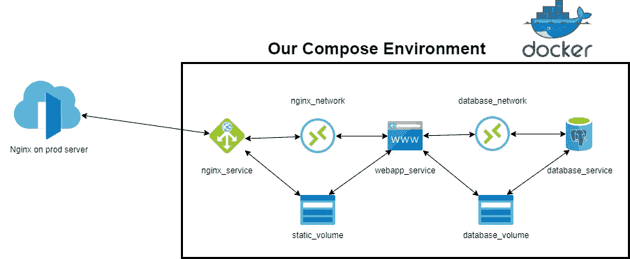

# 一个样板文件，可以方便地整理和部署 Django 应用程序

> 原文：<https://medium.com/codex/a-boilerplate-to-easily-dockerize-and-deploy-django-apps-8c3a459d01e?source=collection_archive---------5----------------------->

## Django，PostgreSQL，Nginx，Docker，Docker Compose

嗨伙计们！自从我上次写信以来已经有一段时间了。在本文中，我将写一个我创建的 repo 来 dockerize 和轻松部署我的 Django 应用程序。


照片由[穆罕默德·拉赫马尼](https://unsplash.com/@afgprogrammer?utm_source=unsplash&utm_medium=referral&utm_content=creditCopyText)在 [Unsplash](https://unsplash.com/s/photos/docker-django?utm_source=unsplash&utm_medium=referral&utm_content=creditCopyText) 上拍摄

# 介绍

这个回购确实有助于我部署我的应用程序。我把回购当做样板。要使用它，您只需要在您使用下面的 repo 克隆的文件夹中创建一个空的 Django 项目。在本文中，我将解释 dockerizing 过程背后的文件和逻辑。

[](https://github.com/mebaysan/Easily-Dockerize-Django-Prod-Dev) [## GitHub-mebaysan/easy-Dockerize-Django-Prod-Dev:我创建了这个 repo 来共享我的样板文件…

### 我创建了这个 repo 来方便地对 Django 应用程序进行 dockerize。在此回购中，我有自己的配置设置来分离生产和开发…

github.com](https://github.com/mebaysan/Easily-Dockerize-Django-Prod-Dev) 

# 生成文件

我们可以说这是一个配方文件，用来管理我们用来构建或运行项目的命令。要使用这个文件，我们使用`make`命令。在这个样板文件中，通常会使用下面的命令:

*   `make collect`
*   `make migration`
*   `make runproxyversion`

```
.PHONY: help

help:
	@echo "{{project_name}} Projects"
	@echo "~~~~~~~~~~~~~~~"
	@echo ""
	@echo "check        : Health check"
	@echo "coverage     : Make test coverage"
	@echo "docup        : Run docker compose services"
	@echo "docdown      : Stop docker containers"
	@echo "migrations   : Make django migrations"
	@echo "install      : Install python requirements"
	@echo "recover      : docdown + docup + wait + migrations + loaddata"
	@echo "runserver    : Run django server in debug mode"
	@echo "run_gunicorn : Run django server with gunicorn"
	@echo "static       : Collect static files"
	@echo "superuser    : Create django super user"
	@echo "test         : Start django test runner"
	@echo "translation  : Translation operation"
	@echo "wait         : Wait for 3 seconds"
	@echo ""

check:
	@python manage.py check

coverage:
	@coverage run --source='.' manage.py test
	@coverage report -m
	@coverage html
	@coverage xml

docup:
	@docker-compose up -d --build

docdown:
	@docker-compose down -v

dumpdata:
	@python manage.py dumpdata -o dummy.json

loaddata:
	@python manage.py loaddata scripts/dummy.json

migration:
	@python manage.py makemigrations
	@python manage.py migrate

install:
	@pip3 install -r requirements.txt

recover: install docdown docup wait migration loaddata
	@echo "\n\t~~~~~~~~~~~~~~~"
	@echo "\tusername: admin"
	@echo "\tpassword: 123"
	@echo "\t~~~~~~~~~~~~~~~\n"

recover_refactor: install docdown docup wait migration superuser
	@echo "\n\t~~~~~~~~~~~~~~~"
	@echo "\tusername: admin"
	@echo "\tpassword: 123"
	@echo "\t~~~~~~~~~~~~~~~\n"

runserver:
	@python manage.py runserver 127.0.0.1:8000

run_gunicorn:
	@gunicorn {{project_name}}.wsgi -b 0.0.0.0:8000

collect:
	@python manage.py collectstatic --no-input

superuser:
	@python manage.py createsuperuser

tests:
	@python manage.py test

translation:
	@python manage.py makemessages -l tr
	@python manage.py compilemessages

wait:
	@sleep 3

runproxyversion:
	@make collect
	@make migration
	@gunicorn {{project_name}}.wsgi:application --bind 0.0.0.0:8000
```

# Django App Dockerfile

这是位于项目根级别的`Dockerfile`。基本上，它按照下面的步骤创建一个图像。

*   提取 3.9 版本的 Python 作为基础映像
*   将工作目录设置为`/app`
*   将与该 Dockerfile 同级的所有文件复制到`WORKDIR`
*   升级 pip
*   执行用于安装项目依赖项的`make install`命令
*   为将使用此映像创建的容器公开 8000 端口

```
FROM python:3.9 # enviroment

ENV PYTHONDONTWRITEBYTECODE=1

ENV PYTHONUNBUFFERED=1

WORKDIR /app

COPY . .

RUN pip install --upgrade pip  

RUN make install

EXPOSE 8000
```

# Nginx Dockerfile 文件

在`nginx`文件夹下，有我们的 Nginx 图像。我们将使用这个图像创建一个容器来服务(发布)我们的 Django 应用程序。

```
FROM nginx:latest

RUN rm /etc/nginx/conf.d/default.conf

COPY nginx.conf /etc/nginx/conf.d
```

该图像将搜索`nginx.conf`文件，该文件必须与要复制到`/etc/nginx/conf.d`的 docker 文件位于同一目录。

```
upstream baysan_web_gunicorn {
    server webservice:8000; # default django port comes from service name in docker-compose.yml
}

server {
    listen 80; # default external port. Anything coming from port 80 will go through NGINX

    location / {
        proxy_pass http://baysan_web_gunicorn;
        proxy_set_header X-Forwarded-For $proxy_add_x_forwarded_for;
        proxy_set_header Host $host;
        proxy_redirect off;
    }
    location /static/ {
        alias /app//static/; # where our static files are hosted, these files are coming from the volume we created for static files
    }

}
```

上面的`nginx.conf`文件帮助我们在 Django 应用程序和 Nginx 之间建立通信。我们创建了一个自定义名称的上游。上游将监听这个容器运行的同一个网络中名为`webservice`的服务。注意这里，`webservice`是一个来自`docker-compose.yml`的服务名。然后，Nginx 将开始监听端口 80，当一个请求到来时，它将把请求导向`webservice`。因此，它将像一个反向代理一样工作。

# Docker 合成文件

最后，我们需要一个组合器`docker-compose.yml`来运行和组合我们将使用上面的图片创建的容器。

```
version: "3.9"

services:

  webservice:
    container_name: baysan_web
    build: .
    depends_on:
      - database
    environment:
      - SECRET_KEY=verysecretKey
      - DEBUG=0
      - DB_NAME=postgres
      - DB_HOST=database
      - DB_PORT=5432
      - DB_USER=postgres
      - DB_PASSWORD=secretpassword
      - ALLOWED_HOSTS=127.0.0.1
    command: make runproxyversion
    networks:
      - nginx_network
      - pg_network
    volumes:
      - static_volume:/app/static

  database:
    container_name: baysan_database
    image: postgres
    restart: always
    environment:
      - POSTGRES_PASSWORD=secretpassword
    volumes:
      - database_volume:/var/lib/postgresql/data
    networks:
      - pg_network

  nginx:
    container_name: baysan_nginx
    build: ./nginx
    ports:
      - "80:80"
    volumes:
      - static_volume:/app/static
    depends_on:
      - webservice
    restart: "on-failure"
    networks:
      - nginx_networknetworks:
  nginx_network:
    driver: bridge
  pg_network:
    driver: bridge

volumes:
  database_volume:
  static_volume:
```

这里需要注意成交量和网络。因为有时我们不能在生产模式下提供静态文件(即 DEBUG=False ),或者我们不能创建通信 web app 服务和数据库服务。为此，我创建了 2 个卷和 2 个网络。

*   1 个网络，用于数据库服务和 web app 服务之间的通信
*   1 用于 web 服务和 Nginx 服务之间通信的网络
*   1 卷用于数据库服务(以提供一致性)
*   1 卷用于从 web app 容器到 Nginx 容器的静态文件(如果我们有媒体文件，我们将需要为媒体文件创建一个新的)。



作者图片

我还在`nginx_service`中的`ports`下设置了“80:80 ”,以处理来自 Django 应用程序外部的请求。

还有，在`settings`文件夹下，有 2 个`config_*.py`文件。如果调试环境变量是由`docker-compose.yml`文件给定的 1，项目将处于调试模式。否则，它将处于生产模式。`settings.py`文件如下所示。

```
#  Rest of the settings.py can be changed for projects. For my set-up, I need the lines below.import os
from pathlib import Path

BASE_DIR = Path(__file__).resolve().parent.parent

DEBUG = int(os.environ.get("DEBUG", default=0))
if DEBUG == 1:
    from .config_dev import *
else:
    from .config_prod import *
```

# 在生产中部署

为了部署我们的环境，我在 prod 服务器上使用 Nginx。我在 prod 服务器上创建了一个新的反向代理，将请求指向在`docker-compose.yml`文件中创建的 Nginx 容器。

我在`/etc/nginx/sites-available`文件夹下创建一个新文件，并将下面的内容放入文件中。在这里，我直接向`http://127.0.0.1:80`发出请求。我们这样做是因为我们在 Nginx 服务中设置了`80:80`。通过更改这些端口号，我们可以在同一台服务器上部署更多的项目。

```
server {
        listen 80;
        listen [::]:80;
        server_name YOUR_URL(S);
        server_name_in_redirect off;

        access_log /var/log/nginx/reverse-access.log;
        error_log /var/log/nginx/reverse-error.log;

        location / {
            proxy_set_header Client-IP $remote_addr;
            proxy_set_header X-Forwarded-For $proxy_add_x_forwarded_for;
            proxy_set_header Host $host;
            proxy_pass http://127.0.0.1:80;
    }
}
```

最后，我们需要为这个文件创建一个符号链接。

```
sudo ln -s /etc/nginx/sites-available/myproject /etc/nginx/sites-enabled
```



作者图片

# 最后

我对这些话题有点紧张，比如如何在容器之间建立桥梁，如何服务我的静态文件，如何在我的服务器上创建反向代理等等。在我学会这些话题后，我开始在每个项目中使用它们。我希望这份报告和这篇文章能帮助你开发、管理和部署你的项目。您可以使用下面的链接访问回购。

[](https://github.com/mebaysan/Easily-Dockerize-Django-Prod-Dev) [## GitHub-mebaysan/easy-Dockerize-Django-Prod-Dev:我创建了这个 repo 来共享我的样板文件…

### 我创建了这个 repo 来方便地对 Django 应用程序进行 dockerize。在此回购中，我有自己的配置设置来分离生产和开发…

github.com](https://github.com/mebaysan/Easily-Dockerize-Django-Prod-Dev) 

诚挚的问候

此外，您可以通过下面的链接阅读本文的第一部分。

[](/codex/a-boilerplate-to-self-hosted-continuous-delivery-django-apps-part-2-f358274a0ac3) [## 自托管连续交付 Django 应用程序的样板文件(第 2 部分)

### Django，Docker，GitHub 操作，工作流，自托管，自定义运行器

medium.com](/codex/a-boilerplate-to-self-hosted-continuous-delivery-django-apps-part-2-f358274a0ac3)