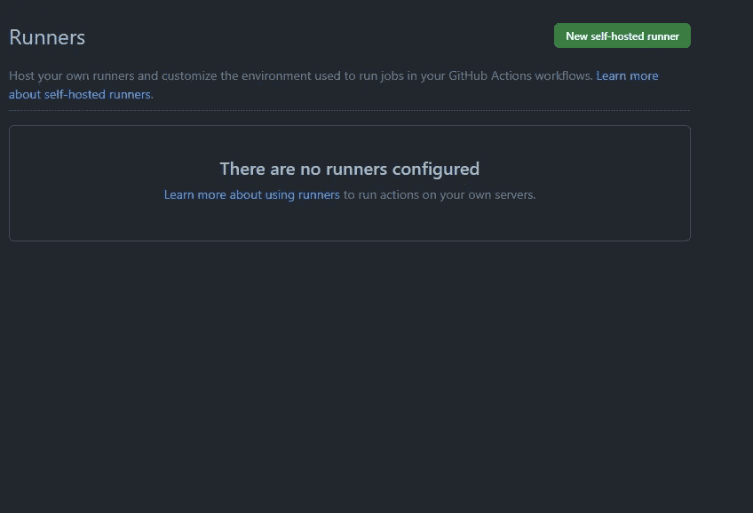
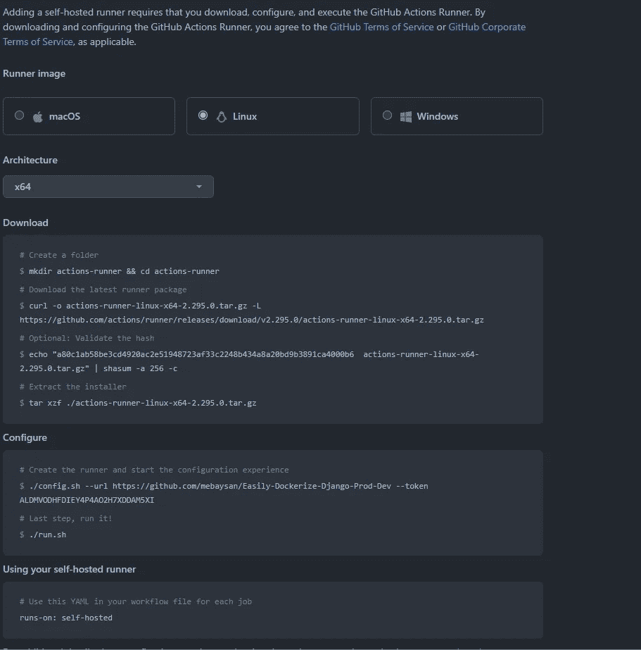
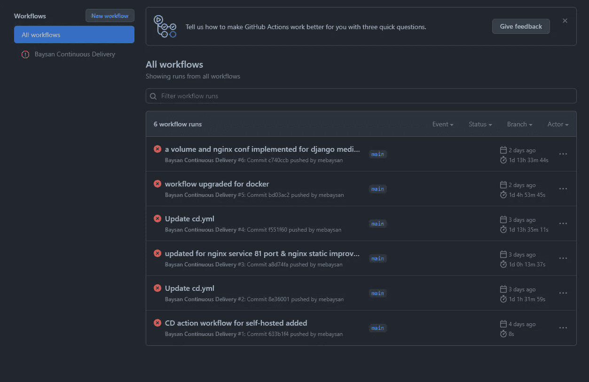

# 自托管连续交付 Django 应用程序的样板文件(第 2 部分)

> 原文：<https://medium.com/codex/a-boilerplate-to-self-hosted-continuous-delivery-django-apps-part-2-f358274a0ac3?source=collection_archive---------8----------------------->

## Django，Docker，GitHub 操作，工作流，自托管，自定义运行器

你好。在本文中，我将写一个 GitHub Actions 工作流，我创建它是为了在我自己的 VPS 上自动化我的部署过程。实际上，我们将使用的工作流和项目样板就是我创建的样板 repo，用于处理这些类型的流程。另外，我发表了一篇关于回购的文章。你可以通过下面的链接阅读这个故事的第一部分。

[](/codex/a-boilerplate-to-easily-dockerize-and-deploy-django-apps-8c3a459d01e) [## 一个样板文件，可以方便地整理和部署 Django 应用程序

### Django，PostgreSQL，Nginx，Docker，Docker Compose

medium.com](/codex/a-boilerplate-to-easily-dockerize-and-deploy-django-apps-8c3a459d01e) 

[Yancy Min](https://unsplash.com/@yancymin?utm_source=unsplash&utm_medium=referral&utm_content=creditCopyText) 在 [Unsplash](https://unsplash.com/s/photos/github?utm_source=unsplash&utm_medium=referral&utm_content=creditCopyText) 上拍照

另外，你可以通过下面的链接阅读这个故事的第一部分。

[](/codex/a-boilerplate-to-easily-dockerize-and-deploy-django-apps-8c3a459d01e) [## 一个样板文件，可以方便地整理和部署 Django 应用程序

### Django，PostgreSQL，Nginx，Docker，Docker Compose

medium.com](/codex/a-boilerplate-to-easily-dockerize-and-deploy-django-apps-8c3a459d01e) 

# GitHub 操作

我们可以通过使用 GitHub 动作来自动化我们的工作流程。

[](https://github.com/features/actions) [## 功能* GitHub 操作

### 此时您不能执行该操作。您已使用另一个标签页或窗口登录。您已在另一个选项卡中注销，或者…

github.com](https://github.com/features/actions) 

我们可以通过在存储库中创建`.github/workflows`文件夹来使用它们。为了节省时间，我不想深究诸如 GitHub Action 是什么、YAML 文件是什么等重要话题。

# 自托管光盘工作流程

我通常使用 Hetzner 来部署我的项目，而不是 GCP 或 AWS。比他们更钱包友好。在**自托管**工作流中，主要思想是创建一个**运行器**，用于跟踪工作流上的**触发事件**。

## cd.yml

在我的样板文件 repo 中，有一个名为`cd.yml`的文件。我在这个文件中定义了我的工作流。

```
name: Baysan Continuous Deliveryon:
  push:
    branches: [ "main" ]jobs:
  deploy:
    runs-on: self-hostedsteps:
    - uses: actions/checkout@v3

    - name: Build Updated Docker Compose Environment
      run: docker-compose build- name: Stop Old Docker Compose Environment
      run: docker-compose down- name: Run Updated Docker Compose Environment
      run: docker-compose up -d- name: Remove Unused Docker Compose Environment
      run: |
        docker container prune -f
        docker image prune -f
```

基本上，该文件执行以下步骤:

*   当`main`分支上有`pushed`时，执行此工作流。
*   将工作定义为`deploy`
*   作业将在`self-hosted`服务器上运行
*   使用`actions/checkout@v3`获取最新版本的代码
*   在服务器上，执行`docker-compose build`
*   在服务器上，执行`docker-compose down`
*   在服务器上，执行`docker-compose up -d`
*   在服务器上，执行`docker container prune -f && docker image prune -f`

实际上，理解这个文件很简单。我们可以使用下面的选项来运行我们的工作流程。

[](https://docs.github.com/en/actions/using-jobs/choosing-the-runner-for-a-job) [## 为工作选择跑步者- GitHub Docs

### 利用职务。。runs-on 定义运行作业的计算机类型。该机器可以是 GitHub 托管的 runner，也可以是…

docs.github.com](https://docs.github.com/en/actions/using-jobs/choosing-the-runner-for-a-job) 

然而，我使用`self-hosted`在我的服务器上运行这个工作流。现在，可以使用这个工作流了。我们只需要在我们的服务器上设置一个 runner 来跟踪这个工作流。

## 创建流道

在`Settings`下，我们找到`Actions`选项。我们使用`Actions`下的`Runners`选项卡来创建我们的跑步者。



然后，我们只需点击`New self-hosted runner`按钮，就能找到我们需要的一切。



实际上，当你遵循命令时，你将成功地创建你自己的跑步者。如果你是`root`用户，你可能会得到一个类似于`Must not be executed as ROOT`的错误。您可以使用下面的命令绕过此安全规则。

```
export RUNNER_ALLOW_RUNASROOT=1
```

然而，有一个棘手的问题。通过使用`run.sh`脚本，您可以启动您的跑步者。但是当你关闭终端的时候，转轮也会被关闭。要处理这个问题，你应该使用`svc.sh`文件。你可以通过执行`./svc.sh help`获得使用说明。

您可以将 runner 作为服务安装在您的服务器上。

```
./svc.sh install
```

然后，您可以使用下面的命令启动它。

```
./svc.sh start
```

另外，你可以检查它的健康状况。

```
./svc.sh status
```

如果您想移除该滑槽，只需使用`uninstall`即可。

```
./svc.sh uninstall
```

现在，您可以在回购的`Actions`部分看到您的工作流程。



我们看到他们都失败了，因为我没有为这个样板回购设置一个运行程序

# 最后

希望你喜欢。我一直很好奇这个话题。当我知道的时候，我超级开心。因为我梦想我可以只用 GitHub 而不是 AWS 或 GCP 来自动化我的项目。您可以通过下面的链接访问我在文章中提到和使用的样板文件。

[](https://github.com/mebaysan/Easily-Dockerize-Django-Prod-Dev) [## GitHub-mebaysan/easy-Dockerize-Django-Prod-Dev:我创建了这个 repo 来共享我的样板文件…

### 我创建了这个 repo 来方便地对 Django 应用程序进行 dockerize。在此回购中，我有自己的配置设置来分离生产和开发…

github.com](https://github.com/mebaysan/Easily-Dockerize-Django-Prod-Dev) 

我还在我的 Youtube 频道上分享了一个视频，讲述了如何使用这个回购，以及我们如何在一个真实的服务器上轻松部署我们的项目。目前，它只是在土耳其。我相信有一天我会上传我的英文视频

诚挚的问候

另外，你可以通过下面的链接阅读这个故事的第一部分。

[](/codex/a-boilerplate-to-easily-dockerize-and-deploy-django-apps-8c3a459d01e) [## 一个样板文件，可以方便地整理和部署 Django 应用程序

### Django，PostgreSQL，Nginx，Docker，Docker Compose

medium.com](/codex/a-boilerplate-to-easily-dockerize-and-deploy-django-apps-8c3a459d01e)