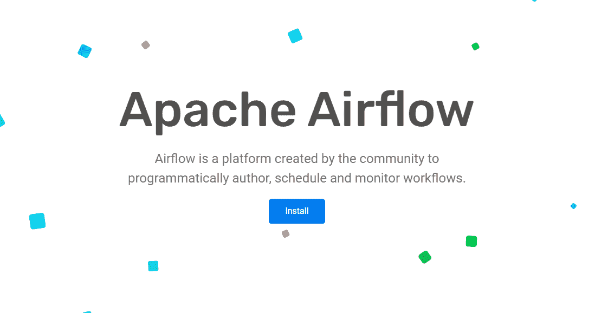

# Apache DolphinScheduler 与其他替代方案的简要比较

> 原文：<https://medium.com/codex/a-brief-comparison-of-apache-dolphinscheduler-with-other-alternatives-177826a0315c?source=collection_archive---------1----------------------->

如果你已经涉足大数据——以及数据工程领域，你会遇到诸如 Apache Airflow 这样的工作流调度器。尽管 Airflow 很快成为数据工程的“黄金标准”,但代码优先的理念让许多爱好者望而却步。

这对初学者来说尤其如此，他们已经被气流陡峭的学习曲线弄得不知所措。

出于纯粹的沮丧，Apache DolphinScheduler 诞生了。该平台的开发者采用了可视化的拖放界面，从而改变了用户与数据交互的方式。

我已经测试了 Apache DolphinScheduler，我可以看到为什么许多大数据工程师和分析师比竞争对手更喜欢这个平台。我给大家展示一下 DS 的优势，画出其他平台的异同。

快乐阅读！

# 什么是阿帕奇海豚调度程序？

首先是*基础*。

[Apache DolphinScheduler](https://dolphinscheduler.apache.org/) 是一个“具有强大 DAG 可视化界面的分布式可扩展工作流调度平台”

DolphinScheduler 经常被吹捧为下一代大数据调度程序，它通过各种开箱即用的作业来解决数据管道中复杂的作业依赖关系。

哇哦，那可是一大堆*技术术语*！

简而言之，DolphinScheduler 允许数据科学家和分析师快速创作、调度和监控批量数据管道，而不需要繁重的脚本。

平台中的工作流通过有向无环图(DAG)来表示。这里，图的每个节点代表一个特定的任务。

该项目于 2017 年在全球 TMT 管理咨询公司 Analysys Mason 启动，并迅速崛起，主要归功于其可视化 DAG 界面。

# 为什么我喜欢海豚调度程序

要理解为什么数据工程师和科学家(当然也包括我，*当然还有*)如此热爱这个平台，让我们回到过去。

2016 年，Apache Airflow(另一个开源工作流调度程序)被构想为帮助 Airbnb 成为一家成熟的数据驱动公司。Apache Airflow 的开发人员采用了代码优先的理念，认为数据管道最好通过代码来表达。

但是开发人员和工程师很快变得沮丧。据用户称:“科学家和开发人员发现通过代码创建工作流非常困难。通常，他们不得不在晚上醒来解决问题。”

在玩了几个星期这些平台后，我也有同样的感受。这主要是因为 Airflow 不能很好地处理大量数据和多个工作流。

这导致了 DolphinScheduler 的诞生，它通过使用可视化的 DAG 结构减少了对代码的需求。用户现在可以通过拖放来快速创建复杂的数据工作流，从而大幅减少错误。另外，即使在多主多工场景的项目中，DolphinScheduler 也有很好的稳定性。

DS 的错误处理和暂停功能赢得了我，这是我在气流上做不到的。

此外，该平台还获得了 Apache Software Foundation (ASF)的顶级项目地位，这表明该项目的产品和社区在 ASF 的精英原则和流程下得到了良好的治理。

DolphinScheduler 被各种全球企业集团使用，包括联想、戴尔、IBM 中国等等。这证明了它的优点和成长。

# DolphinScheduler 的主要特性

那么为什么需要 DolphinScheduler 呢？

Dolphin scheduler 使用了一种**主/从设计，并采用了一种非集中式和分布式的方法**。这种方法有利于扩展性，因为可以很容易地添加更多的节点。此外，一个节点的故障不会导致整个系统的故障。

以下是使其脱颖而出的关键特性:

*   **高可靠性:** DS 提供分散的多工人和多主机、更高的可用性、自我支持和过载处理。
*   **用户友好:**由于所有的过程定义都是可视化的，DS 通过让没有预先编码知识的人(比如数据分析师)创建复杂的工作流来平坦化学习曲线——这是我个人的最爱。
*   **丰富的场景:** DS 提供多种任务类型，包括 Spark、Hive、Python、Flink、MapReduce。此外，该平台的多租户功能提高了效率，并提供了高级别的可扩展性。
*   **高可扩展性:** DS 能够根据集群的规模线性增加其整体调度能力。

此外，用户还可以预先确定各种错误代码的解决方案，从而自动化工作流程并减少问题。DS 还提供子工作流来支持复杂的部署。

# 5 个类似的平台供您试用

我还将 DolphinScheduler 与其他工作流调度平台进行了比较，并分享了它们各自的优缺点。让我们来看看业内最好的五个:

1.  阿帕奇气流
2.  AWS 阶跃函数
3.  谷歌工作流程
4.  阿帕奇阿兹卡班
5.  库贝弗洛

# 阿帕奇气流

[Apache Airflow](https://airflow.apache.org/) 是一个开源平台，帮助用户以编程方式创作、调度和监控工作流。在这里，用户以 DAG 或有向无环图的形式创作工作流。

对于数据工程师和分析师来说，这是一个令人惊叹的平台，因为他们可以可视化生产中的数据管道，监控统计数据，定位问题并解决问题。

Airflow 遵循代码优先的理念，认为复杂的数据管道最好通过代码来表达。该平台缓解了以前的工作流调度器(如 Oozie)中出现的问题，oo zie 在端到端工作流中对作业有所限制。

**使用阿帕奇气流的公司** : Airbnb、沃尔玛、Trustpilot、Slack、Robinhood。

## 用例

Airflow 非常适合在外部系统中构建具有复杂依赖关系的作业。也就是说，该平台通常适用于预先安排的、有特定时间间隔的以及变化缓慢的数据管道。

以下是一些特定的气流使用案例:

*   机器学习(ML)模型训练
*   备份任务和开发工作
*   自动化报告生成
*   从多点提取数据的 ETL 管道
*   以最短的停机时间处理产品升级

## 骗局

尽管 Airflow 是数据工程师和科学家的优秀产品，但它也有自己的缺点:

*   没有数据管道的版本
*   代码优先的方法有一个更陡峭的学习曲线；新用户可能会觉得该平台不够直观
*   为生产建立一个气流架构是困难的
*   难以在本地使用，尤其是在 Windows 系统中
*   调度程序在调度特定任务之前需要时间

# AWS 阶跃函数

[AWS Step Functions](https://aws.amazon.com/step-functions/) 是“一种低代码、可视化的工作流服务”，开发者使用它来自动化 IT 流程，构建分布式应用，并通过 AWS 服务设计机器学习管道。

该服务提供了一个拖放式可视化编辑器，帮助您将单个微服务设计到工作流中。

步骤功能对工作流程中每个步骤的输入、错误处理、输出和重试进行微观管理。这意味着用户可以专注于项目中更重要的高价值业务流程。

Step Functions 提供两种类型的工作流:标准和快速。

标准工作流用于长期运行的工作流，而快速工作流支持大量事件处理工作负载。

**使用 AWS Step 函数的公司** : Zendesk、比特币基地、Yelp、CocaCola 公司、Home24。

## 用例

该服务非常适合需要多点协调以完成更高级任务的流程和工作流。

以下是一些重要的使用案例:

*   提取、转换和加载(ETL)流程的自动化
*   为机器学习准备数据—步骤功能简化了自动化 ML 流水线所需的连续步骤
*   阶跃函数可用于将多个 AWS Lambda 函数组合成响应性无服务器微服务和应用
*   通过快速工作流调用业务流程来响应事件
*   为流数据构建数据处理管道
*   使用大规模并行化对视频进行分割和转码

## 骗局

*   工作流配置需要专有的 Amazon States 语言，这仅用于步骤函数中
*   将业务逻辑从任务序列中分离出来会让开发人员更难理解代码
*   创建供应商锁定，因为定义工作流的状态机和步骤函数只能用于步骤函数平台

# 谷歌工作流程

[Google Workflows](https://cloud.google.com/workflows) 结合了 Google 的云服务和 API，帮助开发者构建可靠的大规模应用、流程自动化，以及部署机器学习和数据管道。

简而言之，工作流是一个“完全托管的编排平台，它按照您定义的顺序执行服务。”

工作流可以结合各种服务，包括云视觉人工智能、基于 HTTP 的 API、云运行和云功能。

谷歌是大数据和分析领域的领导者，它在服务中展示了

开发人员可以通过将工作流整合到他们的解决方案中，使服务依赖关系变得清晰可见。工作流可以重试、保持状态、轮询，甚至等待长达一年。

该平台免费提供前 5000 个内部步骤，每 1000 步收费 0.01 美元。对于外部 HTTP 呼叫，前 2000 次呼叫是免费的，谷歌每 1000 次呼叫收费 0.025 美元。

**使用谷歌工作流程的公司**:威瑞森、SAP、Twitch Interactive 和英特尔。

## 用例

该列表显示了 Google 工作流的一些关键用例:

*   提供服务编排，帮助开发人员通过组合服务来创建解决方案。它也可以是事件驱动的
*   它可以对一组项目或批处理数据进行操作，并且经常被调度。示例包括每天向客户发送电子邮件，准备和运行机器学习作业，以及生成报告
*   谷歌云服务操作的脚本序列，如按计划拒绝资源或提供新的租户项目
*   对业务流程的步骤进行编码，包括动作、人在回路中的事件和条件。从请求到完成跟踪订单就是一个例子

## 骗局

*   巨额支持费
*   不是开源的
*   谷歌云只免费提供 5000 步
*   网络界面有点笨拙
*   从谷歌云存储中下载数据非常昂贵

# 阿帕奇阿兹卡班

[Apache Azkaban](https://azkaban.github.io/) 是一个批处理工作流作业调度程序，帮助开发人员运行 Hadoop 作业。开源平台“通过作业依赖解决订购问题”，并提供直观的网络界面来帮助用户维护和跟踪工作流程。

虽然它是在 LinkedIn 上创建的，用于运行 Hadoop 作业，但它是可扩展的，可以满足任何需要插入和调度的项目。它由一个 AzkabanWebServer、一个 Azkaban ExecutorServer 和一个 MySQL 数据库组成。

该平台兼容任何版本的 Hadoop，并提供分布式多执行器。Apache Azkaban 的特性包括项目工作区、身份验证、用户动作跟踪、SLA 警报和工作流调度。

Azkaban 有一个最直观和简单的界面，让新手数据科学家和工程师可以轻松快速地部署项目。

**使用阿帕奇阿兹卡班**的公司:苹果、Doordash、分子、应用材料。

## 用例

以下是阿帕奇阿兹卡班的一些使用案例:

*   处理项目管理、认证、监控和计划执行
*   各种场景的三种模式:单服务器的试用模式、生产环境的双服务器模式和多执行器分布式模式
*   主要用于 Hadoop 批处理作业的基于时间的依赖调度

## **缺点**

*   当阿兹卡班失败时，所有正在运行的工作流都会丢失
*   没有可视化拖放功能
*   不提供快速部署
*   没有足够的过载处理能力

# 库贝弗洛

[Kubeflow](https://www.kubeflow.org/) 是一个开源工具包，“致力于使在 Kubernetes 上部署机器学习工作流变得简单、可移植和可扩展。”它侧重于复杂项目的详细项目管理、监控和深入分析。

该平台通过为您的机器学习库、管道、笔记本和框架提供云原生接口，将您工作流程中的步骤转换为 Kubernetes 上的作业。

借助 Kubeflow，数据科学家和工程师可以通过分段步骤构建成熟的数据管道。

Kubeflow 的使命是帮助开发人员部署和管理松散耦合的微服务，同时也使其易于部署在各种基础设施上。

使用 Kubeflow 的公司有:欧洲核子研究中心、优步、Shopify、英特尔、Lyft、PayPal 和彭博。

## 用例

让我们来看看 Kubeflow 的核心用例:

*   部署大规模复杂的机器学习系统并管理它们
*   R&D 使用各种机器学习模型
*   数据加载、验证、拆分和处理
*   通过 Katib 自动优化和调整超参数
*   标准化环境中的多云和混合 ML 工作负载
*   模型培训、验证和服务

## 骗局

*   难以实施和设置
*   它不是为显式处理大数据而设计的
*   不完整的文档使得实现和设置更加困难
*   数据科学家可能需要运营部门的帮助来解决问题
*   一些组件和库已经过时
*   未针对运行触发器和设置依赖关系进行优化
*   使用 Kubeflow 协调 Spark 和 Hadoop 工作并不容易
*   集成组件时可能会出现问题——各种组件的不兼容版本可能会破坏系统，唯一的恢复方法可能是重新安装 Kubeflow

# 包扎

我喜欢用 DolphinScheduler 安排工作流程是如此简单。可视化 DAG 接口意味着我不必绞尽脑汁重写完全正确的 Python 代码行。

从一个窗口中，我可以可视化关键信息，包括任务状态、类型、重试次数、可视变量等等。

但最让我沮丧的是，大多数平台都没有暂停功能——在重新运行之前，你必须终止工作流。有了 DS，我可以通过它的错误处理工具暂停甚至恢复操作。

此外，由于使用分布式调度，总体调度能力随着集群规模的增加而线性增加。此外，由于其多租户支持特性，DolphinScheduler 还支持传统的 shell 任务和大数据平台，包括 Spark、Hive、Python 和 MR。

该平台通过一键式部署使处理大数据变得更加容易，并缩短了学习曲线，使其成为数据工程领域的一个颠覆性平台。

这种易用性让我选择了 DolphinScheduler，而不是 Airflow、Azkaban 和 Kubeflow。

这篇精心策划的文章涵盖了业界五个最佳工作流调度器的特性、用例以及缺点。我希望这篇文章对你有所帮助，并激励你开始行动！

# 加入社区

参与 DolphinScheduler 社区并为其做出贡献的方式有很多，包括:

文档、翻译、问答、测试、代码、文章、主题演讲等。

我们假设第一个 PR(文档、代码)是简单的，应该用来熟悉提交过程和社区协作风格。

所以社区整理了以下适合新手的问题列表:【https://github.com/apache/dolphinscheduler/issues/5689

非新手问题列表:【https://github.com/apache/dolphinscheduler/issues? q = is % 3A open+is % 3A issue+label % 3A % 22 volunteer+wanted % 22

如何参与投稿:[https://dolphin scheduler . Apache . org/en-us/community/development/contribute . html](https://dolphinscheduler.apache.org/en-us/community/development/contribute.html)

**GitHub 代码库:**[https://github.com/apache/dolphinscheduler](https://github.com/apache/dolphinscheduler)

**官方网站:**https://dolphinscheduler.apache.org/

邮件列表:dev@dolphinscheduler@apache.org

**推特:**@海豚时间表

https://www.youtube.com/channel/UCmrPmeE7dVqo8DYhSLHa0vA

**懈怠:【https://s.apache.org/dolphinscheduler-slack】T21**

**投稿指南:**https://dolphin scheduler . Apache . org/en-us/community/index . html

你的项目之星很重要，不要犹豫，点亮阿帕奇海豚调度❤️之星